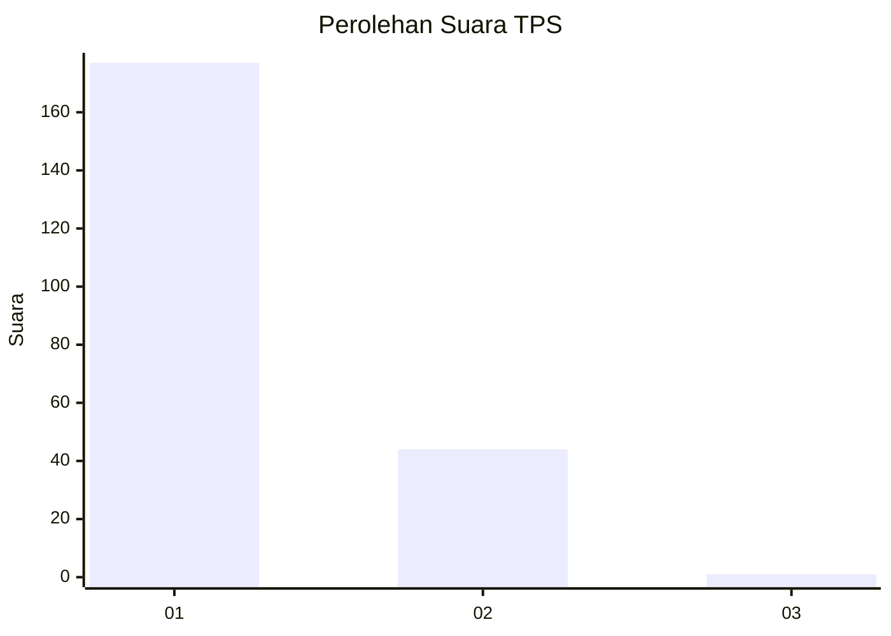
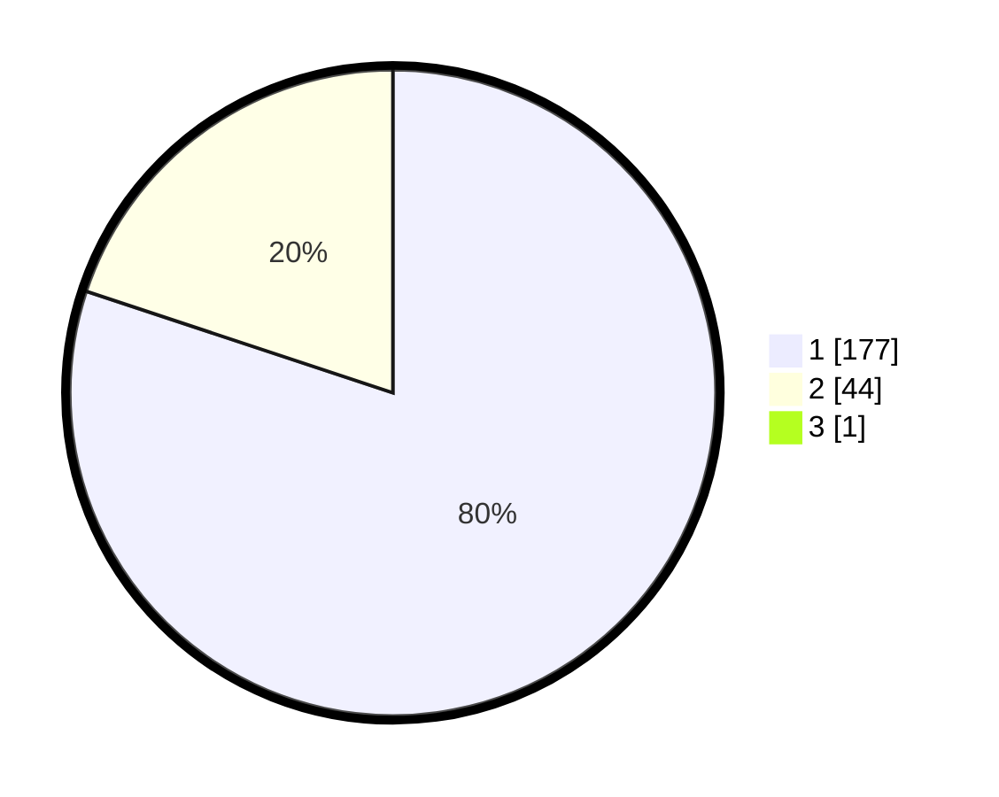

# Hasil

## Grafik

## Tabel

| No. | Nama Paslon    | Suara | Suara (raw) | Persentase |
|:--- |:-------------- | -----:| -----------:| ----------:|
| 1   | ANIES MUHAIMIN | 177   | [177][p-1]  | 79,73      |
| 2   | PRABOWO GIBRAN | 44    | [44][p-2]   | 19,82      |
| 3   | GANJAR MAHFUD  | 1     | [1][p-3]    | 0,45       |

[p-1]: https://github.com/gigit-pemilu/pemilu-2024-32-jawa-barat/blob/main/pilpres/hitung-suara/sub/32-jawa-barat/sub/03-cianjur/sub/29-cijati/sub/2007-sukaluyu/sub/011-tps/sub/paslon-1.txt
[p-2]: https://github.com/gigit-pemilu/pemilu-2024-32-jawa-barat/blob/main/pilpres/hitung-suara/sub/32-jawa-barat/sub/03-cianjur/sub/29-cijati/sub/2007-sukaluyu/sub/011-tps/sub/paslon-2.txt
[p-3]: https://github.com/gigit-pemilu/pemilu-2024-32-jawa-barat/blob/main/pilpres/hitung-suara/sub/32-jawa-barat/sub/03-cianjur/sub/29-cijati/sub/2007-sukaluyu/sub/011-tps/sub/paslon-3.txt

## Foto C Plano

https://sirekap-obj-formc.kpu.go.id/2a64/pemilu/ppwp/32/03/29/20/07/3203292007011-20240215-143305--38aa4286-2067-4e17-8f3b-c786fdbf1559.jpg

https://sirekap-obj-formc.kpu.go.id/2a64/pemilu/ppwp/32/03/29/20/07/3203292007011-20240215-143939--f33e2a76-894d-4de8-bc4a-909bede2e9d1.jpg

https://sirekap-obj-formc.kpu.go.id/2a64/pemilu/ppwp/32/03/29/20/07/3203292007011-20240215-144243--c06f5995-baa5-442b-b1d4-300030a54157.jpg

## Metadata

| Key        | Value               |
| ---------- | ------------------- |
| Time Stamp | 2024-02-15 19:30:26 |

