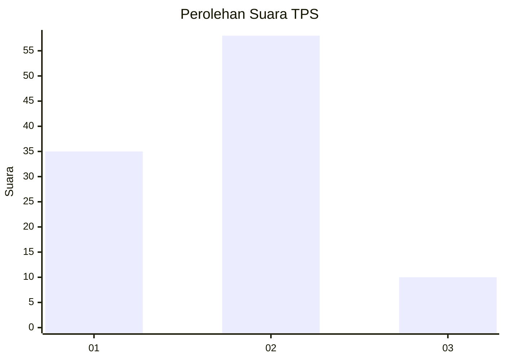
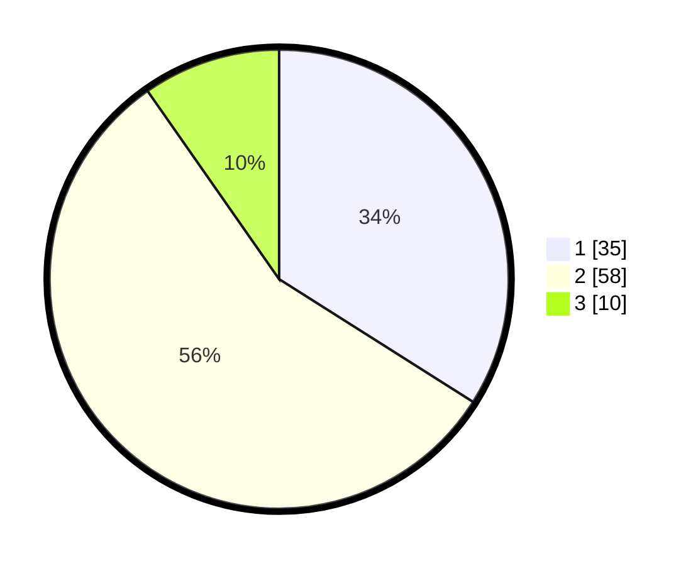

# Hasil

## Grafik

## Tabel

| No. | Nama Paslon    | Suara | Suara (raw) | Persentase |
|:--- |:-------------- | -----:| -----------:| ----------:|
| 1   | ANIES MUHAIMIN | 35    | [35][p-1]   | 33,98      |
| 2   | PRABOWO GIBRAN | 58    | [58][p-2]   | 56,31      |
| 3   | GANJAR MAHFUD  | 10    | [10][p-3]   | 9,71       |

[p-1]: https://github.com/gigit-pemilu/pemilu-2024/blob/main/pilpres/hitung-suara/sub/32-jawa-barat/sub/03-cianjur/sub/29-cijati/sub/2009-sinarbakti/sub/002-tps/sub/paslon-1.txt
[p-2]: https://github.com/gigit-pemilu/pemilu-2024/blob/main/pilpres/hitung-suara/sub/32-jawa-barat/sub/03-cianjur/sub/29-cijati/sub/2009-sinarbakti/sub/002-tps/sub/paslon-2.txt
[p-3]: https://github.com/gigit-pemilu/pemilu-2024/blob/main/pilpres/hitung-suara/sub/32-jawa-barat/sub/03-cianjur/sub/29-cijati/sub/2009-sinarbakti/sub/002-tps/sub/paslon-3.txt

## Foto C Plano

https://sirekap-obj-formc.kpu.go.id/4627/pemilu/ppwp/32/03/29/20/09/3203292009002-20240215-083222--68d29759-c114-4ca3-abb4-9d8bd46e758c.jpg

https://sirekap-obj-formc.kpu.go.id/4627/pemilu/ppwp/32/03/29/20/09/3203292009002-20240215-083637--e84383e8-1163-405a-a610-4a7a7d7031bc.jpg

https://sirekap-obj-formc.kpu.go.id/4627/pemilu/ppwp/32/03/29/20/09/3203292009002-20240215-084007--cf0d642b-08fd-427c-a5e5-3b72f9e1f8d1.jpg

## Metadata

| Key        | Value               |
| ---------- | ------------------- |
| Time Stamp | 2024-02-25 12:00:00 |

