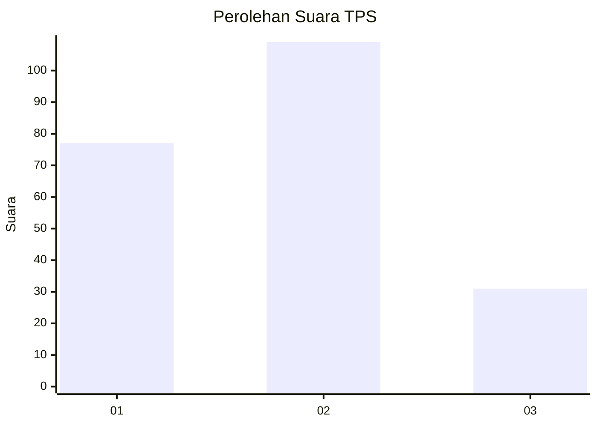
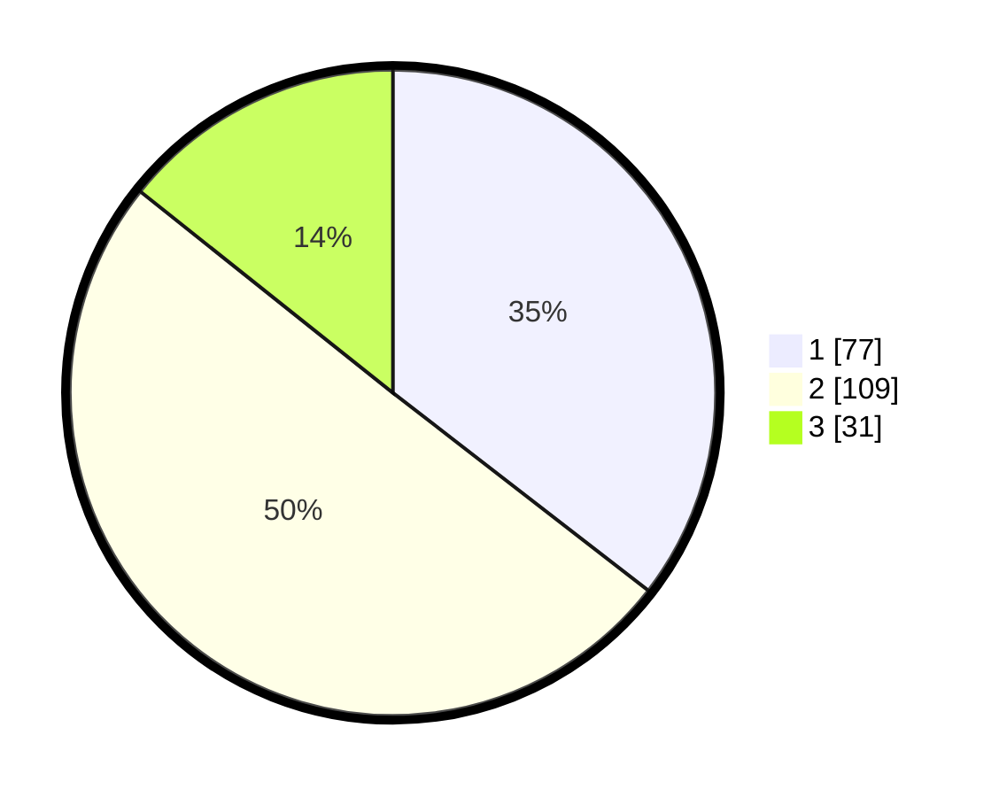

# Hasil

## Grafik

## Tabel

| No. | Nama Paslon    | Suara | Suara (raw) | Persentase |
|:--- |:-------------- | -----:| -----------:| ----------:|
| 1   | ANIES MUHAIMIN | 77    | [77][p-1]   | 35,48      |
| 2   | PRABOWO GIBRAN | 109   | [109][p-2]  | 50,23      |
| 3   | GANJAR MAHFUD  | 31    | [31][p-3]   | 14,29      |

[p-1]: https://github.com/gigit-pemilu/pemilu-2024/blob/main/pilpres/hitung-suara/sub/32-jawa-barat/sub/03-cianjur/sub/29-cijati/sub/2009-sinarbakti/sub/006-tps/sub/paslon-1.txt
[p-2]: https://github.com/gigit-pemilu/pemilu-2024/blob/main/pilpres/hitung-suara/sub/32-jawa-barat/sub/03-cianjur/sub/29-cijati/sub/2009-sinarbakti/sub/006-tps/sub/paslon-2.txt
[p-3]: https://github.com/gigit-pemilu/pemilu-2024/blob/main/pilpres/hitung-suara/sub/32-jawa-barat/sub/03-cianjur/sub/29-cijati/sub/2009-sinarbakti/sub/006-tps/sub/paslon-3.txt

## Foto C Plano

https://sirekap-obj-formc.kpu.go.id/02c9/pemilu/ppwp/32/03/29/20/09/3203292009006-20240214-220708--aeb9081b-a79a-4cec-9904-1f3bf3592d86.jpg

https://sirekap-obj-formc.kpu.go.id/02c9/pemilu/ppwp/32/03/29/20/09/3203292009006-20240214-220909--65f15ecf-81d2-4636-ab0b-be17edbbb5a6.jpg

https://sirekap-obj-formc.kpu.go.id/02c9/pemilu/ppwp/32/03/29/20/09/3203292009006-20240214-221043--06597fc0-d02f-436d-8275-6a28346cc292.jpg

## Metadata

| Key        | Value               |
| ---------- | ------------------- |
| Time Stamp | 2024-02-25 18:00:00 |

