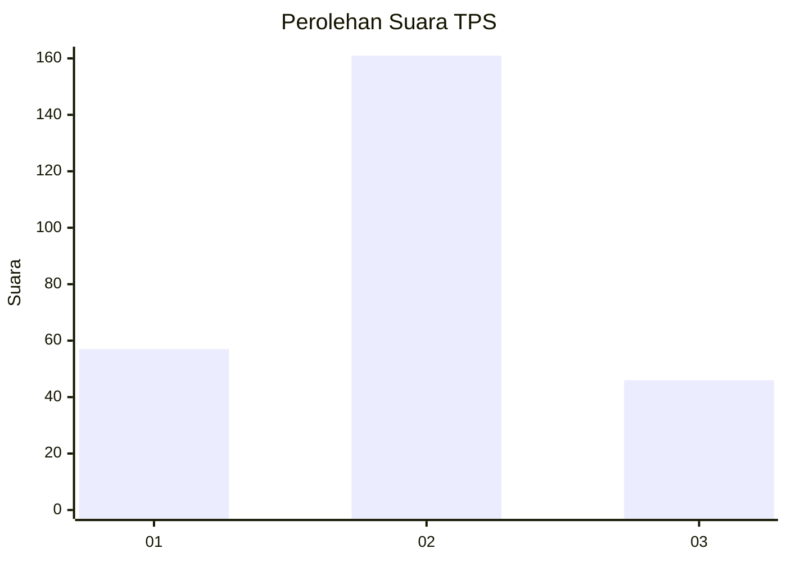

# Hasil

## Grafik

## Tabel

| No. | Nama Paslon    | Suara | Suara (raw) | Persentase |
|:--- |:-------------- | -----:| -----------:| ----------:|
| 1   | ANIES MUHAIMIN | 57    | [57][p-1]   | 21,59      |
| 2   | PRABOWO GIBRAN | 161   | [161][p-2]  | 60,98      |
| 3   | GANJAR MAHFUD  | 46    | [46][p-3]   | 17,42      |

[p-1]: https://github.com/gigit-pemilu/pemilu-2024/blob/main/pilpres/hitung-suara/sub/32-jawa-barat/sub/03-cianjur/sub/30-leles/sub/2005-sukajaya/sub/007-tps/sub/paslon-1.txt
[p-2]: https://github.com/gigit-pemilu/pemilu-2024/blob/main/pilpres/hitung-suara/sub/32-jawa-barat/sub/03-cianjur/sub/30-leles/sub/2005-sukajaya/sub/007-tps/sub/paslon-2.txt
[p-3]: https://github.com/gigit-pemilu/pemilu-2024/blob/main/pilpres/hitung-suara/sub/32-jawa-barat/sub/03-cianjur/sub/30-leles/sub/2005-sukajaya/sub/007-tps/sub/paslon-3.txt

## Foto C Plano

https://sirekap-obj-formc.kpu.go.id/bca3/pemilu/ppwp/32/03/30/20/05/3203302005007-20240215-195506--5bc7e61f-5662-43de-9617-38dcbe49cd28.jpg

https://sirekap-obj-formc.kpu.go.id/bca3/pemilu/ppwp/32/03/30/20/05/3203302005007-20240215-103157--5cfbf270-6741-4919-8a77-eec4cb532c48.jpg

https://sirekap-obj-formc.kpu.go.id/bca3/pemilu/ppwp/32/03/30/20/05/3203302005007-20240215-153003--f884bd4c-f817-40aa-bdf6-d011e24ab7ff.jpg

## Metadata

| Key        | Value               |
| ---------- | ------------------- |
| Time Stamp | 2024-02-24 23:00:00 |

