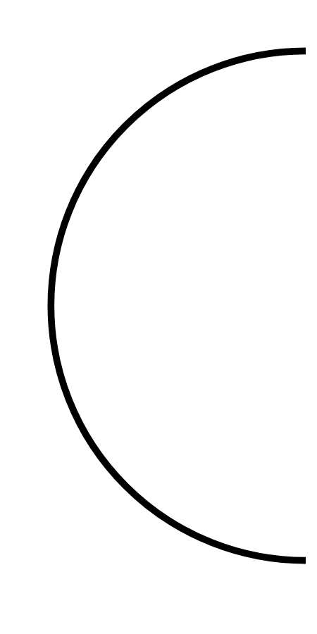

# Hasil

## Grafik

```mermaid
xychart-beta
    title "Perolehan Suara TPS"
    x-axis []
    y-axis "Suara" 0 --> 0
    bar []
```



## Tabel

| No. | Nama Paslon | Suara | Suara (raw) | Persentase |
|:--- |:----------- | -----:| -----------:| ----------:|


[p-1]: https://github.com/gigit-pemilu/pemilu-2024/blob/main/pilpres/hitung-suara/sub/32-jawa-barat/sub/03-cianjur/sub/31-haurwangi/sub/2005-mekarwangi/sub/003-tps/sub/paslon-1.txt
[p-2]: https://github.com/gigit-pemilu/pemilu-2024/blob/main/pilpres/hitung-suara/sub/32-jawa-barat/sub/03-cianjur/sub/31-haurwangi/sub/2005-mekarwangi/sub/003-tps/sub/paslon-2.txt
[p-3]: https://github.com/gigit-pemilu/pemilu-2024/blob/main/pilpres/hitung-suara/sub/32-jawa-barat/sub/03-cianjur/sub/31-haurwangi/sub/2005-mekarwangi/sub/003-tps/sub/paslon-3.txt

## Foto C Plano

https://sirekap-obj-formc.kpu.go.id/d0ae/pemilu/ppwp/32/03/31/20/05/3203312005003-20240215-072936--14ce891c-21a3-4f16-ac13-3d2c37c15e2b.jpg

https://sirekap-obj-formc.kpu.go.id/d0ae/pemilu/ppwp/32/03/31/20/05/3203312005003-20240220-113932--d379457f-2169-424a-b2fc-eb495b8923fb.jpg

https://sirekap-obj-formc.kpu.go.id/d0ae/pemilu/ppwp/32/03/31/20/05/3203312005003-20240215-072146--0c871b0b-03ce-4af9-84a4-282a32a394fd.jpg


## Metadata

| Key        | Value               |
| ---------- | ------------------- |
| Time Stamp | 2024-02-20 22:00:00 |


