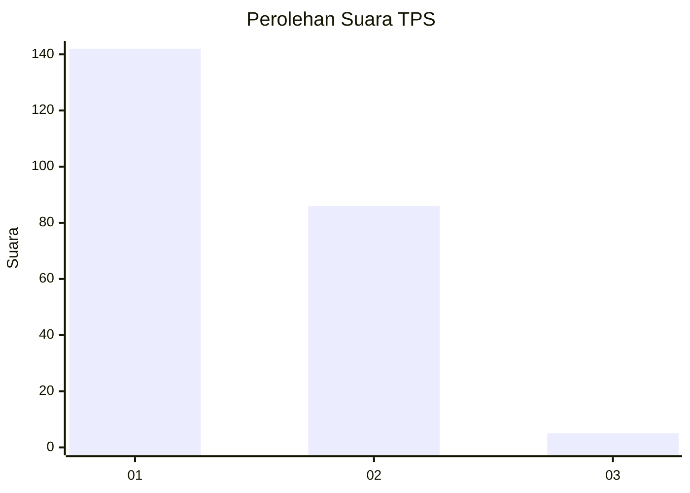
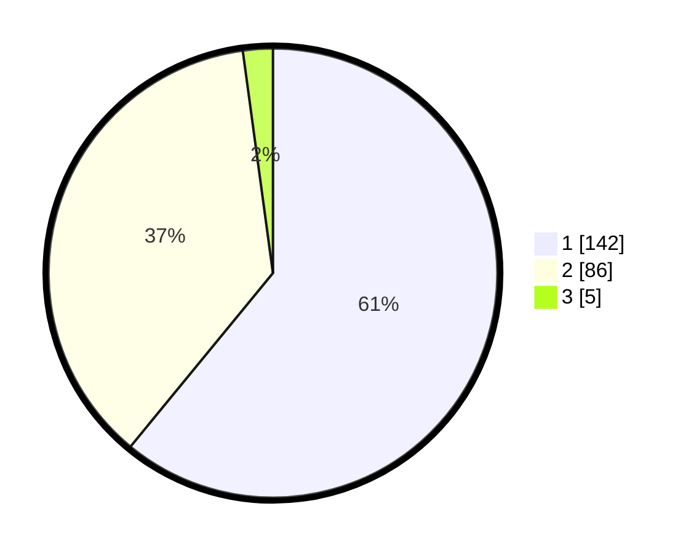

# Hasil

## Grafik

## Tabel

| No. | Nama Paslon    | Suara | Suara (raw) | Persentase |
|:--- |:-------------- | -----:| -----------:| ----------:|
| 1   | ANIES MUHAIMIN | 142   | [142][p-1]  | 60,94      |
| 2   | PRABOWO GIBRAN | 86    | [86][p-2]   | 36,91      |
| 3   | GANJAR MAHFUD  | 5     | [5][p-3]    | 2,15       |

[p-1]: https://github.com/gigit-pemilu/pemilu-2024-32-jawa-barat/blob/main/pilpres/hitung-suara/sub/32-jawa-barat/sub/03-cianjur/sub/32-pasirkuda/sub/2003-pusakajaya/sub/001-tps/sub/paslon-1.txt
[p-2]: https://github.com/gigit-pemilu/pemilu-2024-32-jawa-barat/blob/main/pilpres/hitung-suara/sub/32-jawa-barat/sub/03-cianjur/sub/32-pasirkuda/sub/2003-pusakajaya/sub/001-tps/sub/paslon-2.txt
[p-3]: https://github.com/gigit-pemilu/pemilu-2024-32-jawa-barat/blob/main/pilpres/hitung-suara/sub/32-jawa-barat/sub/03-cianjur/sub/32-pasirkuda/sub/2003-pusakajaya/sub/001-tps/sub/paslon-3.txt

## Foto C Plano

https://sirekap-obj-formc.kpu.go.id/82a4/pemilu/ppwp/32/03/32/20/03/3203322003001-20240215-205753--791f6fb1-925e-41e9-bfe9-12bf39079d77.jpg

https://sirekap-obj-formc.kpu.go.id/82a4/pemilu/ppwp/32/03/32/20/03/3203322003001-20240215-210741--e1a61db4-8c84-48bd-b0b9-c7c686d5d8c8.jpg

https://sirekap-obj-formc.kpu.go.id/82a4/pemilu/ppwp/32/03/32/20/03/3203322003001-20240215-210916--abf2fc95-1463-4884-8cdb-86347cf10360.jpg

## Metadata

| Key        | Value               |
| ---------- | ------------------- |
| Time Stamp | 2024-02-16 00:30:27 |

