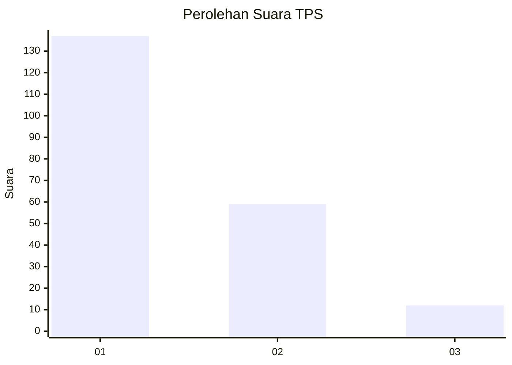
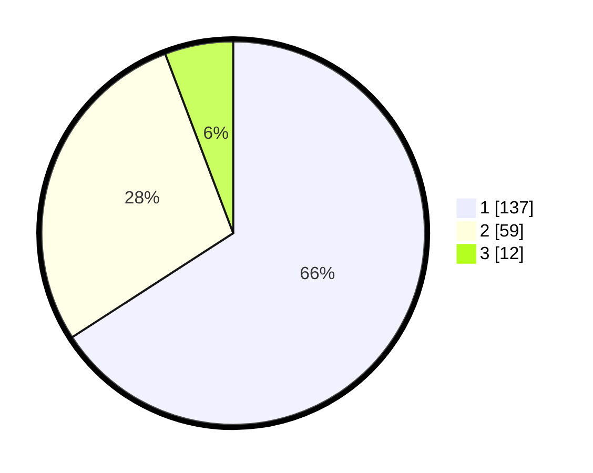

# Hasil

## Grafik

## Tabel

| No. | Nama Paslon    | Suara | Suara (raw) | Persentase |
|:--- |:-------------- | -----:| -----------:| ----------:|
| 1   | ANIES MUHAIMIN | 137   | [137][p-1]  | 65,87      |
| 2   | PRABOWO GIBRAN | 59    | [59][p-2]   | 28,37      |
| 3   | GANJAR MAHFUD  | 12    | [12][p-3]   | 5,77       |

[p-1]: https://github.com/gigit-pemilu/pemilu-2024-32-jawa-barat/blob/main/pilpres/hitung-suara/sub/32-jawa-barat/sub/04-bandung/sub/05-cileunyi/sub/2003-cimekar/sub/076-tps/sub/paslon-1.txt
[p-2]: https://github.com/gigit-pemilu/pemilu-2024-32-jawa-barat/blob/main/pilpres/hitung-suara/sub/32-jawa-barat/sub/04-bandung/sub/05-cileunyi/sub/2003-cimekar/sub/076-tps/sub/paslon-2.txt
[p-3]: https://github.com/gigit-pemilu/pemilu-2024-32-jawa-barat/blob/main/pilpres/hitung-suara/sub/32-jawa-barat/sub/04-bandung/sub/05-cileunyi/sub/2003-cimekar/sub/076-tps/sub/paslon-3.txt

## Foto C Plano

https://sirekap-obj-formc.kpu.go.id/9506/pemilu/ppwp/32/04/05/20/03/3204052003076-20240216-171858--185e9c9f-b7ba-4747-b316-74d1d9e4462b.jpg

https://sirekap-obj-formc.kpu.go.id/9506/pemilu/ppwp/32/04/05/20/03/3204052003076-20240216-172534--f006b7d0-0c2c-42bc-af44-c09c8500919c.jpg

https://sirekap-obj-formc.kpu.go.id/9506/pemilu/ppwp/32/04/05/20/03/3204052003076-20240216-165530--969fab27-b7e9-4fd4-b23d-34190df6a54c.jpg

## Metadata

| Key        | Value               |
| ---------- | ------------------- |
| Time Stamp | 2024-02-16 23:00:00 |

