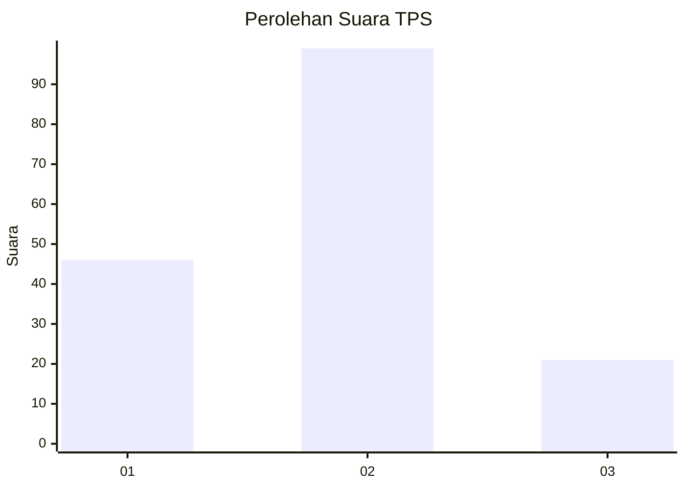
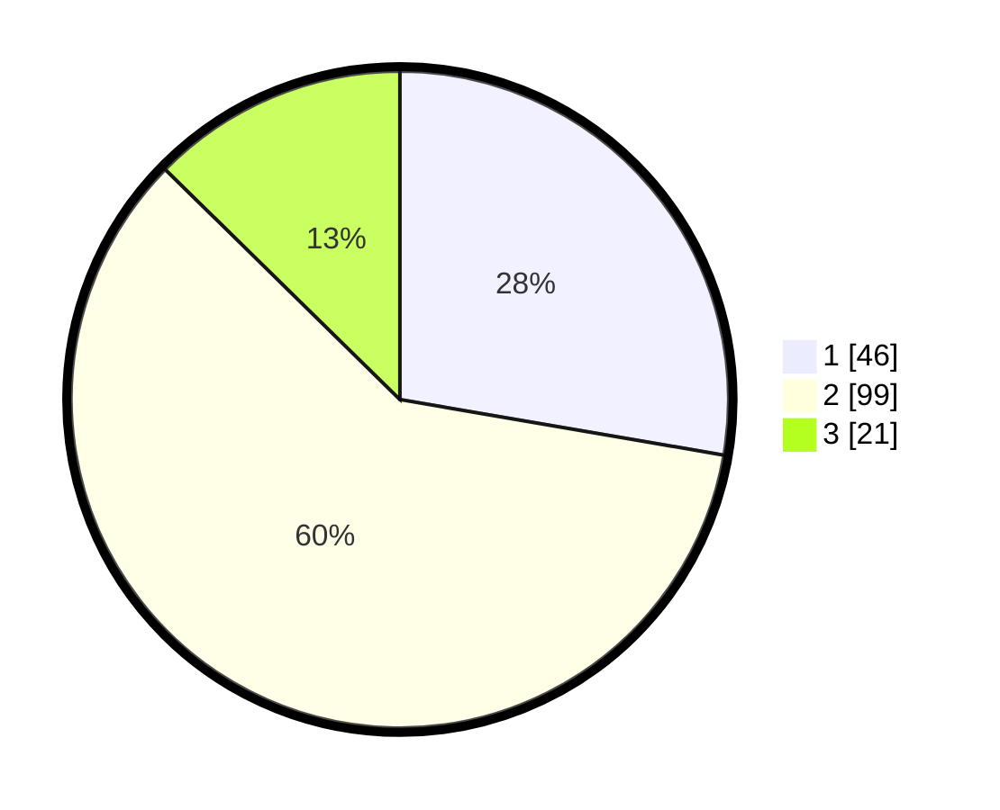

# Hasil

## Grafik

## Tabel

| No. | Nama Paslon    | Suara | Suara (raw) | Persentase |
|:--- |:-------------- | -----:| -----------:| ----------:|
| 1   | ANIES MUHAIMIN | 46    | [46][p-1]   | 27,71      |
| 2   | PRABOWO GIBRAN | 99    | [99][p-2]   | 59,64      |
| 3   | GANJAR MAHFUD  | 21    | [21][p-3]   | 12,65      |

[p-1]: https://github.com/gigit-pemilu/pemilu-2024/blob/main/pilpres/hitung-suara/sub/32-jawa-barat/sub/04-bandung/sub/06-cimenyan/sub/1002-cibeunying/sub/007-tps/sub/paslon-1.txt
[p-2]: https://github.com/gigit-pemilu/pemilu-2024/blob/main/pilpres/hitung-suara/sub/32-jawa-barat/sub/04-bandung/sub/06-cimenyan/sub/1002-cibeunying/sub/007-tps/sub/paslon-2.txt
[p-3]: https://github.com/gigit-pemilu/pemilu-2024/blob/main/pilpres/hitung-suara/sub/32-jawa-barat/sub/04-bandung/sub/06-cimenyan/sub/1002-cibeunying/sub/007-tps/sub/paslon-3.txt

## Foto C Plano

https://sirekap-obj-formc.kpu.go.id/f323/pemilu/ppwp/32/04/06/10/02/3204061002007-20240227-165252--6db324d6-0c71-446f-bbe7-41c24f4b10d2.jpg

https://sirekap-obj-formc.kpu.go.id/f323/pemilu/ppwp/32/04/06/10/02/3204061002007-20240227-165323--ecbd897a-1c49-42e5-a5e8-8d2a55812362.jpg

https://sirekap-obj-formc.kpu.go.id/f323/pemilu/ppwp/32/04/06/10/02/3204061002007-20240227-165406--23b7e356-4b9b-41ad-854d-f9e48f8a9bd5.jpg

## Metadata

| Key        | Value               |
| ---------- | ------------------- |
| Time Stamp | 2024-02-28 19:00:00 |

