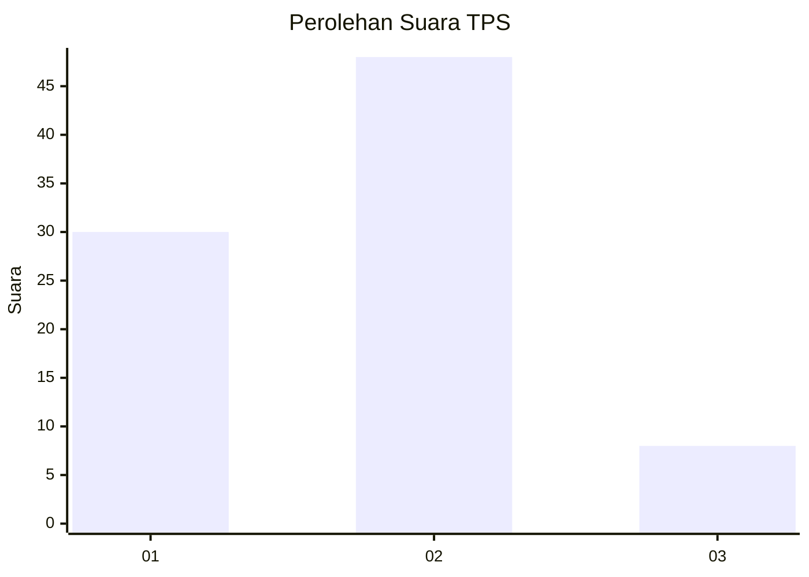
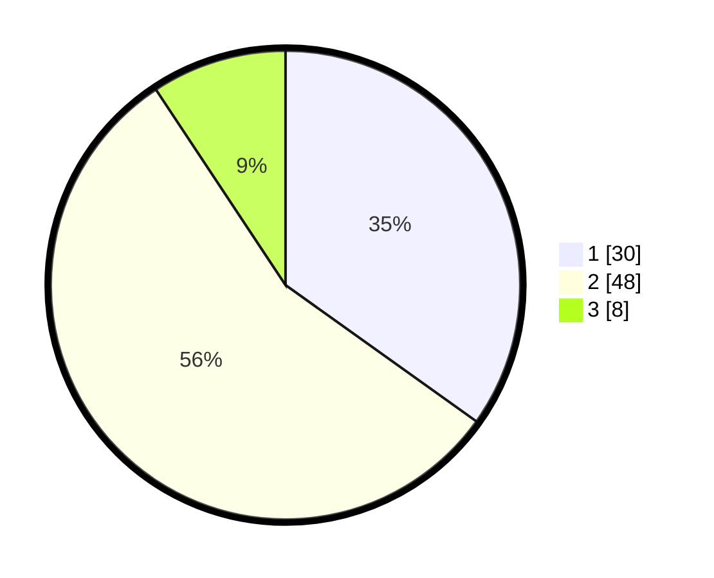

# Hasil

## Grafik

## Tabel

| No. | Nama Paslon    | Suara | Suara (raw) | Persentase |
|:--- |:-------------- | -----:| -----------:| ----------:|
| 1   | ANIES MUHAIMIN | 30    | [30][p-1]   | 34,88      |
| 2   | PRABOWO GIBRAN | 48    | [48][p-2]   | 55,81      |
| 3   | GANJAR MAHFUD  | 8     | [8][p-3]    | 9,30       |

[p-1]: https://github.com/gigit-pemilu/pemilu-2024-32-jawa-barat/blob/main/pilpres/hitung-suara/sub/32-jawa-barat/sub/04-bandung/sub/06-cimenyan/sub/2006-ciburial/sub/015-tps/sub/paslon-1.txt
[p-2]: https://github.com/gigit-pemilu/pemilu-2024-32-jawa-barat/blob/main/pilpres/hitung-suara/sub/32-jawa-barat/sub/04-bandung/sub/06-cimenyan/sub/2006-ciburial/sub/015-tps/sub/paslon-2.txt
[p-3]: https://github.com/gigit-pemilu/pemilu-2024-32-jawa-barat/blob/main/pilpres/hitung-suara/sub/32-jawa-barat/sub/04-bandung/sub/06-cimenyan/sub/2006-ciburial/sub/015-tps/sub/paslon-3.txt

## Foto C Plano

https://sirekap-obj-formc.kpu.go.id/571b/pemilu/ppwp/32/04/06/20/06/3204062006015-20240214-213928--137b3210-76c0-496c-8e84-4ed296dc30c9.jpg

https://sirekap-obj-formc.kpu.go.id/571b/pemilu/ppwp/32/04/06/20/06/3204062006015-20240214-214244--ac63f55e-c729-4c04-a12a-e025a02fb85d.jpg

https://sirekap-obj-formc.kpu.go.id/571b/pemilu/ppwp/32/04/06/20/06/3204062006015-20240214-214408--9a6cc140-dfc9-4b53-be0d-0c8f1efdb8fe.jpg

## Metadata

| Key        | Value               |
| ---------- | ------------------- |
| Time Stamp | 2024-02-16 10:30:29 |

