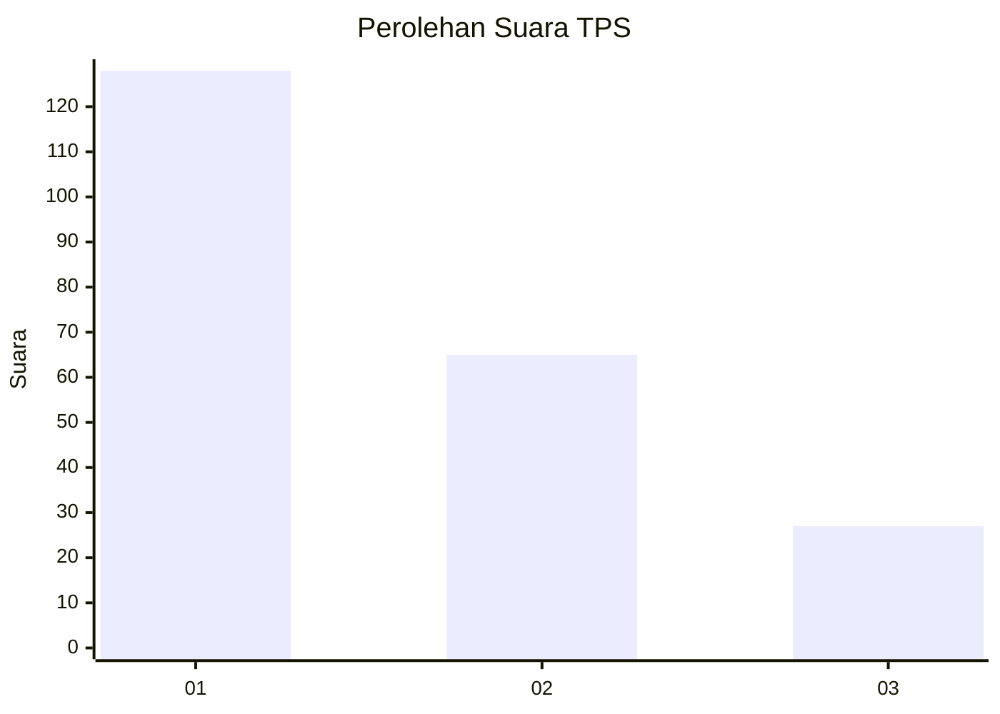
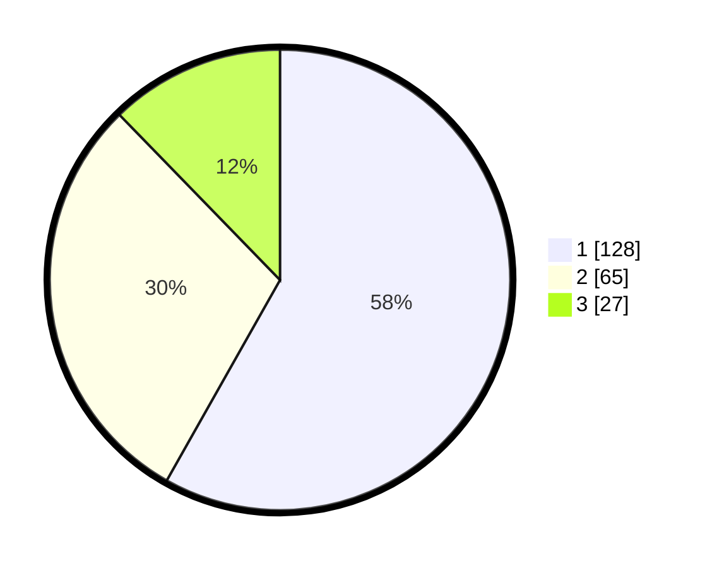

# Hasil

## Grafik

## Tabel

| No. | Nama Paslon    | Suara | Suara (raw) | Persentase |
|:--- |:-------------- | -----:| -----------:| ----------:|
| 1   | ANIES MUHAIMIN | 128   | [128][p-1]  | 58,18      |
| 2   | PRABOWO GIBRAN | 65    | [65][p-2]   | 29,55      |
| 3   | GANJAR MAHFUD  | 27    | [27][p-3]   | 12,27      |

[p-1]: https://github.com/gigit-pemilu/pemilu-2024/blob/main/pilpres/hitung-suara/sub/32-jawa-barat/sub/04-bandung/sub/08-bojongsoang/sub/2001-lengkong/sub/044-tps/sub/paslon-1.txt
[p-2]: https://github.com/gigit-pemilu/pemilu-2024/blob/main/pilpres/hitung-suara/sub/32-jawa-barat/sub/04-bandung/sub/08-bojongsoang/sub/2001-lengkong/sub/044-tps/sub/paslon-2.txt
[p-3]: https://github.com/gigit-pemilu/pemilu-2024/blob/main/pilpres/hitung-suara/sub/32-jawa-barat/sub/04-bandung/sub/08-bojongsoang/sub/2001-lengkong/sub/044-tps/sub/paslon-3.txt

## Foto C Plano

https://sirekap-obj-formc.kpu.go.id/5b16/pemilu/ppwp/32/04/08/20/01/3204082001044-20240220-110102--0fb5a05b-0a4a-4f79-b837-13aadeb21753.jpg

https://sirekap-obj-formc.kpu.go.id/5b16/pemilu/ppwp/32/04/08/20/01/3204082001044-20240220-110247--f04d729c-582e-4c49-8bdc-8b0362222267.jpg

https://sirekap-obj-formc.kpu.go.id/5b16/pemilu/ppwp/32/04/08/20/01/3204082001044-20240220-110417--d7412c9a-b927-478f-a839-ab70ff15cf8c.jpg

## Metadata

| Key        | Value               |
| ---------- | ------------------- |
| Time Stamp | 2024-02-20 12:00:00 |

## DATA PEMILIH TETAP

Jumlah pemilih dalam DPT: **264**.
 * L: **137**.
 * P: **736**.

## DATA PENGGUNA HAK PILIH

Jumlah pengguna hak pilih dalam DPT: **779**.
 * L: **103**.
 * P: **176**.

Jumlah pengguna hak pilih dalam DPTb: **644**.
 * L: **2**.
 * P: **4**.

Jumlah pengguna hak pilih dalam DPK: **44**.
 * L: **0**.
 * P: **0**.

Jumlah pengguna hak pilih: **264**.
 * L: **705**.
 * P: **120**.

## JUMLAH SUARA SAH DAN TIDAK SAH

JUMLAH SELURUH SUARA SAH: **220**.

JUMLAH SUARA TIDAK SAH: **5**.

JUMLAH SELURUH SUARA SAH DAN SUARA TIDAK SAH: **225**.

