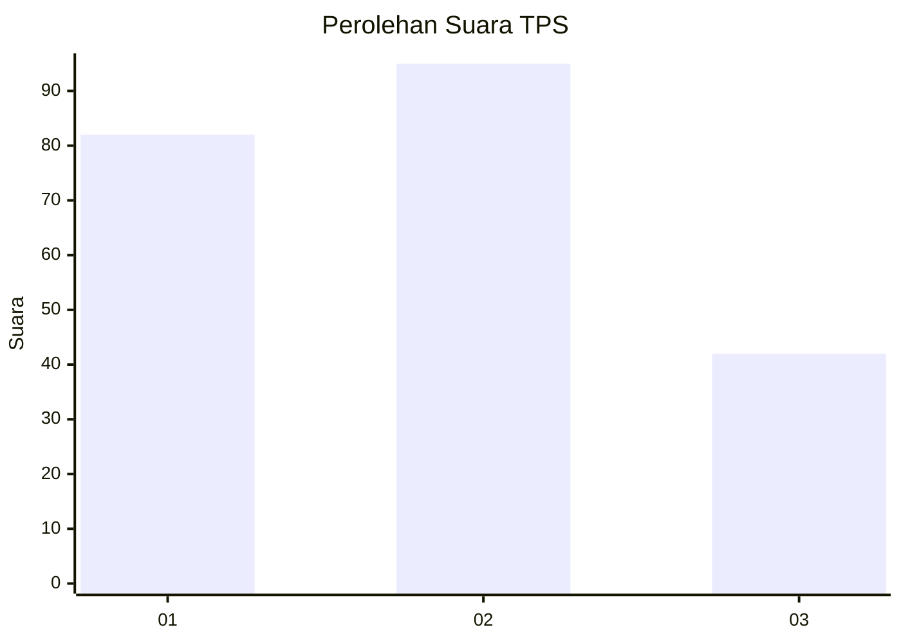
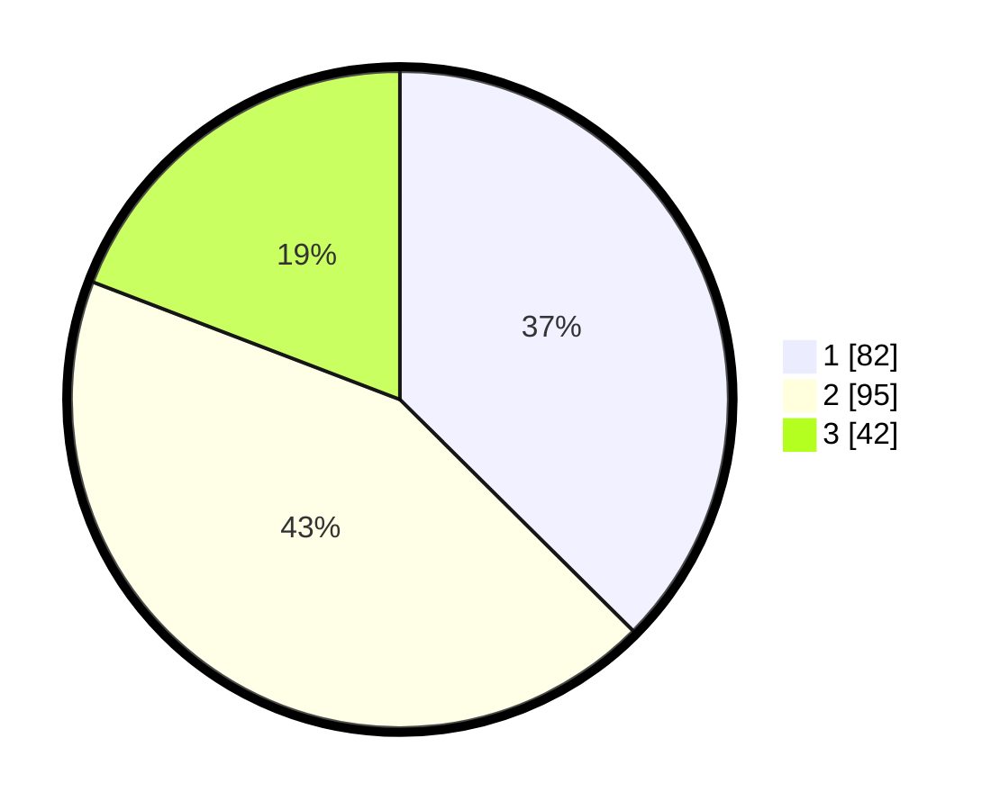

# Hasil

## Grafik

## Tabel

| No. | Nama Paslon    | Suara | Suara (raw) | Persentase |
|:--- |:-------------- | -----:| -----------:| ----------:|
| 1   | ANIES MUHAIMIN | 82    | [82][p-1]   | 37,44      |
| 2   | PRABOWO GIBRAN | 95    | [95][p-2]   | 43,38      |
| 3   | GANJAR MAHFUD  | 42    | [42][p-3]   | 19,18      |

[p-1]: https://github.com/gigit-pemilu/pemilu-2024/blob/main/pilpres/hitung-suara/sub/32-jawa-barat/sub/04-bandung/sub/08-bojongsoang/sub/2004-cipagalo/sub/004-tps/sub/paslon-1.txt
[p-2]: https://github.com/gigit-pemilu/pemilu-2024/blob/main/pilpres/hitung-suara/sub/32-jawa-barat/sub/04-bandung/sub/08-bojongsoang/sub/2004-cipagalo/sub/004-tps/sub/paslon-2.txt
[p-3]: https://github.com/gigit-pemilu/pemilu-2024/blob/main/pilpres/hitung-suara/sub/32-jawa-barat/sub/04-bandung/sub/08-bojongsoang/sub/2004-cipagalo/sub/004-tps/sub/paslon-3.txt

## Foto C Plano

https://sirekap-obj-formc.kpu.go.id/62e1/pemilu/ppwp/32/04/08/20/04/3204082004004-20240223-100622--9b314b23-c92b-4f5b-887c-bcfae2eef1d6.jpg

https://sirekap-obj-formc.kpu.go.id/62e1/pemilu/ppwp/32/04/08/20/04/3204082004004-20240223-100706--037ed3f2-53ea-4561-84b4-08a3c1655960.jpg

https://sirekap-obj-formc.kpu.go.id/62e1/pemilu/ppwp/32/04/08/20/04/3204082004004-20240223-100748--c84370da-922c-4722-ae34-aa01622cba11.jpg

## Metadata

| Key        | Value               |
| ---------- | ------------------- |
| Time Stamp | 2024-02-24 22:31:28 |

## DATA PEMILIH TETAP

Jumlah pemilih dalam DPT: **228**.
 * L: **936**.
 * P: **813**.

## DATA PENGGUNA HAK PILIH

Jumlah pengguna hak pilih dalam DPT: **183**.
 * L: **885**.
 * P: **43**.

Jumlah pengguna hak pilih dalam DPTb: **100**.
 * L: **508**.
 * P: **388**.

Jumlah pengguna hak pilih dalam DPK: **483**.
 * L: **84**.
 * P: **883**.

Jumlah pengguna hak pilih: **143**.
 * L: **832**.
 * P: **601**.

## JUMLAH SUARA SAH DAN TIDAK SAH

JUMLAH SELURUH SUARA SAH: **189**.

JUMLAH SUARA TIDAK SAH: **4**.

JUMLAH SELURUH SUARA SAH DAN SUARA TIDAK SAH: **193**.

