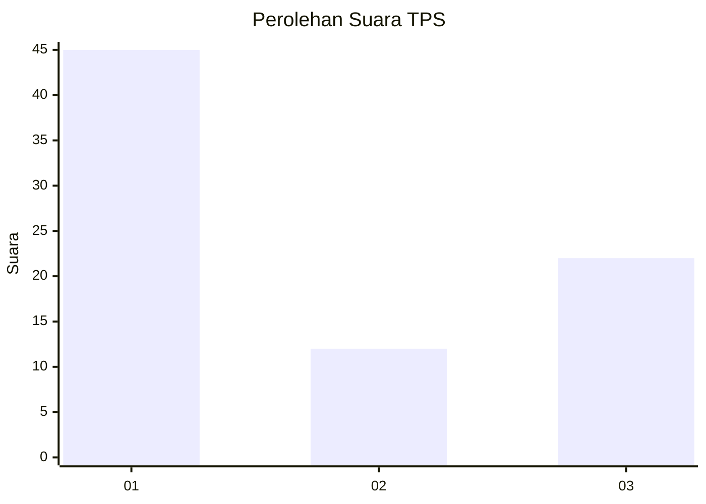
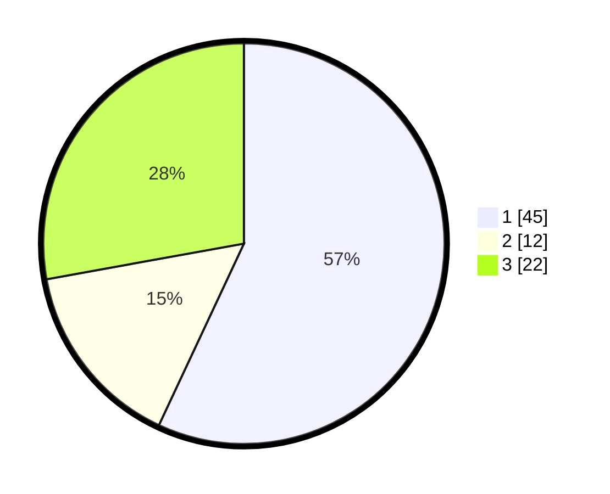

# Hasil

## Grafik

## Tabel

| No. | Nama Paslon    | Suara | Suara (raw) | Persentase |
|:--- |:-------------- | -----:| -----------:| ----------:|
| 1   | ANIES MUHAIMIN | 45    | [45][p-1]   | 56,96      |
| 2   | PRABOWO GIBRAN | 12    | [12][p-2]   | 15,19      |
| 3   | GANJAR MAHFUD  | 22    | [22][p-3]   | 27,85      |

[p-1]: https://github.com/gigit-pemilu/pemilu-2024-32-jawa-barat/blob/main/pilpres/hitung-suara/sub/32-jawa-barat/sub/04-bandung/sub/08-bojongsoang/sub/2004-cipagalo/sub/024-tps/sub/paslon-1.txt
[p-2]: https://github.com/gigit-pemilu/pemilu-2024-32-jawa-barat/blob/main/pilpres/hitung-suara/sub/32-jawa-barat/sub/04-bandung/sub/08-bojongsoang/sub/2004-cipagalo/sub/024-tps/sub/paslon-2.txt
[p-3]: https://github.com/gigit-pemilu/pemilu-2024-32-jawa-barat/blob/main/pilpres/hitung-suara/sub/32-jawa-barat/sub/04-bandung/sub/08-bojongsoang/sub/2004-cipagalo/sub/024-tps/sub/paslon-3.txt

## Foto C Plano

https://sirekap-obj-formc.kpu.go.id/17b1/pemilu/ppwp/32/04/08/20/04/3204082004024-20240223-152625--06d48114-9c28-408f-9118-399e79923422.jpg

https://sirekap-obj-formc.kpu.go.id/17b1/pemilu/ppwp/32/04/08/20/04/3204082004024-20240223-152803--6be9f083-254e-454b-9637-44af9f339efa.jpg

https://sirekap-obj-formc.kpu.go.id/17b1/pemilu/ppwp/32/04/08/20/04/3204082004024-20240223-153113--c4cea49b-16e1-46fb-856e-5978a4ca68c9.jpg

## Metadata

| Key        | Value               |
| ---------- | ------------------- |
| Time Stamp | 2024-02-24 22:31:28 |

## DATA PEMILIH TETAP

Jumlah pemilih dalam DPT: **275**.
 * L: **134**.
 * P: **133**.

## DATA PENGGUNA HAK PILIH

Jumlah pengguna hak pilih dalam DPT: **241**.
 * L: **117**.
 * P: **124**.

Jumlah pengguna hak pilih dalam DPTb: **308**.
 * L: **788**.
 * P: **380**.

Jumlah pengguna hak pilih dalam DPK: **357**.
 * L: **21**.
 * P: **881**.

Jumlah pengguna hak pilih: **243**.
 * L: **513**.
 * P: **125**.

## JUMLAH SUARA SAH DAN TIDAK SAH

JUMLAH SELURUH SUARA SAH: **239**.

JUMLAH SUARA TIDAK SAH: **884**.

JUMLAH SELURUH SUARA SAH DAN SUARA TIDAK SAH: **247**.

