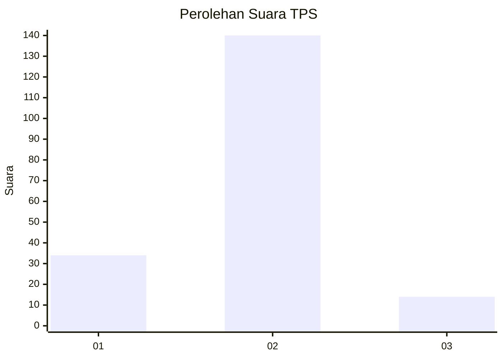
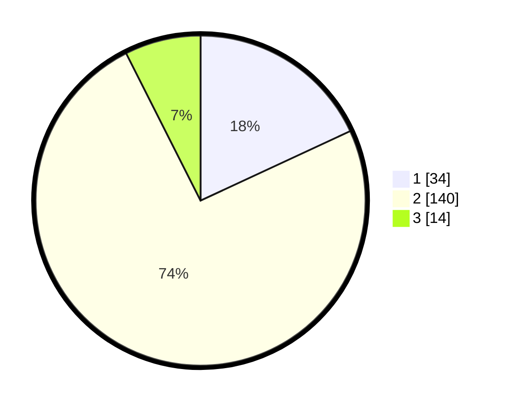

# Hasil

## Grafik

## Tabel

| No. | Nama Paslon    | Suara | Suara (raw) | Persentase |
|:--- |:-------------- | -----:| -----------:| ----------:|
| 1   | ANIES MUHAIMIN | 34    | [34][p-1]   | 18,09      |
| 2   | PRABOWO GIBRAN | 140   | [140][p-2]  | 74,47      |
| 3   | GANJAR MAHFUD  | 14    | [14][p-3]   | 7,45       |

[p-1]: https://github.com/gigit-pemilu/pemilu-2024/blob/main/pilpres/hitung-suara/sub/32-jawa-barat/sub/04-bandung/sub/08-bojongsoang/sub/2004-cipagalo/sub/026-tps/sub/paslon-1.txt
[p-2]: https://github.com/gigit-pemilu/pemilu-2024/blob/main/pilpres/hitung-suara/sub/32-jawa-barat/sub/04-bandung/sub/08-bojongsoang/sub/2004-cipagalo/sub/026-tps/sub/paslon-2.txt
[p-3]: https://github.com/gigit-pemilu/pemilu-2024/blob/main/pilpres/hitung-suara/sub/32-jawa-barat/sub/04-bandung/sub/08-bojongsoang/sub/2004-cipagalo/sub/026-tps/sub/paslon-3.txt

## Foto C Plano

https://sirekap-obj-formc.kpu.go.id/33af/pemilu/ppwp/32/04/08/20/04/3204082004026-20240223-150223--a922fbcc-dc15-4cc2-aa96-1a0743c62a72.jpg

https://sirekap-obj-formc.kpu.go.id/33af/pemilu/ppwp/32/04/08/20/04/3204082004026-20240223-150330--5af267f1-88ad-4042-a152-a25fded45fd6.jpg

https://sirekap-obj-formc.kpu.go.id/33af/pemilu/ppwp/32/04/08/20/04/3204082004026-20240223-150422--92fe8e2c-6083-458d-af51-204bce6be099.jpg

## Metadata

| Key        | Value               |
| ---------- | ------------------- |
| Time Stamp | 2024-02-24 22:31:28 |

## DATA PEMILIH TETAP

Jumlah pemilih dalam DPT: **278**.
 * L: **836**.
 * P: **372**.

## DATA PENGGUNA HAK PILIH

Jumlah pengguna hak pilih dalam DPT: **228**.
 * L: **809**.
 * P: **319**.

Jumlah pengguna hak pilih dalam DPTb: **888**.
 * L: **800**.
 * P: **800**.

Jumlah pengguna hak pilih dalam DPK: **205**.
 * L: **322**.
 * P: **822**.

Jumlah pengguna hak pilih: **232**.
 * L: **833**.
 * P: **823**.

## JUMLAH SUARA SAH DAN TIDAK SAH

JUMLAH SELURUH SUARA SAH: **228**.

JUMLAH SUARA TIDAK SAH: **84**.

JUMLAH SELURUH SUARA SAH DAN SUARA TIDAK SAH: **232**.

