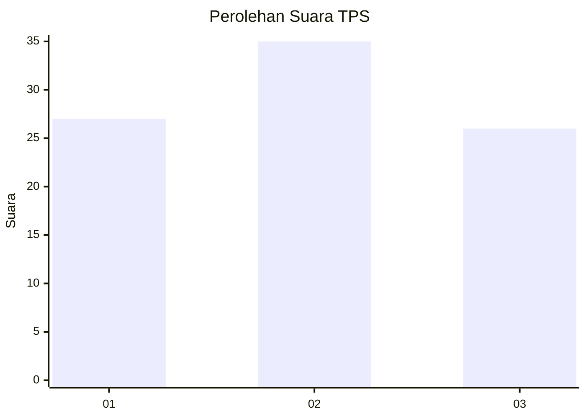
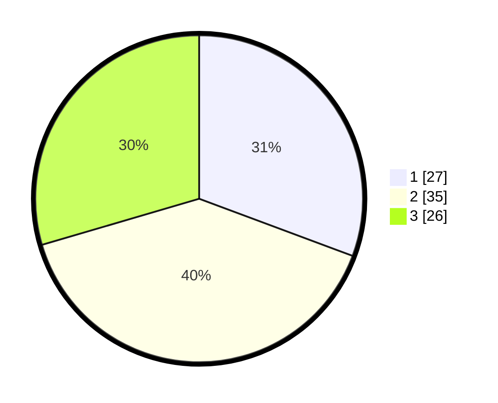

# Hasil

## Grafik

## Tabel

| No. | Nama Paslon    | Suara | Suara (raw) | Persentase |
|:--- |:-------------- | -----:| -----------:| ----------:|
| 1   | ANIES MUHAIMIN | 27    | [27][p-1]   | 30,68      |
| 2   | PRABOWO GIBRAN | 35    | [35][p-2]   | 39,77      |
| 3   | GANJAR MAHFUD  | 26    | [26][p-3]   | 29,55      |

[p-1]: https://github.com/gigit-pemilu/pemilu-2024-32-jawa-barat/blob/main/pilpres/hitung-suara/sub/32-jawa-barat/sub/04-bandung/sub/08-bojongsoang/sub/2004-cipagalo/sub/032-tps/sub/paslon-1.txt
[p-2]: https://github.com/gigit-pemilu/pemilu-2024-32-jawa-barat/blob/main/pilpres/hitung-suara/sub/32-jawa-barat/sub/04-bandung/sub/08-bojongsoang/sub/2004-cipagalo/sub/032-tps/sub/paslon-2.txt
[p-3]: https://github.com/gigit-pemilu/pemilu-2024-32-jawa-barat/blob/main/pilpres/hitung-suara/sub/32-jawa-barat/sub/04-bandung/sub/08-bojongsoang/sub/2004-cipagalo/sub/032-tps/sub/paslon-3.txt

## Foto C Plano

https://sirekap-obj-formc.kpu.go.id/9891/pemilu/ppwp/32/04/08/20/04/3204082004032-20240223-145745--081bdfbc-de26-4ece-a952-5bddc1a83248.jpg

https://sirekap-obj-formc.kpu.go.id/9891/pemilu/ppwp/32/04/08/20/04/3204082004032-20240223-145538--149705c1-9892-47f5-8ef5-eee4faac9c61.jpg

https://sirekap-obj-formc.kpu.go.id/9891/pemilu/ppwp/32/04/08/20/04/3204082004032-20240223-145632--7fe6647f-f3d2-477c-ac6a-3d1d14c8e4e0.jpg

## Metadata

| Key        | Value               |
| ---------- | ------------------- |
| Time Stamp | 2024-02-24 22:31:28 |

## DATA PEMILIH TETAP

Jumlah pemilih dalam DPT: **0**.
 * L: **200**.
 * P: **505**.

## DATA PENGGUNA HAK PILIH

Jumlah pengguna hak pilih dalam DPT: **500**.
 * L: **225**.
 * P: **200**.

Jumlah pengguna hak pilih dalam DPTb: **40**.
 * L: **748**.
 * P: **744**.

Jumlah pengguna hak pilih dalam DPK: **40**.
 * L: **470**.
 * P: **747**.

Jumlah pengguna hak pilih: **348**.
 * L: **448**.
 * P: **764**.

## JUMLAH SUARA SAH DAN TIDAK SAH

JUMLAH SELURUH SUARA SAH: **274**.

JUMLAH SUARA TIDAK SAH: **4**.

JUMLAH SELURUH SUARA SAH DAN SUARA TIDAK SAH: **223**.

