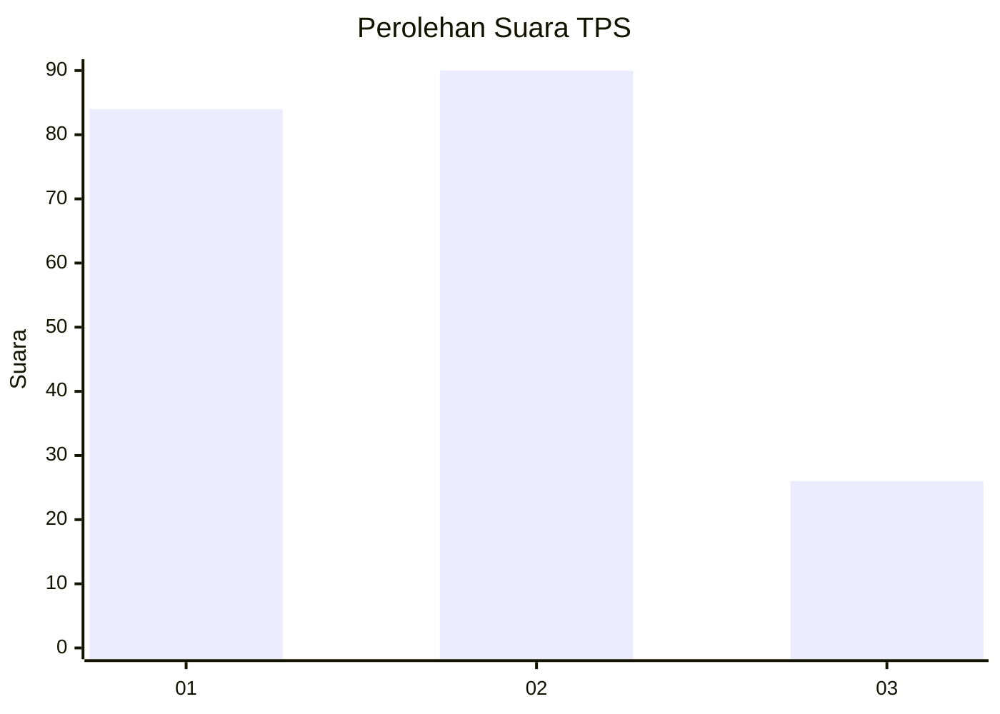
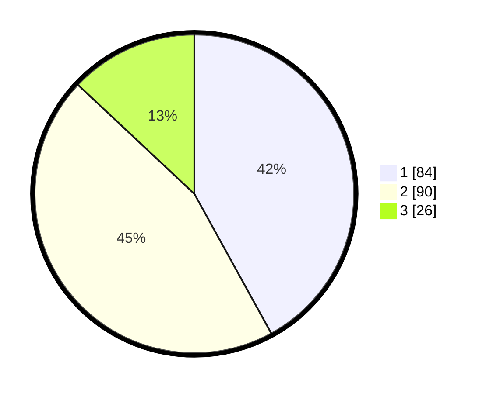

# Hasil

## Grafik

## Tabel

| No. | Nama Paslon    | Suara | Suara (raw) | Persentase |
|:--- |:-------------- | -----:| -----------:| ----------:|
| 1   | ANIES MUHAIMIN | 84    | [84][p-1]   | 42,00      |
| 2   | PRABOWO GIBRAN | 90    | [90][p-2]   | 45,00      |
| 3   | GANJAR MAHFUD  | 26    | [26][p-3]   | 13,00      |

[p-1]: https://github.com/gigit-pemilu/pemilu-2024-32-jawa-barat/blob/main/pilpres/hitung-suara/sub/32-jawa-barat/sub/04-bandung/sub/09-margahayu/sub/1004-sulaiman/sub/008-tps/sub/paslon-1.txt
[p-2]: https://github.com/gigit-pemilu/pemilu-2024-32-jawa-barat/blob/main/pilpres/hitung-suara/sub/32-jawa-barat/sub/04-bandung/sub/09-margahayu/sub/1004-sulaiman/sub/008-tps/sub/paslon-2.txt
[p-3]: https://github.com/gigit-pemilu/pemilu-2024-32-jawa-barat/blob/main/pilpres/hitung-suara/sub/32-jawa-barat/sub/04-bandung/sub/09-margahayu/sub/1004-sulaiman/sub/008-tps/sub/paslon-3.txt

## Foto C Plano

https://sirekap-obj-formc.kpu.go.id/4232/pemilu/ppwp/32/04/09/10/04/3204091004008-20240223-151355--3b30d002-afe3-4386-a99c-59a3eaec4083.jpg

https://sirekap-obj-formc.kpu.go.id/4232/pemilu/ppwp/32/04/09/10/04/3204091004008-20240223-152032--9366d20a-77f4-4556-b48f-07725eaddbbc.jpg

https://sirekap-obj-formc.kpu.go.id/4232/pemilu/ppwp/32/04/09/10/04/3204091004008-20240223-152214--bfcae3ae-b523-4800-8c7e-2f25c6580008.jpg

## Metadata

| Key        | Value               |
| ---------- | ------------------- |
| Time Stamp | 2024-02-24 22:31:28 |

## DATA PEMILIH TETAP

Jumlah pemilih dalam DPT: **112**.
 * L: **451**.
 * P: **742**.

## DATA PENGGUNA HAK PILIH

Jumlah pengguna hak pilih dalam DPT: **21**.
 * L: **51**.
 * P: **222**.

Jumlah pengguna hak pilih dalam DPTb: **0**.
 * L: **22**.
 * P: **500**.

Jumlah pengguna hak pilih dalam DPK: **7**.
 * L: **5**.
 * P: **5**.

Jumlah pengguna hak pilih: **125**.
 * L: **0**.
 * P: **209**.

## JUMLAH SUARA SAH DAN TIDAK SAH

JUMLAH SELURUH SUARA SAH: **205**.

JUMLAH SUARA TIDAK SAH: **4**.

JUMLAH SELURUH SUARA SAH DAN SUARA TIDAK SAH: **209**.

