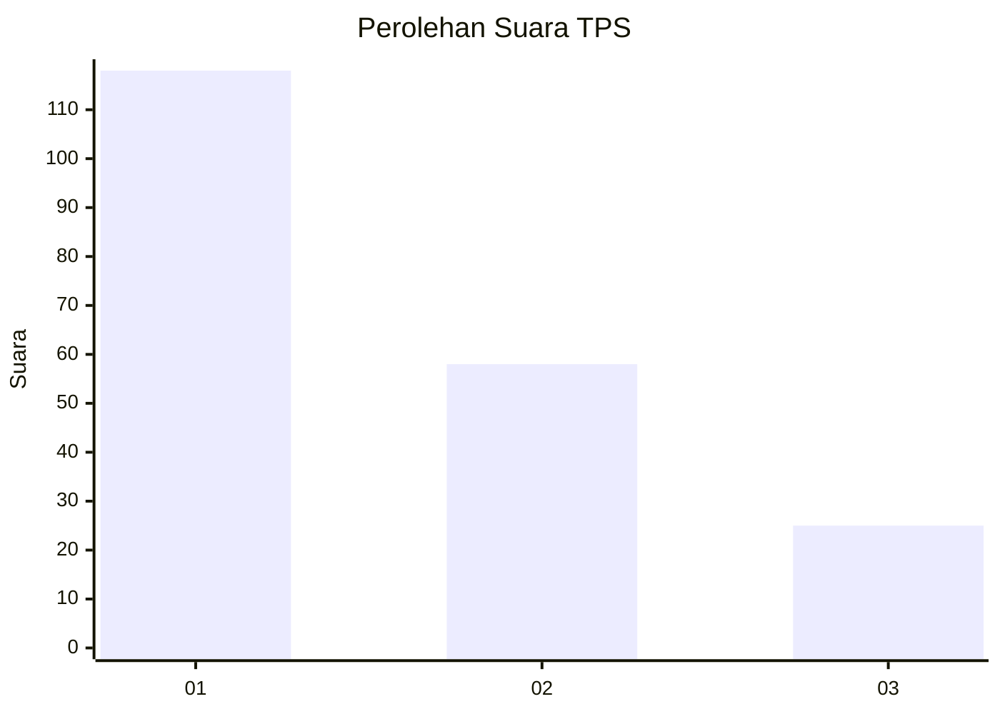
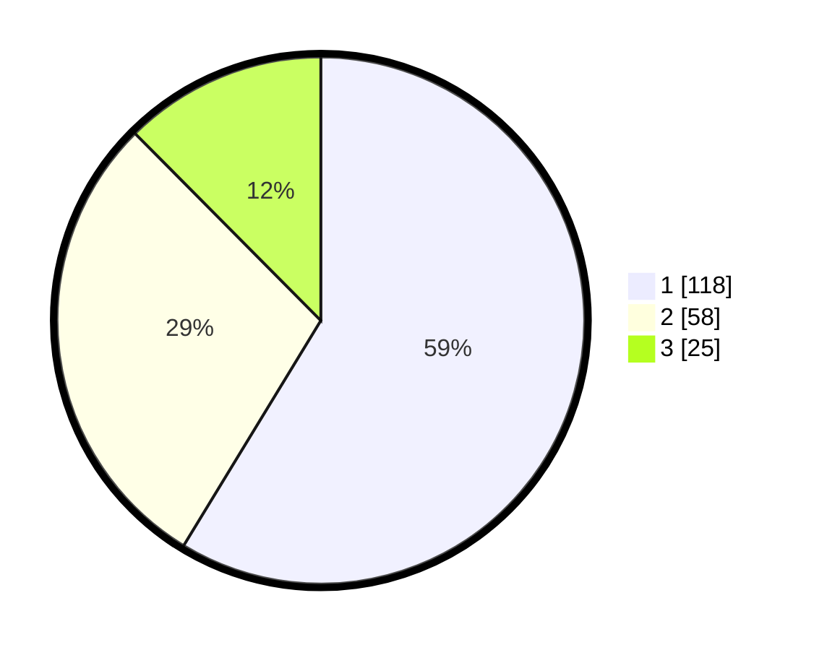

# Hasil

## Grafik

## Tabel

| No. | Nama Paslon    | Suara | Suara (raw) | Persentase |
|:--- |:-------------- | -----:| -----------:| ----------:|
| 1   | ANIES MUHAIMIN | 118   | [118][p-1]  | 58,71      |
| 2   | PRABOWO GIBRAN | 58    | [58][p-2]   | 28,86      |
| 3   | GANJAR MAHFUD  | 25    | [25][p-3]   | 12,44      |

[p-1]: https://github.com/gigit-pemilu/pemilu-2024/blob/main/pilpres/hitung-suara/sub/32-jawa-barat/sub/04-bandung/sub/09-margahayu/sub/2005-sayati/sub/006-tps/sub/paslon-1.txt
[p-2]: https://github.com/gigit-pemilu/pemilu-2024/blob/main/pilpres/hitung-suara/sub/32-jawa-barat/sub/04-bandung/sub/09-margahayu/sub/2005-sayati/sub/006-tps/sub/paslon-2.txt
[p-3]: https://github.com/gigit-pemilu/pemilu-2024/blob/main/pilpres/hitung-suara/sub/32-jawa-barat/sub/04-bandung/sub/09-margahayu/sub/2005-sayati/sub/006-tps/sub/paslon-3.txt

## Foto C Plano

https://sirekap-obj-formc.kpu.go.id/8040/pemilu/ppwp/32/04/09/20/05/3204092005006-20240215-053841--5bfe08a7-1c7d-4e52-a3cd-945a8b5f5365.jpg

https://sirekap-obj-formc.kpu.go.id/8040/pemilu/ppwp/32/04/09/20/05/3204092005006-20240214-202852--22c49fba-8ce7-41fc-9e97-d97bfdaccb9f.jpg

https://sirekap-obj-formc.kpu.go.id/8040/pemilu/ppwp/32/04/09/20/05/3204092005006-20240214-202859--9c610aa5-6036-4290-9b2d-6c21b3adeef6.jpg

## Metadata

| Key        | Value               |
| ---------- | ------------------- |
| Time Stamp | 2024-02-15 06:00:23 |

