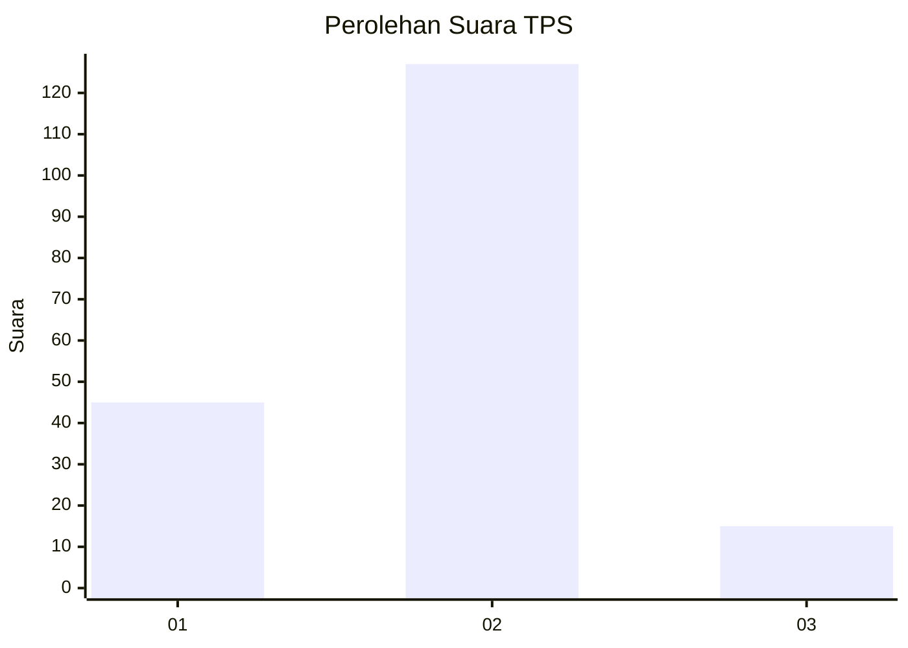
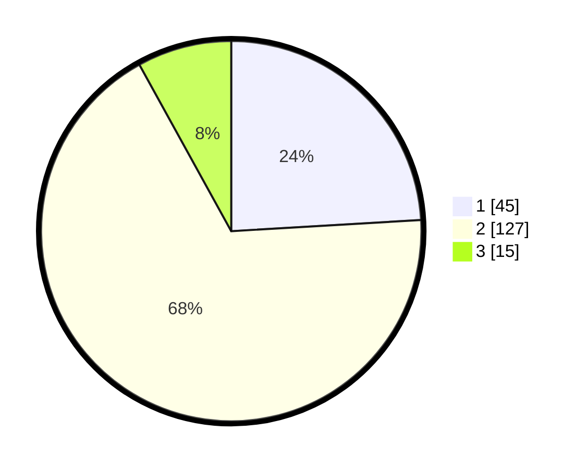

# Hasil

## Grafik

## Tabel

| No. | Nama Paslon    | Suara | Suara (raw) | Persentase |
|:--- |:-------------- | -----:| -----------:| ----------:|
| 1   | ANIES MUHAIMIN | 45    | [45][p-1]   | 24,06      |
| 2   | PRABOWO GIBRAN | 127   | [127][p-2]  | 67,91      |
| 3   | GANJAR MAHFUD  | 15    | [15][p-3]   | 8,02       |

[p-1]: https://github.com/gigit-pemilu/pemilu-2024-32-jawa-barat/blob/main/pilpres/hitung-suara/sub/32-jawa-barat/sub/04-bandung/sub/10-margaasih/sub/2001-margaasih/sub/005-tps/sub/paslon-1.txt
[p-2]: https://github.com/gigit-pemilu/pemilu-2024-32-jawa-barat/blob/main/pilpres/hitung-suara/sub/32-jawa-barat/sub/04-bandung/sub/10-margaasih/sub/2001-margaasih/sub/005-tps/sub/paslon-2.txt
[p-3]: https://github.com/gigit-pemilu/pemilu-2024-32-jawa-barat/blob/main/pilpres/hitung-suara/sub/32-jawa-barat/sub/04-bandung/sub/10-margaasih/sub/2001-margaasih/sub/005-tps/sub/paslon-3.txt

## Foto C Plano

https://sirekap-obj-formc.kpu.go.id/3b6b/pemilu/ppwp/32/04/10/20/01/3204102001005-20240225-191141--6cc49697-a54a-4b57-bf0b-0629b8cda1ee.jpg

https://sirekap-obj-formc.kpu.go.id/3b6b/pemilu/ppwp/32/04/10/20/01/3204102001005-20240225-185705--1b36186b-a8a4-4c7e-8d19-37328fac1fc8.jpg

https://sirekap-obj-formc.kpu.go.id/3b6b/pemilu/ppwp/32/04/10/20/01/3204102001005-20240225-190940--08ec585d-1d40-4ec9-beea-ccd88460c1da.jpg

## Metadata

| Key        | Value               |
| ---------- | ------------------- |
| Time Stamp | 2024-02-26 11:00:00 |

