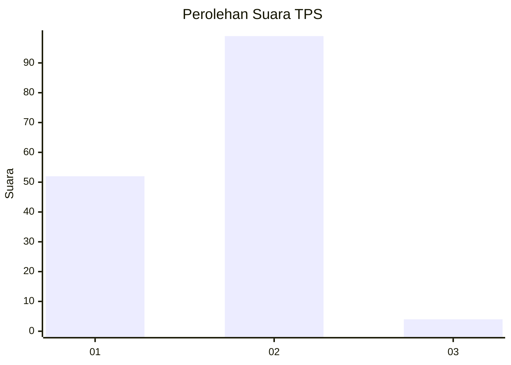
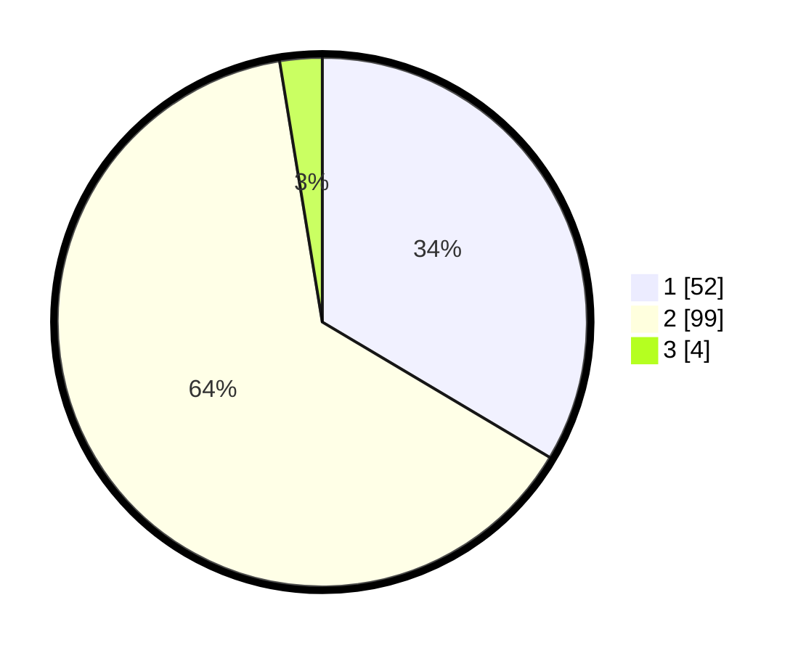

# Hasil

## Grafik

## Tabel

| No. | Nama Paslon    | Suara | Suara (raw) | Persentase |
|:--- |:-------------- | -----:| -----------:| ----------:|
| 1   | ANIES MUHAIMIN | 52    | [52][p-1]   | 33,55      |
| 2   | PRABOWO GIBRAN | 99    | [99][p-2]   | 63,87      |
| 3   | GANJAR MAHFUD  | 4     | [4][p-3]    | 2,58       |

[p-1]: https://github.com/gigit-pemilu/pemilu-2024/blob/main/pilpres/hitung-suara/sub/32-jawa-barat/sub/04-bandung/sub/10-margaasih/sub/2001-margaasih/sub/031-tps/sub/paslon-1.txt
[p-2]: https://github.com/gigit-pemilu/pemilu-2024/blob/main/pilpres/hitung-suara/sub/32-jawa-barat/sub/04-bandung/sub/10-margaasih/sub/2001-margaasih/sub/031-tps/sub/paslon-2.txt
[p-3]: https://github.com/gigit-pemilu/pemilu-2024/blob/main/pilpres/hitung-suara/sub/32-jawa-barat/sub/04-bandung/sub/10-margaasih/sub/2001-margaasih/sub/031-tps/sub/paslon-3.txt

## Foto C Plano

https://sirekap-obj-formc.kpu.go.id/23d8/pemilu/ppwp/32/04/10/20/01/3204102001031-20240226-173428--fb8de68e-032b-407e-a0a1-00afc6ccd481.jpg

https://sirekap-obj-formc.kpu.go.id/23d8/pemilu/ppwp/32/04/10/20/01/3204102001031-20240226-173502--bc65cd4d-c744-49dc-9300-0c2a96a15ace.jpg

https://sirekap-obj-formc.kpu.go.id/23d8/pemilu/ppwp/32/04/10/20/01/3204102001031-20240226-173527--8093e7cc-c9f7-4b3a-9e94-0010a3994c7b.jpg

## Metadata

| Key        | Value               |
| ---------- | ------------------- |
| Time Stamp | 2024-02-26 18:00:00 |

## DATA PEMILIH TETAP

Jumlah pemilih dalam DPT: **238**.
 * L: **449**.
 * P: **849**.

## DATA PENGGUNA HAK PILIH

Jumlah pengguna hak pilih dalam DPT: **654**.
 * L: **873**.
 * P: **887**.

Jumlah pengguna hak pilih dalam DPTb: **888**.
 * L: **888**.
 * P: **888**.

Jumlah pengguna hak pilih dalam DPK: **888**.
 * L: **883**.
 * P: **880**.

Jumlah pengguna hak pilih: **463**.
 * L: **875**.
 * P: **884**.

## JUMLAH SUARA SAH DAN TIDAK SAH

JUMLAH SELURUH SUARA SAH: **655**.

JUMLAH SUARA TIDAK SAH: **888**.

JUMLAH SELURUH SUARA SAH DAN SUARA TIDAK SAH: **83**.

