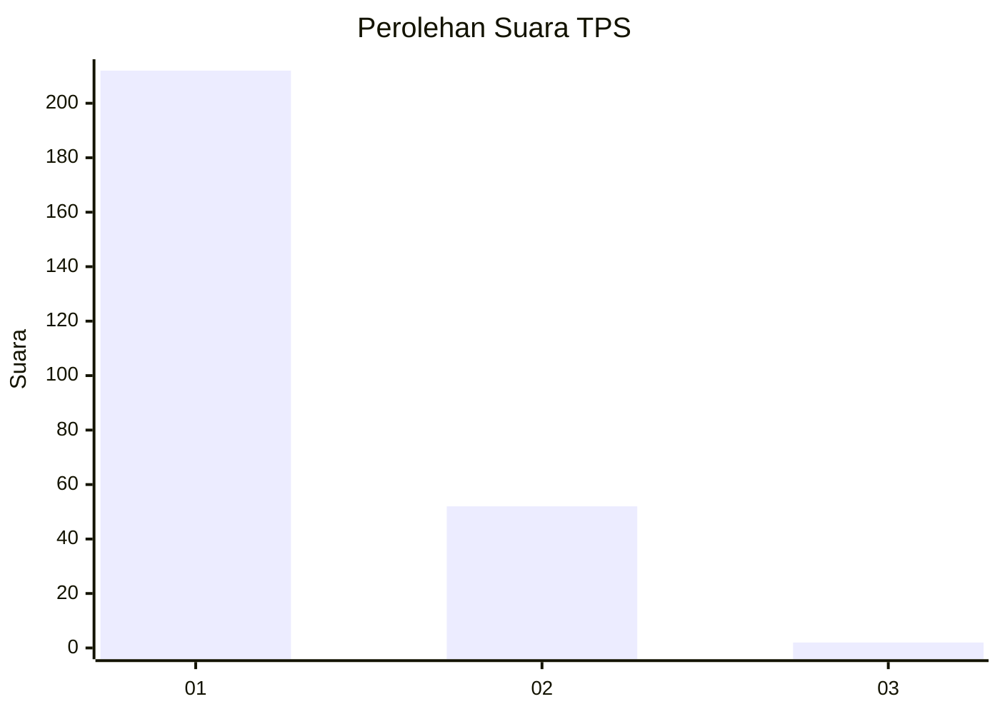
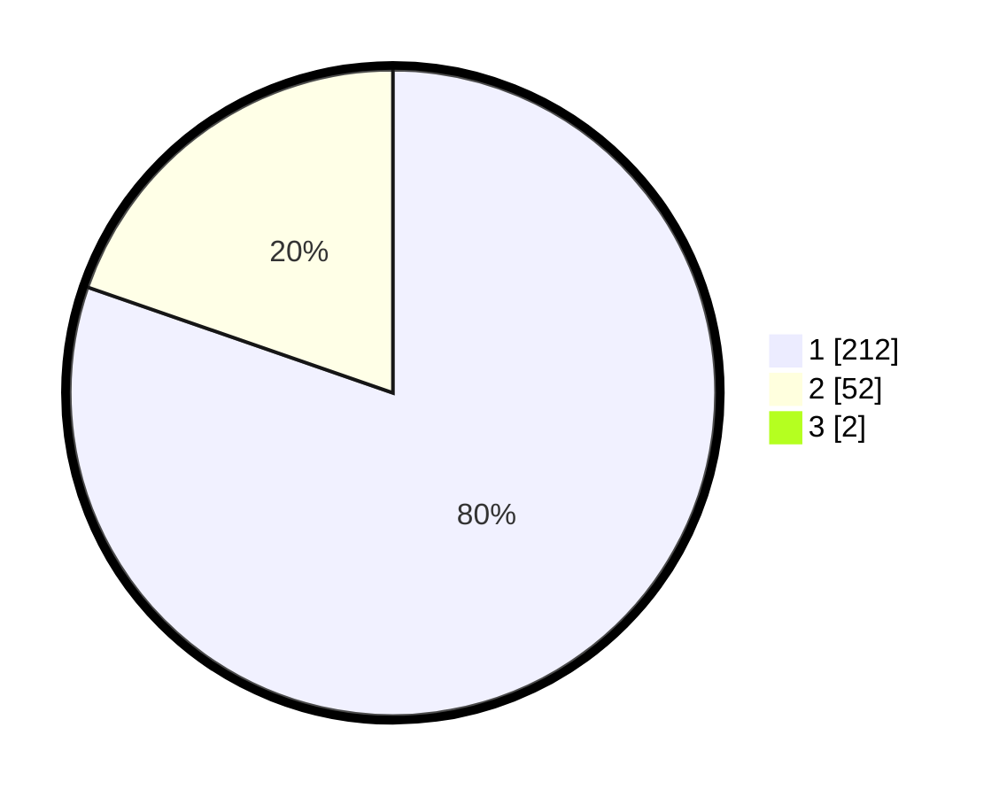

# Hasil

## Grafik

## Tabel

| No. | Nama Paslon    | Suara | Suara (raw) | Persentase |
|:--- |:-------------- | -----:| -----------:| ----------:|
| 1   | ANIES MUHAIMIN | 212   | [212][p-1]  | 79,70      |
| 2   | PRABOWO GIBRAN | 52    | [52][p-2]   | 19,55      |
| 3   | GANJAR MAHFUD  | 2     | [2][p-3]    | 0,75       |

[p-1]: https://github.com/gigit-pemilu/pemilu-2024-32-jawa-barat/blob/main/pilpres/hitung-suara/sub/32-jawa-barat/sub/04-bandung/sub/10-margaasih/sub/2005-rahayu/sub/032-tps/sub/paslon-1.txt
[p-2]: https://github.com/gigit-pemilu/pemilu-2024-32-jawa-barat/blob/main/pilpres/hitung-suara/sub/32-jawa-barat/sub/04-bandung/sub/10-margaasih/sub/2005-rahayu/sub/032-tps/sub/paslon-2.txt
[p-3]: https://github.com/gigit-pemilu/pemilu-2024-32-jawa-barat/blob/main/pilpres/hitung-suara/sub/32-jawa-barat/sub/04-bandung/sub/10-margaasih/sub/2005-rahayu/sub/032-tps/sub/paslon-3.txt

## Foto C Plano

https://sirekap-obj-formc.kpu.go.id/b2a5/pemilu/ppwp/32/04/10/20/05/3204102005032-20240223-202107--d1a3a637-b8a1-4f21-864d-da745ce80d0d.jpg

https://sirekap-obj-formc.kpu.go.id/b2a5/pemilu/ppwp/32/04/10/20/05/3204102005032-20240223-202448--74331363-262e-4870-906b-149f0059fa56.jpg

https://sirekap-obj-formc.kpu.go.id/b2a5/pemilu/ppwp/32/04/10/20/05/3204102005032-20240220-121910--106d1111-4145-4738-9b54-3eeffdc34988.jpg

## Metadata

| Key        | Value               |
| ---------- | ------------------- |
| Time Stamp | 2024-02-24 22:31:28 |

