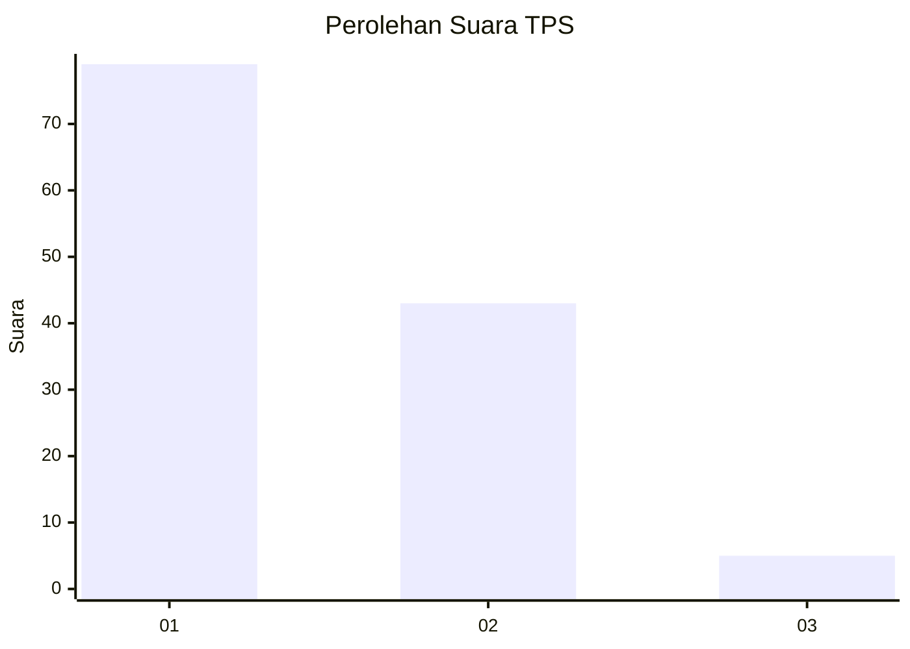
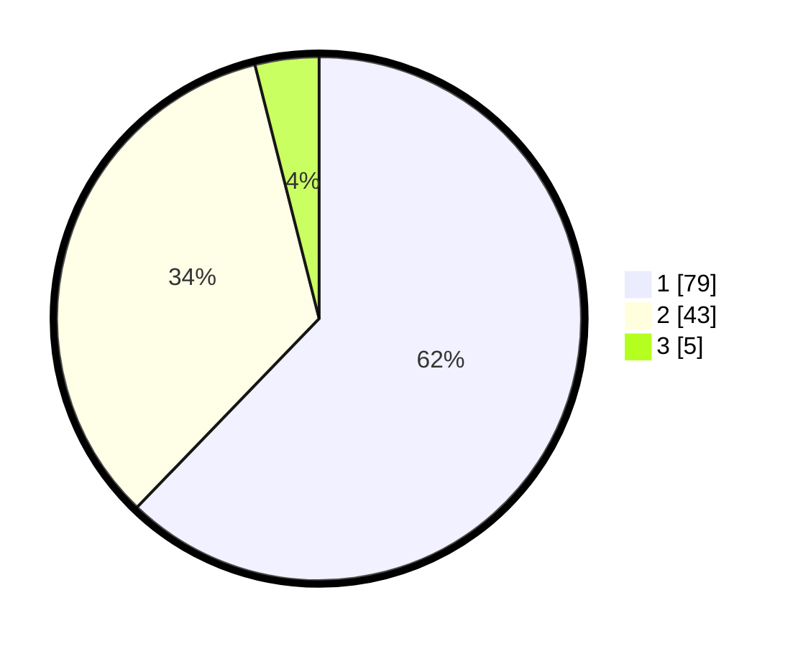

# Hasil

## Grafik

## Tabel

| No. | Nama Paslon    | Suara | Suara (raw) | Persentase |
|:--- |:-------------- | -----:| -----------:| ----------:|
| 1   | ANIES MUHAIMIN | 79    | [79][p-1]   | 62,20      |
| 2   | PRABOWO GIBRAN | 43    | [43][p-2]   | 33,86      |
| 3   | GANJAR MAHFUD  | 5     | [5][p-3]    | 3,94       |

[p-1]: https://github.com/gigit-pemilu/pemilu-2024-32-jawa-barat/blob/main/pilpres/hitung-suara/sub/32-jawa-barat/sub/04-bandung/sub/10-margaasih/sub/2006-cigondewah-hilir/sub/024-tps/sub/paslon-1.txt
[p-2]: https://github.com/gigit-pemilu/pemilu-2024-32-jawa-barat/blob/main/pilpres/hitung-suara/sub/32-jawa-barat/sub/04-bandung/sub/10-margaasih/sub/2006-cigondewah-hilir/sub/024-tps/sub/paslon-2.txt
[p-3]: https://github.com/gigit-pemilu/pemilu-2024-32-jawa-barat/blob/main/pilpres/hitung-suara/sub/32-jawa-barat/sub/04-bandung/sub/10-margaasih/sub/2006-cigondewah-hilir/sub/024-tps/sub/paslon-3.txt

## Foto C Plano

https://sirekap-obj-formc.kpu.go.id/dc24/pemilu/ppwp/32/04/10/20/06/3204102006024-20240224-112504--e1ecabaa-a62a-4baf-bce2-28c567256f88.jpg

https://sirekap-obj-formc.kpu.go.id/dc24/pemilu/ppwp/32/04/10/20/06/3204102006024-20240224-112626--1fc22418-c9eb-4f76-83fa-dd5c6cce0717.jpg

https://sirekap-obj-formc.kpu.go.id/dc24/pemilu/ppwp/32/04/10/20/06/3204102006024-20240224-112854--19191499-df1b-4554-9bdc-8662d57ff396.jpg

## Metadata

| Key        | Value               |
| ---------- | ------------------- |
| Time Stamp | 2024-02-26 11:00:00 |

