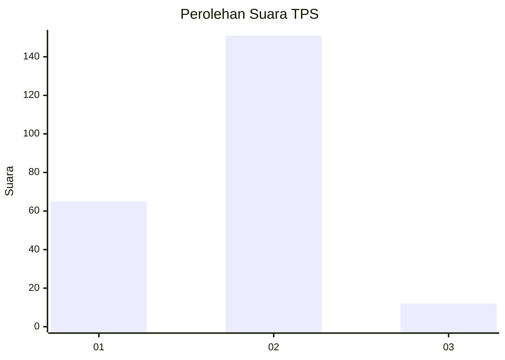
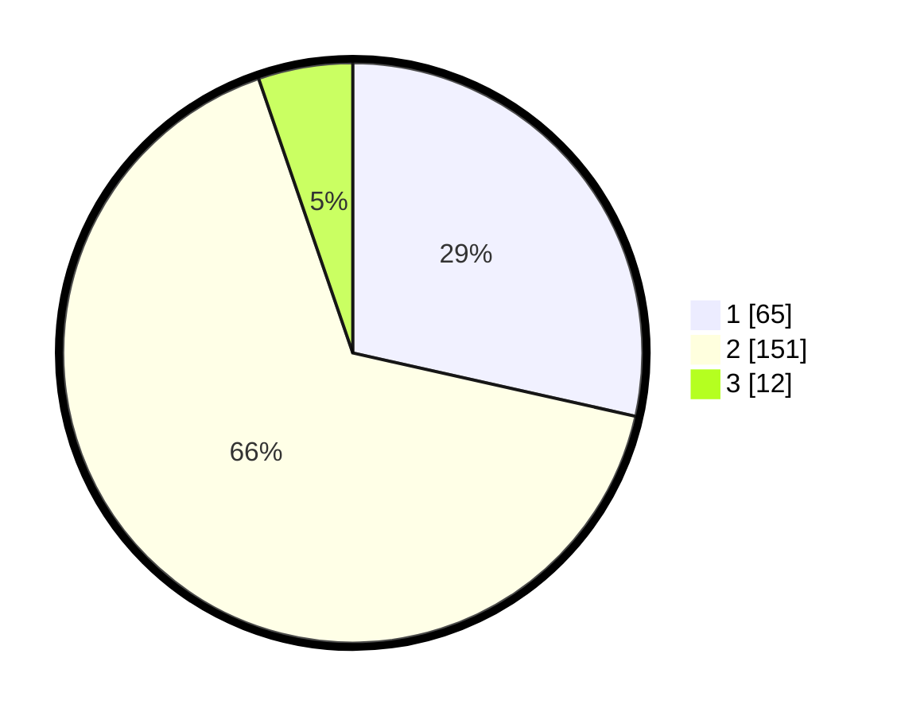

# Hasil

## Grafik

## Tabel

| No. | Nama Paslon    | Suara | Suara (raw) | Persentase |
|:--- |:-------------- | -----:| -----------:| ----------:|
| 1   | ANIES MUHAIMIN | 65    | [65][p-1]   | 28,51      |
| 2   | PRABOWO GIBRAN | 151   | [151][p-2]  | 66,23      |
| 3   | GANJAR MAHFUD  | 12    | [12][p-3]   | 5,26       |

[p-1]: https://github.com/gigit-pemilu/pemilu-2024-32-jawa-barat/blob/main/pilpres/hitung-suara/sub/32-jawa-barat/sub/04-bandung/sub/11-katapang/sub/2001-sangkanhurip/sub/002-tps/sub/paslon-1.txt
[p-2]: https://github.com/gigit-pemilu/pemilu-2024-32-jawa-barat/blob/main/pilpres/hitung-suara/sub/32-jawa-barat/sub/04-bandung/sub/11-katapang/sub/2001-sangkanhurip/sub/002-tps/sub/paslon-2.txt
[p-3]: https://github.com/gigit-pemilu/pemilu-2024-32-jawa-barat/blob/main/pilpres/hitung-suara/sub/32-jawa-barat/sub/04-bandung/sub/11-katapang/sub/2001-sangkanhurip/sub/002-tps/sub/paslon-3.txt

## Foto C Plano

https://sirekap-obj-formc.kpu.go.id/7174/pemilu/ppwp/32/04/11/20/01/3204112001002-20240225-143543--dc31389b-5c43-433e-a5fb-aa454804d146.jpg

https://sirekap-obj-formc.kpu.go.id/7174/pemilu/ppwp/32/04/11/20/01/3204112001002-20240225-142952--5e81ca66-12b6-48c5-aedf-5fd2178c2032.jpg

https://sirekap-obj-formc.kpu.go.id/7174/pemilu/ppwp/32/04/11/20/01/3204112001002-20240225-143232--a9c052b0-159c-4efe-8b48-22fde858ba85.jpg

## Metadata

| Key        | Value               |
| ---------- | ------------------- |
| Time Stamp | 2024-02-25 18:00:00 |

