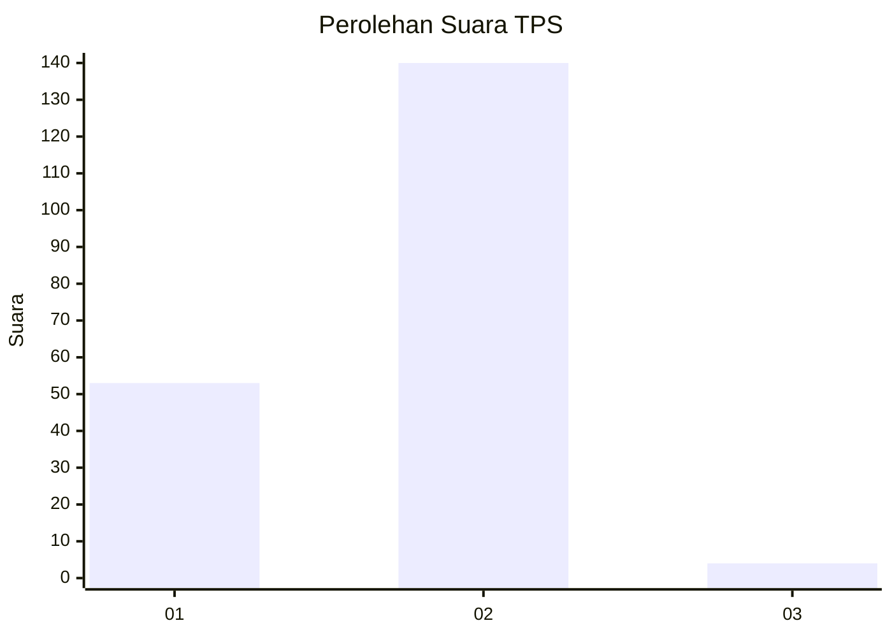
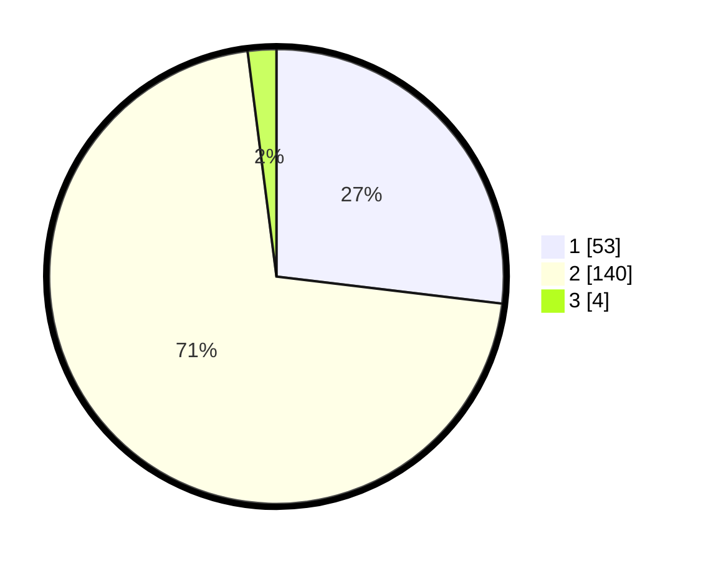

# Hasil

## Grafik

## Tabel

| No. | Nama Paslon    | Suara | Suara (raw) | Persentase |
|:--- |:-------------- | -----:| -----------:| ----------:|
| 1   | ANIES MUHAIMIN | 53    | [53][p-1]   | 26,90      |
| 2   | PRABOWO GIBRAN | 140   | [140][p-2]  | 71,07      |
| 3   | GANJAR MAHFUD  | 4     | [4][p-3]    | 2,03       |

[p-1]: https://github.com/gigit-pemilu/pemilu-2024-32-jawa-barat/blob/main/pilpres/hitung-suara/sub/32-jawa-barat/sub/04-bandung/sub/11-katapang/sub/2001-sangkanhurip/sub/004-tps/sub/paslon-1.txt
[p-2]: https://github.com/gigit-pemilu/pemilu-2024-32-jawa-barat/blob/main/pilpres/hitung-suara/sub/32-jawa-barat/sub/04-bandung/sub/11-katapang/sub/2001-sangkanhurip/sub/004-tps/sub/paslon-2.txt
[p-3]: https://github.com/gigit-pemilu/pemilu-2024-32-jawa-barat/blob/main/pilpres/hitung-suara/sub/32-jawa-barat/sub/04-bandung/sub/11-katapang/sub/2001-sangkanhurip/sub/004-tps/sub/paslon-3.txt

## Foto C Plano

https://sirekap-obj-formc.kpu.go.id/332b/pemilu/ppwp/32/04/11/20/01/3204112001004-20240225-214121--5eb14c43-a746-4391-8555-ef4846c67bdf.jpg

https://sirekap-obj-formc.kpu.go.id/332b/pemilu/ppwp/32/04/11/20/01/3204112001004-20240225-214250--57e39454-e7bb-46df-98a1-31aac89b3c53.jpg

https://sirekap-obj-formc.kpu.go.id/332b/pemilu/ppwp/32/04/11/20/01/3204112001004-20240225-214922--e9ae66d9-12ac-44c3-afe4-462a88b24a04.jpg

## Metadata

| Key        | Value               |
| ---------- | ------------------- |
| Time Stamp | 2024-02-26 11:00:00 |

