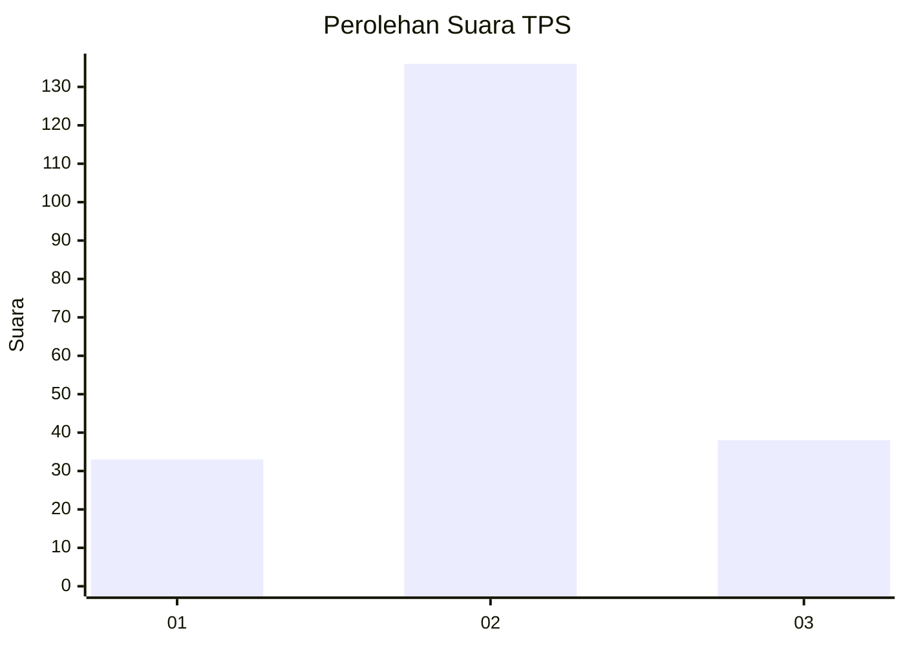
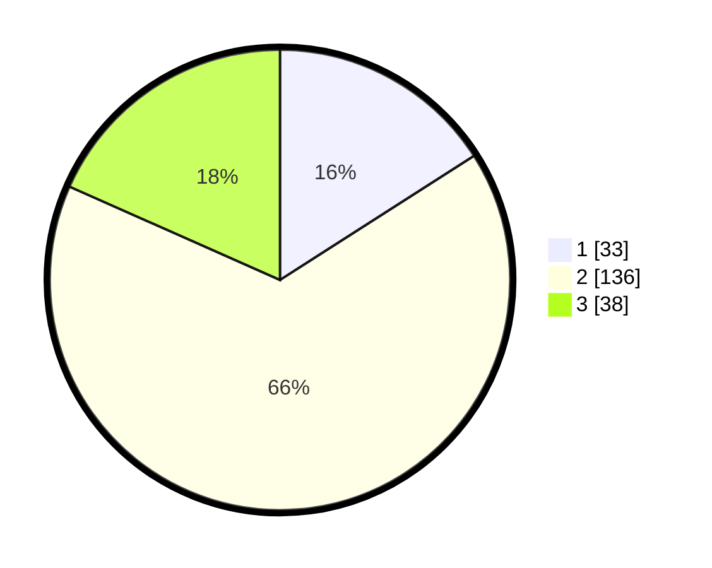

# Hasil

## Grafik

## Tabel

| No. | Nama Paslon    | Suara | Suara (raw) | Persentase |
|:--- |:-------------- | -----:| -----------:| ----------:|
| 1   | ANIES MUHAIMIN | 33    | [33][p-1]   | 15,94      |
| 2   | PRABOWO GIBRAN | 136   | [136][p-2]  | 65,70      |
| 3   | GANJAR MAHFUD  | 38    | [38][p-3]   | 18,36      |

[p-1]: https://github.com/gigit-pemilu/pemilu-2024/blob/main/pilpres/hitung-suara/sub/32-jawa-barat/sub/04-bandung/sub/12-dayeuhkolot/sub/1001-pasawahan/sub/028-tps/sub/paslon-1.txt
[p-2]: https://github.com/gigit-pemilu/pemilu-2024/blob/main/pilpres/hitung-suara/sub/32-jawa-barat/sub/04-bandung/sub/12-dayeuhkolot/sub/1001-pasawahan/sub/028-tps/sub/paslon-2.txt
[p-3]: https://github.com/gigit-pemilu/pemilu-2024/blob/main/pilpres/hitung-suara/sub/32-jawa-barat/sub/04-bandung/sub/12-dayeuhkolot/sub/1001-pasawahan/sub/028-tps/sub/paslon-3.txt

## Foto C Plano

https://sirekap-obj-formc.kpu.go.id/23df/pemilu/ppwp/32/04/12/10/01/3204121001028-20240223-193540--eb44d546-72df-4c18-818f-7a6d433c5ecc.jpg

https://sirekap-obj-formc.kpu.go.id/23df/pemilu/ppwp/32/04/12/10/01/3204121001028-20240223-194249--665927af-558e-44d3-9e33-71a6db4e9df6.jpg

https://sirekap-obj-formc.kpu.go.id/23df/pemilu/ppwp/32/04/12/10/01/3204121001028-20240223-194629--cf964997-71f2-43aa-9de0-e78f1c08a44b.jpg

## Metadata

| Key        | Value               |
| ---------- | ------------------- |
| Time Stamp | 2024-02-24 23:00:00 |

## DATA PEMILIH TETAP

Jumlah pemilih dalam DPT: **246**.
 * L: **429**.
 * P: **63**.

## DATA PENGGUNA HAK PILIH

Jumlah pengguna hak pilih dalam DPT: **208**.
 * L: **896**.
 * P: **642**.

Jumlah pengguna hak pilih dalam DPTb: **880**.
 * L: **880**.
 * P: **81**.

Jumlah pengguna hak pilih dalam DPK: **880**.
 * L: **83**.
 * P: **800**.

Jumlah pengguna hak pilih: **330**.
 * L: **835**.
 * P: **614**.

## JUMLAH SUARA SAH DAN TIDAK SAH

JUMLAH SELURUH SUARA SAH: **207**.

JUMLAH SUARA TIDAK SAH: **3**.

JUMLAH SELURUH SUARA SAH DAN SUARA TIDAK SAH: **210**.

