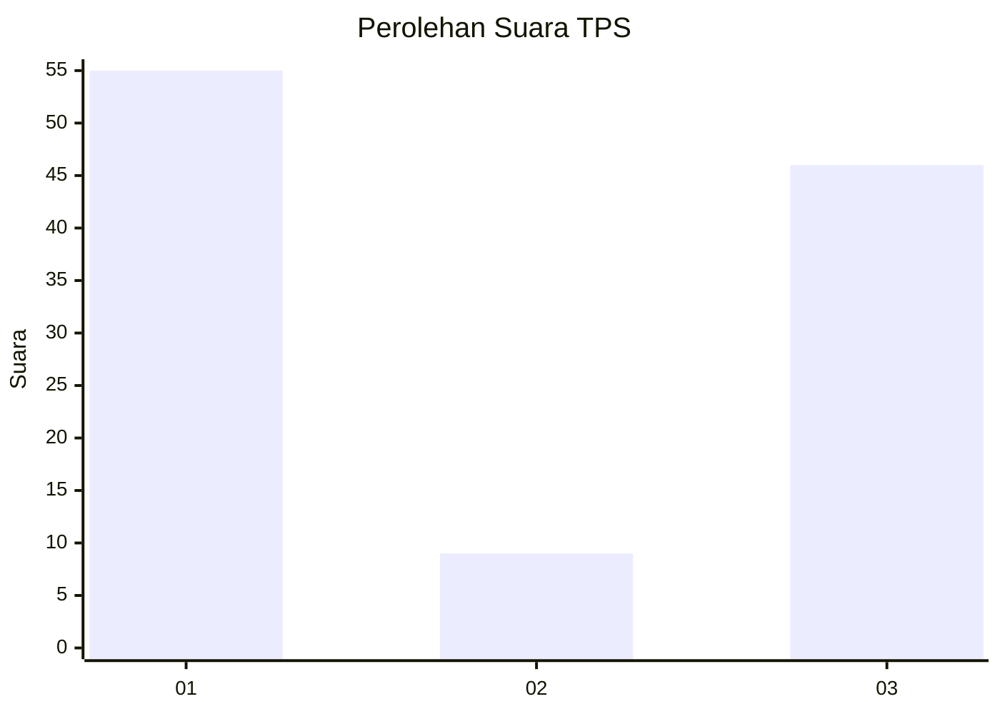
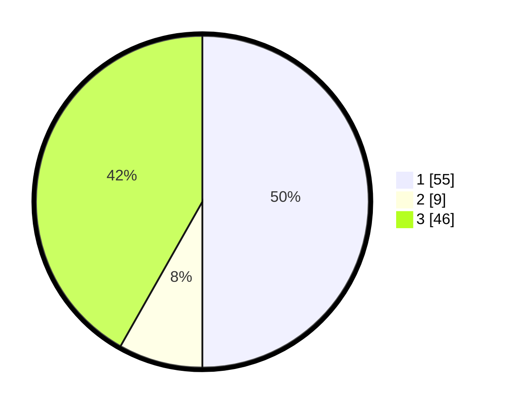

# Hasil

## Grafik

## Tabel

| No. | Nama Paslon    | Suara | Suara (raw) | Persentase |
|:--- |:-------------- | -----:| -----------:| ----------:|
| 1   | ANIES MUHAIMIN | 55    | [55][p-1]   | 50,00      |
| 2   | PRABOWO GIBRAN | 9     | [9][p-2]    | 8,18       |
| 3   | GANJAR MAHFUD  | 46    | [46][p-3]   | 41,82      |

[p-1]: https://github.com/gigit-pemilu/pemilu-2024/blob/main/pilpres/hitung-suara/sub/32-jawa-barat/sub/04-bandung/sub/12-dayeuhkolot/sub/2002-dayeuhkolot/sub/005-tps/sub/paslon-1.txt
[p-2]: https://github.com/gigit-pemilu/pemilu-2024/blob/main/pilpres/hitung-suara/sub/32-jawa-barat/sub/04-bandung/sub/12-dayeuhkolot/sub/2002-dayeuhkolot/sub/005-tps/sub/paslon-2.txt
[p-3]: https://github.com/gigit-pemilu/pemilu-2024/blob/main/pilpres/hitung-suara/sub/32-jawa-barat/sub/04-bandung/sub/12-dayeuhkolot/sub/2002-dayeuhkolot/sub/005-tps/sub/paslon-3.txt

## Foto C Plano

https://sirekap-obj-formc.kpu.go.id/6403/pemilu/ppwp/32/04/12/20/02/3204122002005-20240222-135455--d4b6a1b0-67df-4075-b8ed-258cec3188ce.jpg

https://sirekap-obj-formc.kpu.go.id/6403/pemilu/ppwp/32/04/12/20/02/3204122002005-20240222-135604--d6a8093c-c0d0-4453-bc35-cbe4dfaecf05.jpg

https://sirekap-obj-formc.kpu.go.id/6403/pemilu/ppwp/32/04/12/20/02/3204122002005-20240222-135744--94ab5652-7a91-428f-a880-c285e8cd4ee5.jpg

## Metadata

| Key        | Value               |
| ---------- | ------------------- |
| Time Stamp | 2024-02-22 14:00:00 |

## DATA PEMILIH TETAP

Jumlah pemilih dalam DPT: **232**.
 * L: **824**.
 * P: **898**.

## DATA PENGGUNA HAK PILIH

Jumlah pengguna hak pilih dalam DPT: **283**.
 * L: **897**.
 * P: **886**.

Jumlah pengguna hak pilih dalam DPTb: **486**.
 * L: **888**.
 * P: **886**.

Jumlah pengguna hak pilih dalam DPK: **888**.
 * L: **488**.
 * P: **888**.

Jumlah pengguna hak pilih: **834**.
 * L: **897**.
 * P: **887**.

## JUMLAH SUARA SAH DAN TIDAK SAH

JUMLAH SELURUH SUARA SAH: **680**.

JUMLAH SUARA TIDAK SAH: **4**.

JUMLAH SELURUH SUARA SAH DAN SUARA TIDAK SAH: **584**.

