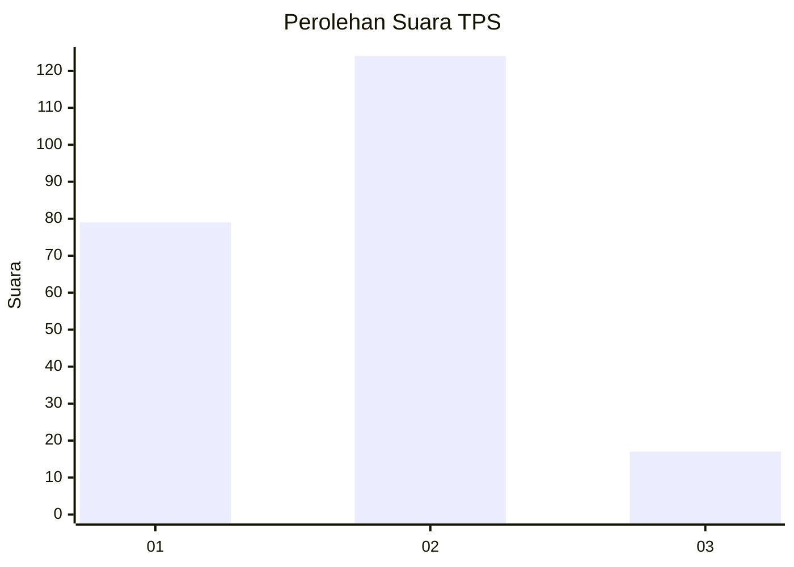

# Hasil

## Grafik

## Tabel

| No. | Nama Paslon    | Suara | Suara (raw) | Persentase |
|:--- |:-------------- | -----:| -----------:| ----------:|
| 1   | ANIES MUHAIMIN | 79    | [79][p-1]   | 35,91      |
| 2   | PRABOWO GIBRAN | 124   | [124][p-2]  | 56,36      |
| 3   | GANJAR MAHFUD  | 17    | [17][p-3]   | 7,73       |

[p-1]: https://github.com/gigit-pemilu/pemilu-2024-32-jawa-barat/blob/main/pilpres/hitung-suara/sub/32-jawa-barat/sub/04-bandung/sub/12-dayeuhkolot/sub/2003-cangkuang-wetan/sub/011-tps/sub/paslon-1.txt
[p-2]: https://github.com/gigit-pemilu/pemilu-2024-32-jawa-barat/blob/main/pilpres/hitung-suara/sub/32-jawa-barat/sub/04-bandung/sub/12-dayeuhkolot/sub/2003-cangkuang-wetan/sub/011-tps/sub/paslon-2.txt
[p-3]: https://github.com/gigit-pemilu/pemilu-2024-32-jawa-barat/blob/main/pilpres/hitung-suara/sub/32-jawa-barat/sub/04-bandung/sub/12-dayeuhkolot/sub/2003-cangkuang-wetan/sub/011-tps/sub/paslon-3.txt

## Foto C Plano

https://sirekap-obj-formc.kpu.go.id/d63c/pemilu/ppwp/32/04/12/20/03/3204122003011-20240224-202731--52534b8c-d7bd-4121-a053-7579d1c5bbf7.jpg

https://sirekap-obj-formc.kpu.go.id/d63c/pemilu/ppwp/32/04/12/20/03/3204122003011-20240224-202843--f521c47e-baa4-43b2-9ced-f335dc57c7b0.jpg

https://sirekap-obj-formc.kpu.go.id/d63c/pemilu/ppwp/32/04/12/20/03/3204122003011-20240224-202956--29067584-a471-40f6-80f1-cb81dd893c11.jpg

## Metadata

| Key        | Value               |
| ---------- | ------------------- |
| Time Stamp | 2024-02-24 22:31:28 |

## DATA PEMILIH TETAP

Jumlah pemilih dalam DPT: **275**.
 * L: **147**.
 * P: **132**.

## DATA PENGGUNA HAK PILIH

Jumlah pengguna hak pilih dalam DPT: **219**.
 * L: **113**.
 * P: **167**.

Jumlah pengguna hak pilih dalam DPTb: **1**.
 * L: **0**.
 * P: **701**.

Jumlah pengguna hak pilih dalam DPK: **404**.
 * L: **442**.
 * P: **442**.

Jumlah pengguna hak pilih: **224**.
 * L: **114**.
 * P: **150**.

## JUMLAH SUARA SAH DAN TIDAK SAH

JUMLAH SELURUH SUARA SAH: **220**.

JUMLAH SUARA TIDAK SAH: **444**.

JUMLAH SELURUH SUARA SAH DAN SUARA TIDAK SAH: **729**.

