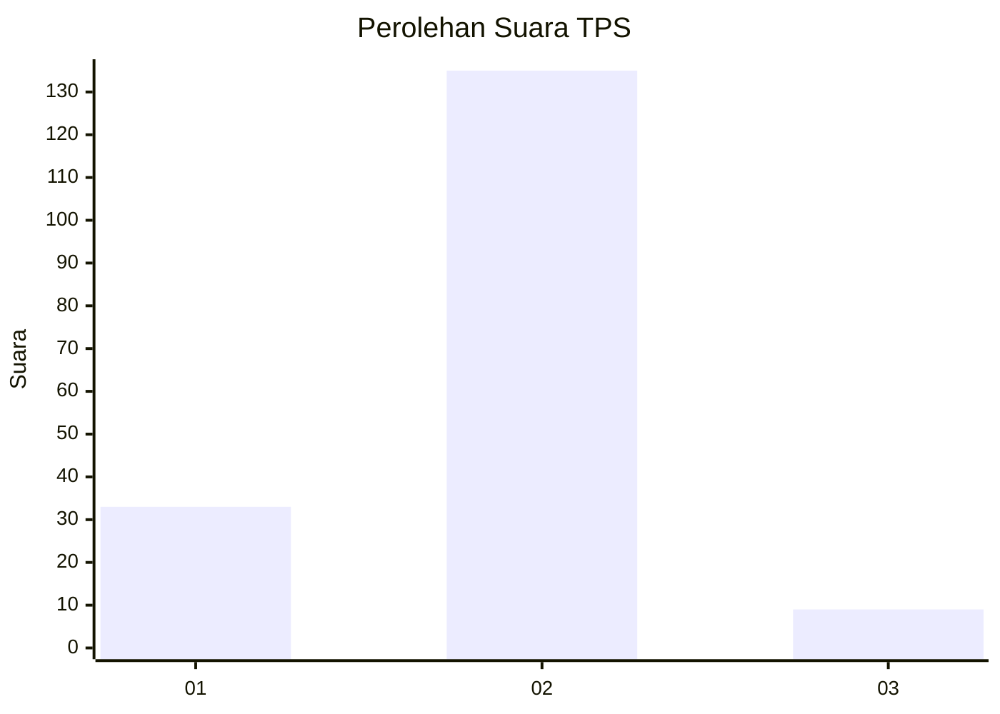
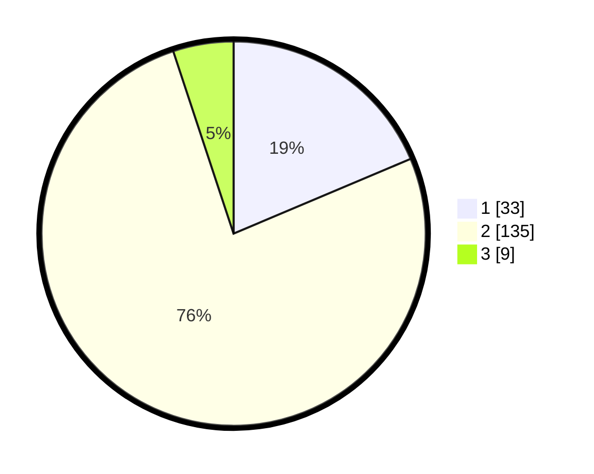

# Hasil

## Grafik

## Tabel

| No. | Nama Paslon    | Suara | Suara (raw) | Persentase |
|:--- |:-------------- | -----:| -----------:| ----------:|
| 1   | ANIES MUHAIMIN | 33    | [33][p-1]   | 18,64      |
| 2   | PRABOWO GIBRAN | 135   | [135][p-2]  | 76,27      |
| 3   | GANJAR MAHFUD  | 9     | [9][p-3]    | 5,08       |

[p-1]: https://github.com/gigit-pemilu/pemilu-2024-32-jawa-barat/blob/main/pilpres/hitung-suara/sub/32-jawa-barat/sub/04-bandung/sub/12-dayeuhkolot/sub/2003-cangkuang-wetan/sub/021-tps/sub/paslon-1.txt
[p-2]: https://github.com/gigit-pemilu/pemilu-2024-32-jawa-barat/blob/main/pilpres/hitung-suara/sub/32-jawa-barat/sub/04-bandung/sub/12-dayeuhkolot/sub/2003-cangkuang-wetan/sub/021-tps/sub/paslon-2.txt
[p-3]: https://github.com/gigit-pemilu/pemilu-2024-32-jawa-barat/blob/main/pilpres/hitung-suara/sub/32-jawa-barat/sub/04-bandung/sub/12-dayeuhkolot/sub/2003-cangkuang-wetan/sub/021-tps/sub/paslon-3.txt

## Foto C Plano

https://sirekap-obj-formc.kpu.go.id/8234/pemilu/ppwp/32/04/12/20/03/3204122003021-20240225-101559--50810597-3317-467c-ba07-c72b934b90fc.jpg

https://sirekap-obj-formc.kpu.go.id/8234/pemilu/ppwp/32/04/12/20/03/3204122003021-20240225-100729--1f576424-4ab1-4f81-be14-b02e5b842b59.jpg

https://sirekap-obj-formc.kpu.go.id/8234/pemilu/ppwp/32/04/12/20/03/3204122003021-20240225-101210--6e397c6b-ab35-4671-b525-f152eba19a08.jpg

## Metadata

| Key        | Value               |
| ---------- | ------------------- |
| Time Stamp | 2024-02-25 11:00:00 |

## DATA PEMILIH TETAP

Jumlah pemilih dalam DPT: **296**.
 * L: **195**.
 * P: **420**.

## DATA PENGGUNA HAK PILIH

Jumlah pengguna hak pilih dalam DPT: **876**.
 * L: **879**.
 * P: **897**.

Jumlah pengguna hak pilih dalam DPTb: **882**.
 * L: **888**.
 * P: **888**.

Jumlah pengguna hak pilih dalam DPK: **884**.
 * L: **888**.
 * P: **880**.

Jumlah pengguna hak pilih: **877**.
 * L: **879**.
 * P: **893**.

## JUMLAH SUARA SAH DAN TIDAK SAH

JUMLAH SELURUH SUARA SAH: **177**.

JUMLAH SUARA TIDAK SAH: **0**.

JUMLAH SELURUH SUARA SAH DAN SUARA TIDAK SAH: **177**.

