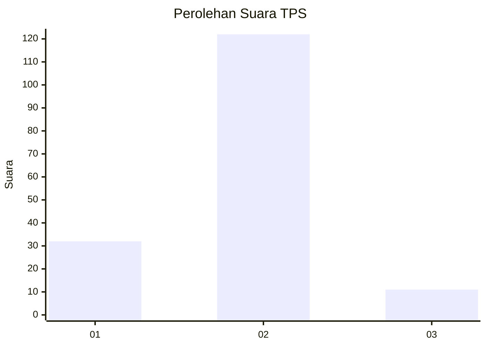
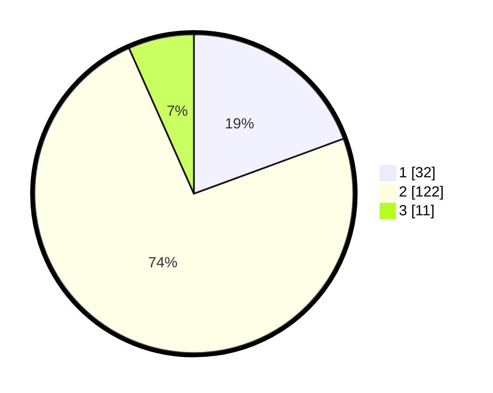

# Hasil

## Grafik

## Tabel

| No. | Nama Paslon    | Suara | Suara (raw) | Persentase |
|:--- |:-------------- | -----:| -----------:| ----------:|
| 1   | ANIES MUHAIMIN | 32    | [32][p-1]   | 19,39      |
| 2   | PRABOWO GIBRAN | 122   | [122][p-2]  | 73,94      |
| 3   | GANJAR MAHFUD  | 11    | [11][p-3]   | 6,67       |

[p-1]: https://github.com/gigit-pemilu/pemilu-2024-32-jawa-barat/blob/main/pilpres/hitung-suara/sub/32-jawa-barat/sub/04-bandung/sub/12-dayeuhkolot/sub/2003-cangkuang-wetan/sub/027-tps/sub/paslon-1.txt
[p-2]: https://github.com/gigit-pemilu/pemilu-2024-32-jawa-barat/blob/main/pilpres/hitung-suara/sub/32-jawa-barat/sub/04-bandung/sub/12-dayeuhkolot/sub/2003-cangkuang-wetan/sub/027-tps/sub/paslon-2.txt
[p-3]: https://github.com/gigit-pemilu/pemilu-2024-32-jawa-barat/blob/main/pilpres/hitung-suara/sub/32-jawa-barat/sub/04-bandung/sub/12-dayeuhkolot/sub/2003-cangkuang-wetan/sub/027-tps/sub/paslon-3.txt

## Foto C Plano

https://sirekap-obj-formc.kpu.go.id/4f05/pemilu/ppwp/32/04/12/20/03/3204122003027-20240225-103107--9b98620f-528f-4220-ab87-9806b0606677.jpg

https://sirekap-obj-formc.kpu.go.id/4f05/pemilu/ppwp/32/04/12/20/03/3204122003027-20240225-103315--b15d5df2-b7fd-496c-83d1-38f852c531c8.jpg

https://sirekap-obj-formc.kpu.go.id/4f05/pemilu/ppwp/32/04/12/20/03/3204122003027-20240225-103712--3b49f89e-a6e1-484c-bf16-919faab60997.jpg

## Metadata

| Key        | Value               |
| ---------- | ------------------- |
| Time Stamp | 2024-02-25 18:00:00 |

## DATA PEMILIH TETAP

Jumlah pemilih dalam DPT: **92**.
 * L: **804**.
 * P: **888**.

## DATA PENGGUNA HAK PILIH

Jumlah pengguna hak pilih dalam DPT: **669**.
 * L: **90**.
 * P: **879**.

Jumlah pengguna hak pilih dalam DPTb: **885**.
 * L: **488**.
 * P: **888**.

Jumlah pengguna hak pilih dalam DPK: **88**.
 * L: **808**.
 * P: **88**.

Jumlah pengguna hak pilih: **969**.
 * L: **840**.
 * P: **884**.

## JUMLAH SUARA SAH DAN TIDAK SAH

JUMLAH SELURUH SUARA SAH: **165**.

JUMLAH SUARA TIDAK SAH: **4**.

JUMLAH SELURUH SUARA SAH DAN SUARA TIDAK SAH: **169**.

