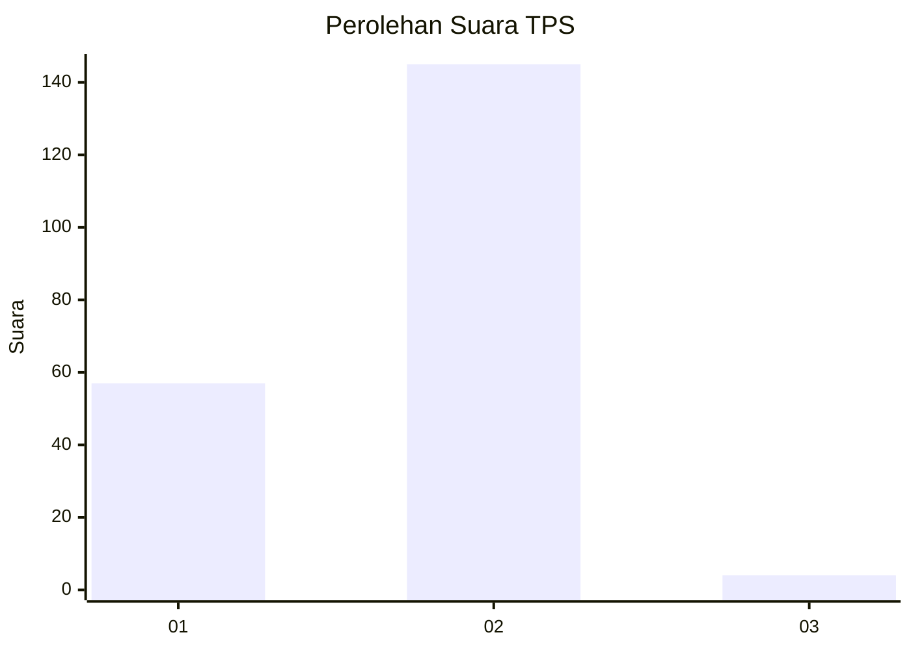
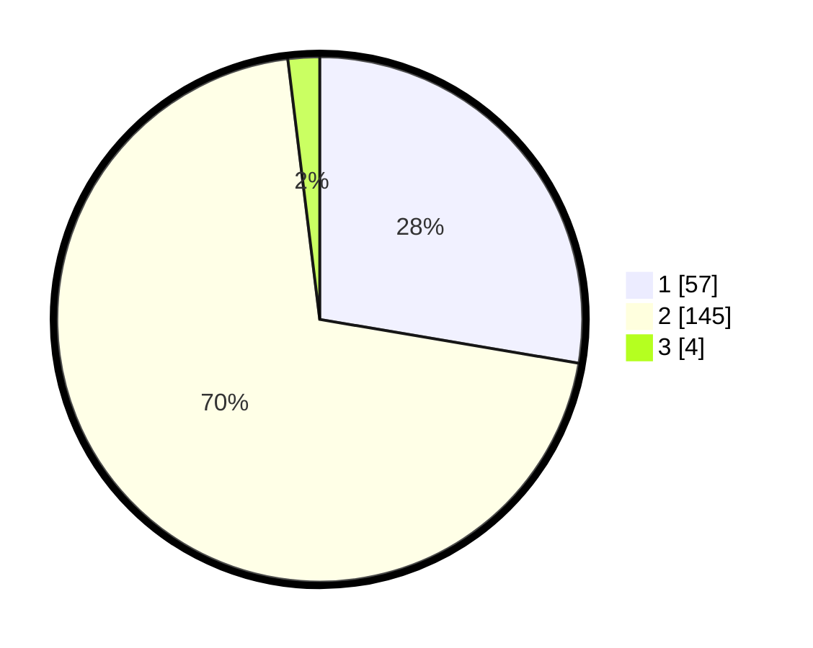

# Hasil

## Grafik

## Tabel

| No. | Nama Paslon    | Suara | Suara (raw) | Persentase |
|:--- |:-------------- | -----:| -----------:| ----------:|
| 1   | ANIES MUHAIMIN | 57    | [57][p-1]   | 27,67      |
| 2   | PRABOWO GIBRAN | 145   | [145][p-2]  | 70,39      |
| 3   | GANJAR MAHFUD  | 4     | [4][p-3]    | 1,94       |

[p-1]: https://github.com/gigit-pemilu/pemilu-2024-32-jawa-barat/blob/main/pilpres/hitung-suara/sub/32-jawa-barat/sub/04-bandung/sub/12-dayeuhkolot/sub/2003-cangkuang-wetan/sub/053-tps/sub/paslon-1.txt
[p-2]: https://github.com/gigit-pemilu/pemilu-2024-32-jawa-barat/blob/main/pilpres/hitung-suara/sub/32-jawa-barat/sub/04-bandung/sub/12-dayeuhkolot/sub/2003-cangkuang-wetan/sub/053-tps/sub/paslon-2.txt
[p-3]: https://github.com/gigit-pemilu/pemilu-2024-32-jawa-barat/blob/main/pilpres/hitung-suara/sub/32-jawa-barat/sub/04-bandung/sub/12-dayeuhkolot/sub/2003-cangkuang-wetan/sub/053-tps/sub/paslon-3.txt

## Foto C Plano

https://sirekap-obj-formc.kpu.go.id/3fef/pemilu/ppwp/32/04/12/20/03/3204122003053-20240225-164114--cb6e3293-d82f-4a0c-ac7d-1474b14d78cd.jpg

https://sirekap-obj-formc.kpu.go.id/3fef/pemilu/ppwp/32/04/12/20/03/3204122003053-20240225-164625--a02d6124-63db-4d19-851c-1b2e385e53d8.jpg

https://sirekap-obj-formc.kpu.go.id/3fef/pemilu/ppwp/32/04/12/20/03/3204122003053-20240225-164907--c02e3bf9-3566-44d6-bf9b-3a67da267997.jpg

## Metadata

| Key        | Value               |
| ---------- | ------------------- |
| Time Stamp | 2024-02-25 21:00:00 |

## DATA PEMILIH TETAP

Jumlah pemilih dalam DPT: **255**.
 * L: **33**.
 * P: **503**.

## DATA PENGGUNA HAK PILIH

Jumlah pengguna hak pilih dalam DPT: **356**.
 * L: **302**.
 * P: **865**.

Jumlah pengguna hak pilih dalam DPTb: **726**.
 * L: **364**.
 * P: **485**.

Jumlah pengguna hak pilih dalam DPK: **848**.
 * L: **844**.
 * P: **344**.

Jumlah pengguna hak pilih: **307**.
 * L: **82**.
 * P: **408**.

## JUMLAH SUARA SAH DAN TIDAK SAH

JUMLAH SELURUH SUARA SAH: **206**.

JUMLAH SUARA TIDAK SAH: **3**.

JUMLAH SELURUH SUARA SAH DAN SUARA TIDAK SAH: **209**.

