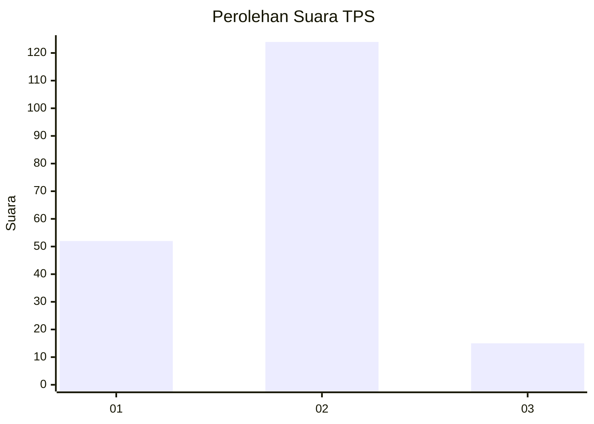
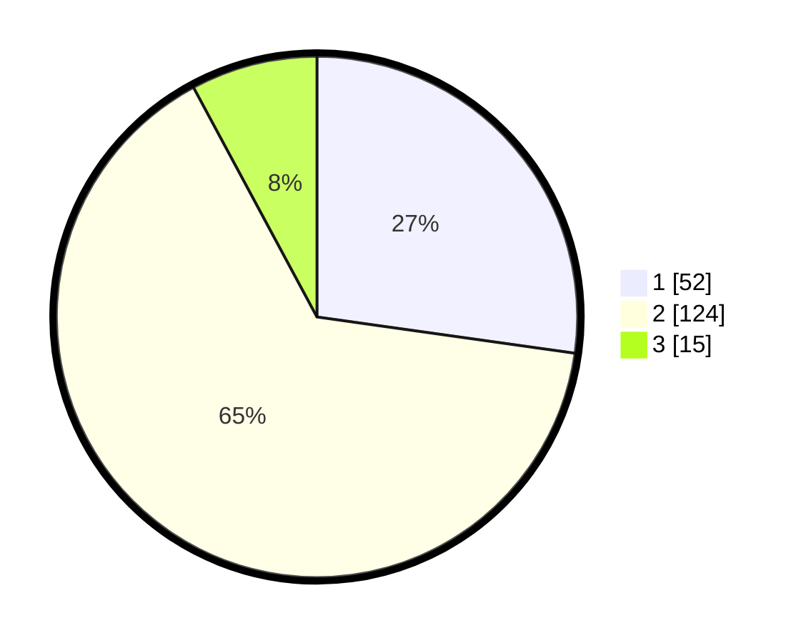

# Hasil

## Grafik

## Tabel

| No. | Nama Paslon    | Suara | Suara (raw) | Persentase |
|:--- |:-------------- | -----:| -----------:| ----------:|
| 1   | ANIES MUHAIMIN | 52    | [52][p-1]   | 27,23      |
| 2   | PRABOWO GIBRAN | 124   | [124][p-2]  | 64,92      |
| 3   | GANJAR MAHFUD  | 15    | [15][p-3]   | 7,85       |

[p-1]: https://github.com/gigit-pemilu/pemilu-2024/blob/main/pilpres/hitung-suara/sub/32-jawa-barat/sub/04-bandung/sub/12-dayeuhkolot/sub/2004-cangkuang-kulon/sub/053-tps/sub/paslon-1.txt
[p-2]: https://github.com/gigit-pemilu/pemilu-2024/blob/main/pilpres/hitung-suara/sub/32-jawa-barat/sub/04-bandung/sub/12-dayeuhkolot/sub/2004-cangkuang-kulon/sub/053-tps/sub/paslon-2.txt
[p-3]: https://github.com/gigit-pemilu/pemilu-2024/blob/main/pilpres/hitung-suara/sub/32-jawa-barat/sub/04-bandung/sub/12-dayeuhkolot/sub/2004-cangkuang-kulon/sub/053-tps/sub/paslon-3.txt

## Foto C Plano

https://sirekap-obj-formc.kpu.go.id/c634/pemilu/ppwp/32/04/12/20/04/3204122004053-20240226-161011--3290c6c4-8138-4d98-ab19-c33adb38c86f.jpg

https://sirekap-obj-formc.kpu.go.id/c634/pemilu/ppwp/32/04/12/20/04/3204122004053-20240226-161039--3e0a8d91-810b-42fd-93f1-351369148b8f.jpg

https://sirekap-obj-formc.kpu.go.id/c634/pemilu/ppwp/32/04/12/20/04/3204122004053-20240226-161106--6eb9dd8c-b4d3-44e1-bf93-d458ed28f854.jpg

## Metadata

| Key        | Value               |
| ---------- | ------------------- |
| Time Stamp | 2024-02-26 17:00:04 |

## DATA PEMILIH TETAP

Jumlah pemilih dalam DPT: **267**.
 * L: **128**.
 * P: **141**.

## DATA PENGGUNA HAK PILIH

Jumlah pengguna hak pilih dalam DPT: **198**.
 * L: **895**.
 * P: **103**.

Jumlah pengguna hak pilih dalam DPTb: **0**.
 * L: **688**.
 * P: **200**.

Jumlah pengguna hak pilih dalam DPK: **800**.
 * L: **0**.
 * P: **888**.

Jumlah pengguna hak pilih: **0**.
 * L: **10**.
 * P: **0**.

## JUMLAH SUARA SAH DAN TIDAK SAH

JUMLAH SELURUH SUARA SAH: **794**.

JUMLAH SUARA TIDAK SAH: **4**.

JUMLAH SELURUH SUARA SAH DAN SUARA TIDAK SAH: **798**.

