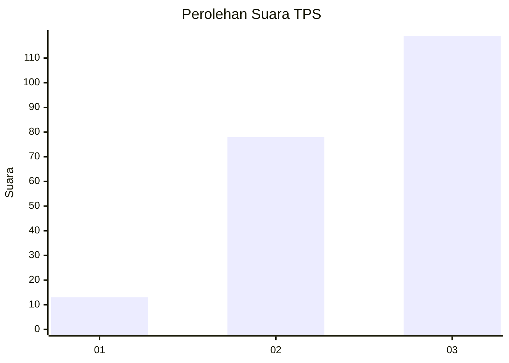
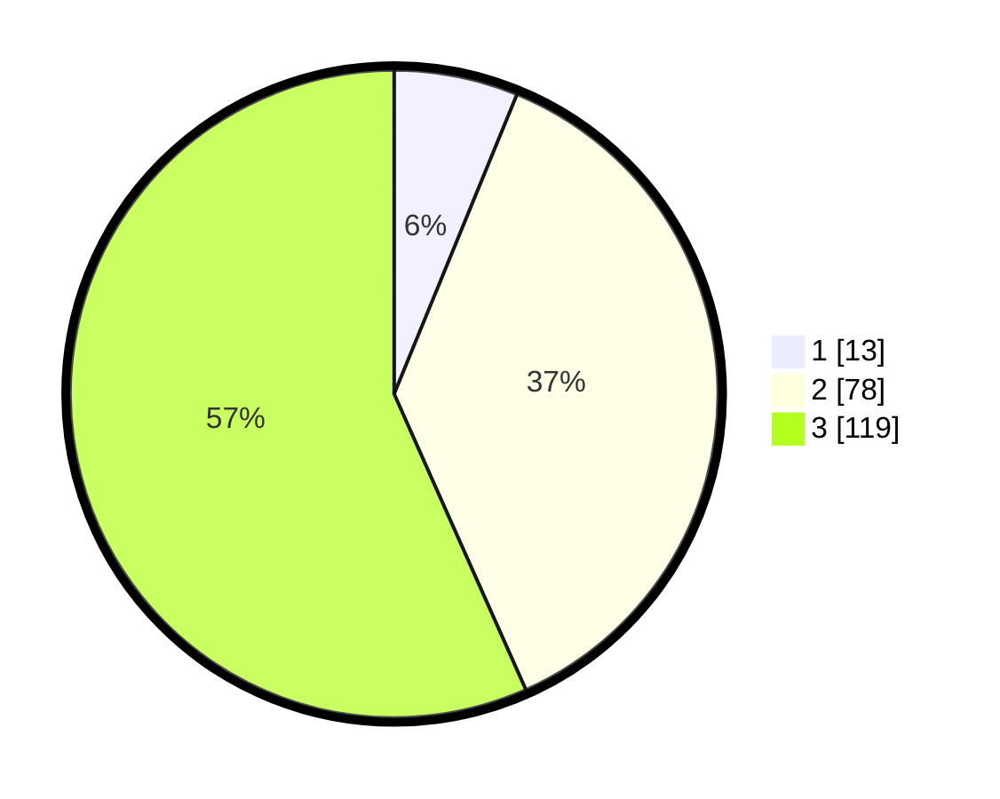

# Hasil

## Grafik

## Tabel

| No. | Nama Paslon    | Suara | Suara (raw) | Persentase |
|:--- |:-------------- | -----:| -----------:| ----------:|
| 1   | ANIES MUHAIMIN | 13    | [13][p-1]   | 6,19       |
| 2   | PRABOWO GIBRAN | 78    | [78][p-2]   | 37,14      |
| 3   | GANJAR MAHFUD  | 119   | [119][p-3]  | 56,67      |

[p-1]: https://github.com/gigit-pemilu/pemilu-2024-32-jawa-barat/blob/main/pilpres/hitung-suara/sub/32-jawa-barat/sub/04-bandung/sub/12-dayeuhkolot/sub/2004-cangkuang-kulon/sub/098-tps/sub/paslon-1.txt
[p-2]: https://github.com/gigit-pemilu/pemilu-2024-32-jawa-barat/blob/main/pilpres/hitung-suara/sub/32-jawa-barat/sub/04-bandung/sub/12-dayeuhkolot/sub/2004-cangkuang-kulon/sub/098-tps/sub/paslon-2.txt
[p-3]: https://github.com/gigit-pemilu/pemilu-2024-32-jawa-barat/blob/main/pilpres/hitung-suara/sub/32-jawa-barat/sub/04-bandung/sub/12-dayeuhkolot/sub/2004-cangkuang-kulon/sub/098-tps/sub/paslon-3.txt

## Foto C Plano

https://sirekap-obj-formc.kpu.go.id/cb4f/pemilu/ppwp/32/04/12/20/04/3204122004098-20240226-143248--30f2cc2e-d8d5-4912-b399-75a78c150262.jpg

https://sirekap-obj-formc.kpu.go.id/cb4f/pemilu/ppwp/32/04/12/20/04/3204122004098-20240226-143439--ce81e65c-3c4c-4306-a5cf-ba77d65a212f.jpg

https://sirekap-obj-formc.kpu.go.id/cb4f/pemilu/ppwp/32/04/12/20/04/3204122004098-20240226-143540--ccb43ad9-59ce-4f9b-beec-c33f20d9790e.jpg

## Metadata

| Key        | Value               |
| ---------- | ------------------- |
| Time Stamp | 2024-02-26 21:00:00 |

## DATA PEMILIH TETAP

Jumlah pemilih dalam DPT: **378**.
 * L: **235**.
 * P: **142**.

## DATA PENGGUNA HAK PILIH

Jumlah pengguna hak pilih dalam DPT: **222**.
 * L: **304**.
 * P: **207**.

Jumlah pengguna hak pilih dalam DPTb: **886**.
 * L: **885**.
 * P: **8**.

Jumlah pengguna hak pilih dalam DPK: **202**.
 * L: **801**.
 * P: **0**.

Jumlah pengguna hak pilih: **213**.
 * L: **205**.
 * P: **297**.

## JUMLAH SUARA SAH DAN TIDAK SAH

JUMLAH SELURUH SUARA SAH: **210**.

JUMLAH SUARA TIDAK SAH: **3**.

JUMLAH SELURUH SUARA SAH DAN SUARA TIDAK SAH: **213**.

