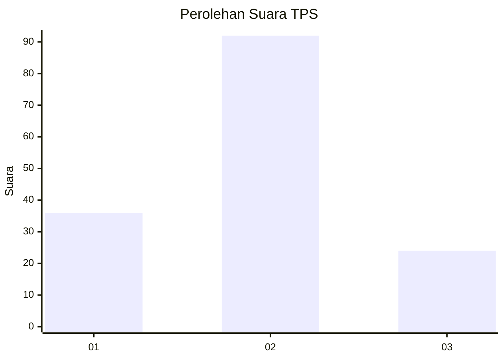
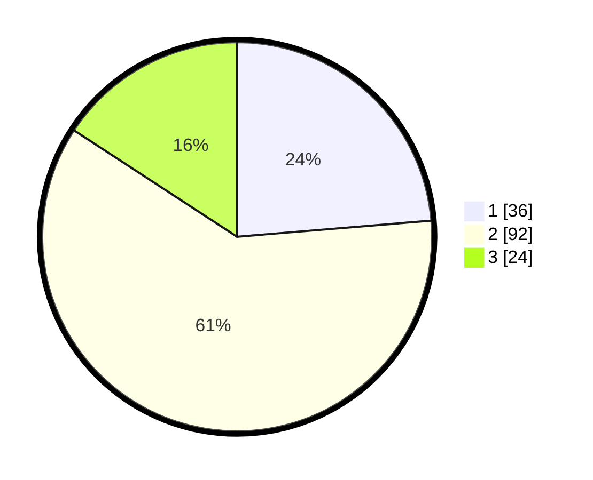

# Hasil

## Grafik

## Tabel

| No. | Nama Paslon    | Suara | Suara (raw) | Persentase |
|:--- |:-------------- | -----:| -----------:| ----------:|
| 1   | ANIES MUHAIMIN | 36    | [36][p-1]   | 23,68      |
| 2   | PRABOWO GIBRAN | 92    | [92][p-2]   | 60,53      |
| 3   | GANJAR MAHFUD  | 24    | [24][p-3]   | 15,79      |

[p-1]: https://github.com/gigit-pemilu/pemilu-2024/blob/main/pilpres/hitung-suara/sub/32-jawa-barat/sub/04-bandung/sub/13-banjaran/sub/2001-kamasan/sub/001-tps/sub/paslon-1.txt
[p-2]: https://github.com/gigit-pemilu/pemilu-2024/blob/main/pilpres/hitung-suara/sub/32-jawa-barat/sub/04-bandung/sub/13-banjaran/sub/2001-kamasan/sub/001-tps/sub/paslon-2.txt
[p-3]: https://github.com/gigit-pemilu/pemilu-2024/blob/main/pilpres/hitung-suara/sub/32-jawa-barat/sub/04-bandung/sub/13-banjaran/sub/2001-kamasan/sub/001-tps/sub/paslon-3.txt

## Foto C Plano

https://sirekap-obj-formc.kpu.go.id/3444/pemilu/ppwp/32/04/13/20/01/3204132001001-20240221-094649--bfa1771f-b001-46b8-b979-8e16ee4bad35.jpg

https://sirekap-obj-formc.kpu.go.id/3444/pemilu/ppwp/32/04/13/20/01/3204132001001-20240221-092423--1a44abfd-6947-45a4-b545-863d001f8883.jpg

https://sirekap-obj-formc.kpu.go.id/3444/pemilu/ppwp/32/04/13/20/01/3204132001001-20240221-092815--ce9c6119-32a9-47e3-9dab-19df866b77ad.jpg

## Metadata

| Key        | Value               |
| ---------- | ------------------- |
| Time Stamp | 2024-02-21 10:00:00 |

