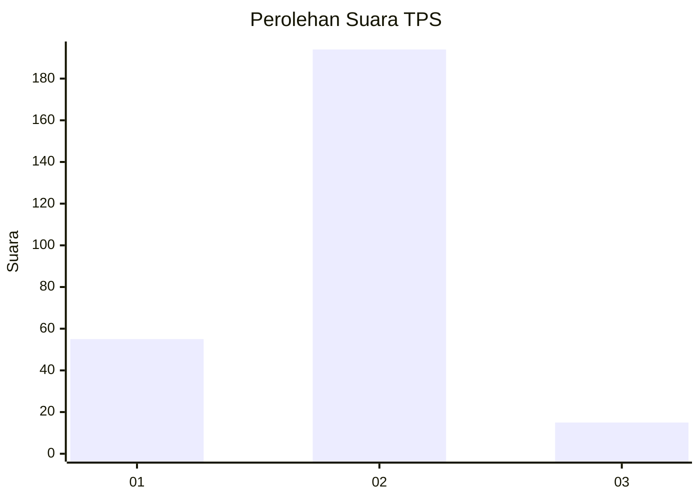

# Hasil

## Grafik

## Tabel

| No. | Nama Paslon    | Suara | Suara (raw) | Persentase |
|:--- |:-------------- | -----:| -----------:| ----------:|
| 1   | ANIES MUHAIMIN | 55    | [55][p-1]   | 20,83      |
| 2   | PRABOWO GIBRAN | 194   | [194][p-2]  | 73,48      |
| 3   | GANJAR MAHFUD  | 15    | [15][p-3]   | 5,68       |

[p-1]: https://github.com/gigit-pemilu/pemilu-2024/blob/main/pilpres/hitung-suara/sub/32-jawa-barat/sub/04-bandung/sub/13-banjaran/sub/2003-banjaran/sub/016-tps/sub/paslon-1.txt
[p-2]: https://github.com/gigit-pemilu/pemilu-2024/blob/main/pilpres/hitung-suara/sub/32-jawa-barat/sub/04-bandung/sub/13-banjaran/sub/2003-banjaran/sub/016-tps/sub/paslon-2.txt
[p-3]: https://github.com/gigit-pemilu/pemilu-2024/blob/main/pilpres/hitung-suara/sub/32-jawa-barat/sub/04-bandung/sub/13-banjaran/sub/2003-banjaran/sub/016-tps/sub/paslon-3.txt

## Foto C Plano

https://sirekap-obj-formc.kpu.go.id/d8ee/pemilu/ppwp/32/04/13/20/03/3204132003016-20240214-202425--ff0241d9-334d-4ea8-81d5-d250afde8831.jpg

https://sirekap-obj-formc.kpu.go.id/d8ee/pemilu/ppwp/32/04/13/20/03/3204132003016-20240214-202645--b384db0d-cbdc-443b-97c6-65377e2ba9ca.jpg

https://sirekap-obj-formc.kpu.go.id/d8ee/pemilu/ppwp/32/04/13/20/03/3204132003016-20240214-202838--89a83c87-914a-4101-9f06-053f13e58806.jpg

## Metadata

| Key        | Value               |
| ---------- | ------------------- |
| Time Stamp | 2024-02-16 23:30:00 |

