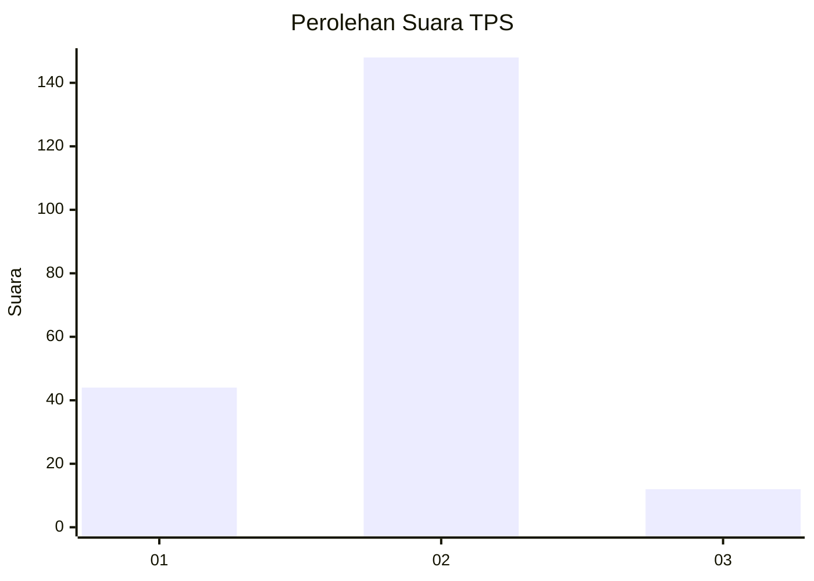

# Hasil

## Grafik

## Tabel

| No. | Nama Paslon    | Suara | Suara (raw) | Persentase |
|:--- |:-------------- | -----:| -----------:| ----------:|
| 1   | ANIES MUHAIMIN | 44    | [44][p-1]   | 21,57      |
| 2   | PRABOWO GIBRAN | 148   | [148][p-2]  | 72,55      |
| 3   | GANJAR MAHFUD  | 12    | [12][p-3]   | 5,88       |

[p-1]: https://github.com/gigit-pemilu/pemilu-2024/blob/main/pilpres/hitung-suara/sub/32-jawa-barat/sub/04-bandung/sub/14-pameungpeuk/sub/2001-sukasari/sub/004-tps/sub/paslon-1.txt
[p-2]: https://github.com/gigit-pemilu/pemilu-2024/blob/main/pilpres/hitung-suara/sub/32-jawa-barat/sub/04-bandung/sub/14-pameungpeuk/sub/2001-sukasari/sub/004-tps/sub/paslon-2.txt
[p-3]: https://github.com/gigit-pemilu/pemilu-2024/blob/main/pilpres/hitung-suara/sub/32-jawa-barat/sub/04-bandung/sub/14-pameungpeuk/sub/2001-sukasari/sub/004-tps/sub/paslon-3.txt

## Foto C Plano

https://sirekap-obj-formc.kpu.go.id/188c/pemilu/ppwp/32/04/14/20/01/3204142001004-20240219-215012--b0a204e6-260d-4e52-a214-2e14a404edc0.jpg

https://sirekap-obj-formc.kpu.go.id/188c/pemilu/ppwp/32/04/14/20/01/3204142001004-20240219-215134--96324dd0-feb5-422f-a475-6cbdc85d6c61.jpg

https://sirekap-obj-formc.kpu.go.id/188c/pemilu/ppwp/32/04/14/20/01/3204142001004-20240219-215758--bbe5c561-9b3e-419f-ae99-6e417a8b7b36.jpg

## Metadata

| Key        | Value               |
| ---------- | ------------------- |
| Time Stamp | 2024-02-22 16:00:00 |

