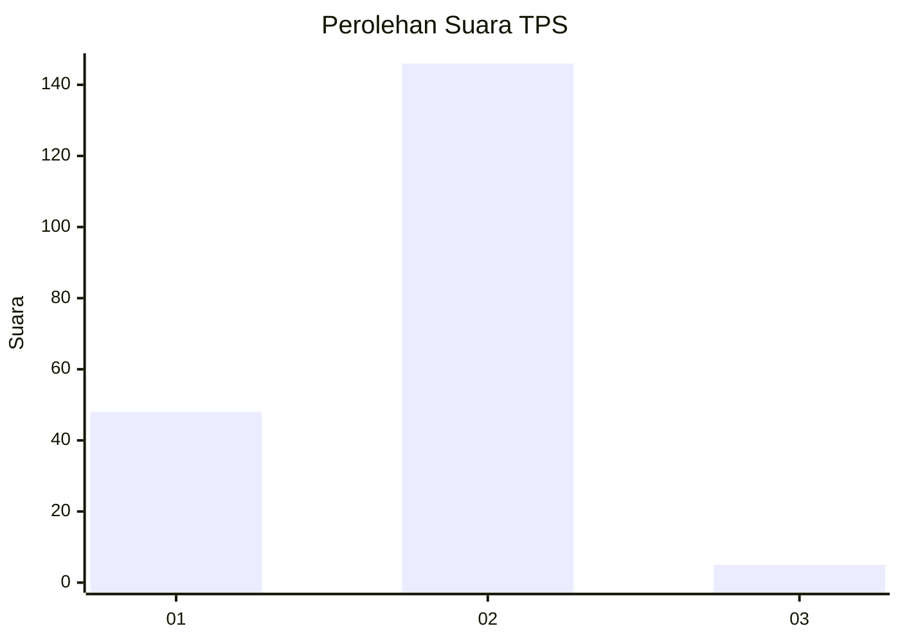
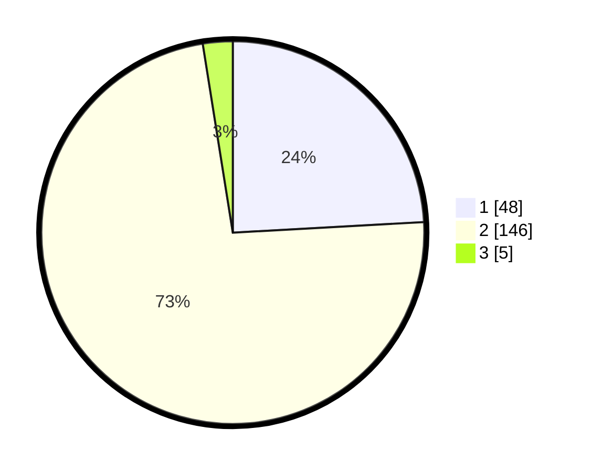

# Hasil

## Grafik

## Tabel

| No. | Nama Paslon    | Suara | Suara (raw) | Persentase |
|:--- |:-------------- | -----:| -----------:| ----------:|
| 1   | ANIES MUHAIMIN | 48    | [48][p-1]   | 24,12      |
| 2   | PRABOWO GIBRAN | 146   | [146][p-2]  | 73,37      |
| 3   | GANJAR MAHFUD  | 5     | [5][p-3]    | 2,51       |

[p-1]: https://github.com/gigit-pemilu/pemilu-2024-32-jawa-barat/blob/main/pilpres/hitung-suara/sub/32-jawa-barat/sub/04-bandung/sub/15-pangalengan/sub/2001-pangalengan/sub/003-tps/sub/paslon-1.txt
[p-2]: https://github.com/gigit-pemilu/pemilu-2024-32-jawa-barat/blob/main/pilpres/hitung-suara/sub/32-jawa-barat/sub/04-bandung/sub/15-pangalengan/sub/2001-pangalengan/sub/003-tps/sub/paslon-2.txt
[p-3]: https://github.com/gigit-pemilu/pemilu-2024-32-jawa-barat/blob/main/pilpres/hitung-suara/sub/32-jawa-barat/sub/04-bandung/sub/15-pangalengan/sub/2001-pangalengan/sub/003-tps/sub/paslon-3.txt

## Foto C Plano

https://sirekap-obj-formc.kpu.go.id/0bf4/pemilu/ppwp/32/04/15/20/01/3204152001003-20240221-111735--40371752-b7d8-427d-bdba-3533800cadde.jpg

https://sirekap-obj-formc.kpu.go.id/0bf4/pemilu/ppwp/32/04/15/20/01/3204152001003-20240221-111901--84a583a3-e3ca-4dc4-9301-08a33da9bdda.jpg

https://sirekap-obj-formc.kpu.go.id/0bf4/pemilu/ppwp/32/04/15/20/01/3204152001003-20240220-151937--cdb9ed82-aee6-4381-a4c7-fdf48d0a0a02.jpg

## Metadata

| Key        | Value               |
| ---------- | ------------------- |
| Time Stamp | 2024-02-24 22:31:28 |

