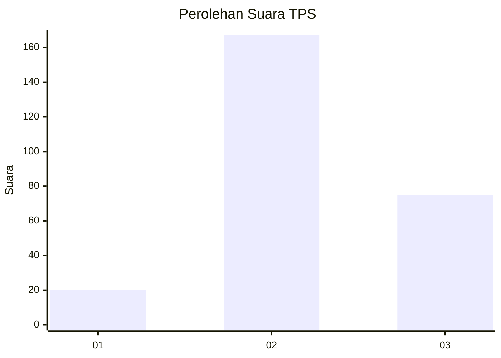
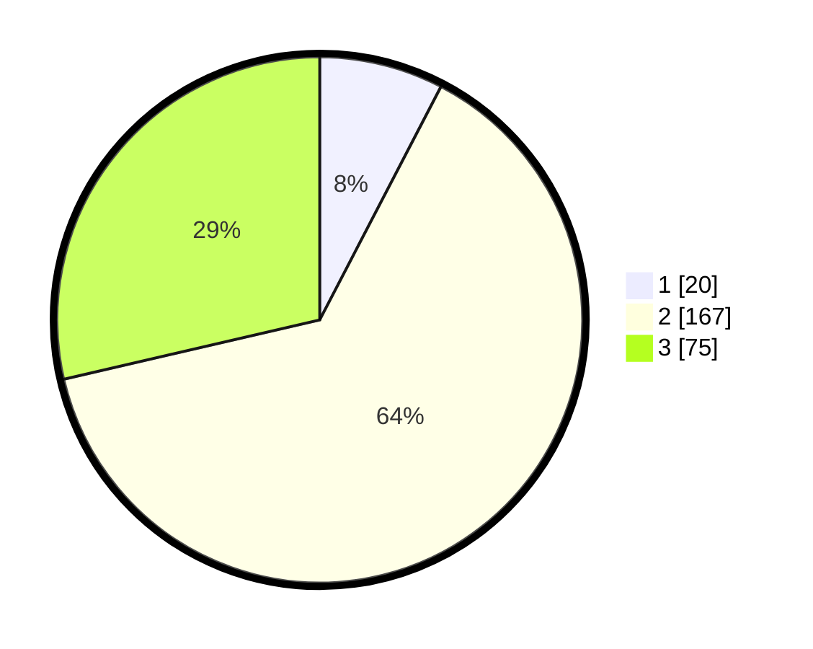

# Hasil

## Grafik

## Tabel

| No. | Nama Paslon    | Suara | Suara (raw) | Persentase |
|:--- |:-------------- | -----:| -----------:| ----------:|
| 1   | ANIES MUHAIMIN | 20    | [20][p-1]   | 7,63       |
| 2   | PRABOWO GIBRAN | 167   | [167][p-2]  | 63,74      |
| 3   | GANJAR MAHFUD  | 75    | [75][p-3]   | 28,63      |

[p-1]: https://github.com/gigit-pemilu/pemilu-2024/blob/main/pilpres/hitung-suara/sub/32-jawa-barat/sub/04-bandung/sub/15-pangalengan/sub/2007-margamulya/sub/024-tps/sub/paslon-1.txt
[p-2]: https://github.com/gigit-pemilu/pemilu-2024/blob/main/pilpres/hitung-suara/sub/32-jawa-barat/sub/04-bandung/sub/15-pangalengan/sub/2007-margamulya/sub/024-tps/sub/paslon-2.txt
[p-3]: https://github.com/gigit-pemilu/pemilu-2024/blob/main/pilpres/hitung-suara/sub/32-jawa-barat/sub/04-bandung/sub/15-pangalengan/sub/2007-margamulya/sub/024-tps/sub/paslon-3.txt

## Foto C Plano

https://sirekap-obj-formc.kpu.go.id/6db0/pemilu/ppwp/32/04/15/20/07/3204152007024-20240224-160616--28d46c87-abcd-4a32-8365-24f2973b3af9.jpg

https://sirekap-obj-formc.kpu.go.id/6db0/pemilu/ppwp/32/04/15/20/07/3204152007024-20240224-160643--5c542d7a-9aa5-46b4-9667-eba8c87d9526.jpg

https://sirekap-obj-formc.kpu.go.id/6db0/pemilu/ppwp/32/04/15/20/07/3204152007024-20240224-160717--52d36809-7f75-4f8a-ba0f-0c4d9ea889df.jpg

## Metadata

| Key        | Value               |
| ---------- | ------------------- |
| Time Stamp | 2024-02-24 22:31:28 |

## DATA PEMILIH TETAP

Jumlah pemilih dalam DPT: **244**.
 * L: **125**.
 * P: **119**.

## DATA PENGGUNA HAK PILIH

Jumlah pengguna hak pilih dalam DPT: **204**.
 * L: **100**.
 * P: **105**.

Jumlah pengguna hak pilih dalam DPTb: **76**.
 * L: **0**.
 * P: **0**.

Jumlah pengguna hak pilih dalam DPK: **0**.
 * L: **1**.
 * P: **0**.

Jumlah pengguna hak pilih: **206**.
 * L: **101**.
 * P: **105**.

## JUMLAH SUARA SAH DAN TIDAK SAH

JUMLAH SELURUH SUARA SAH: **555**.

JUMLAH SUARA TIDAK SAH: **746**.

JUMLAH SELURUH SUARA SAH DAN SUARA TIDAK SAH: **226**.

