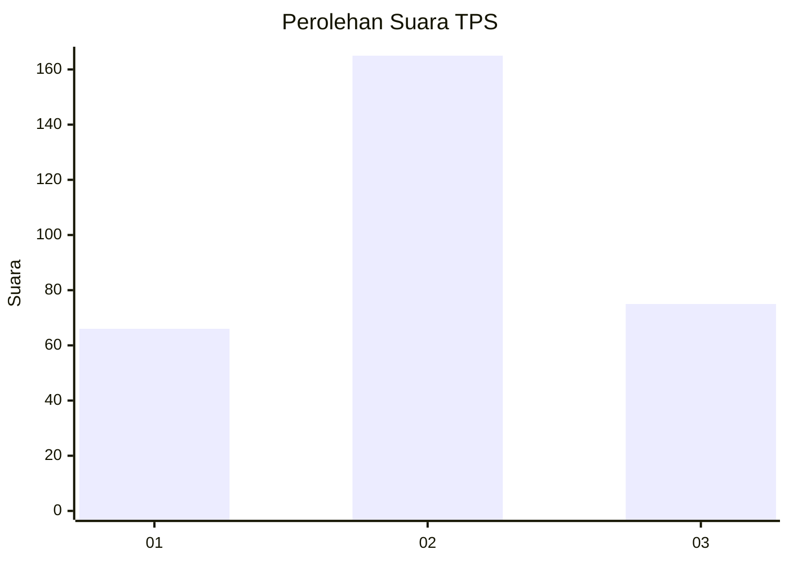
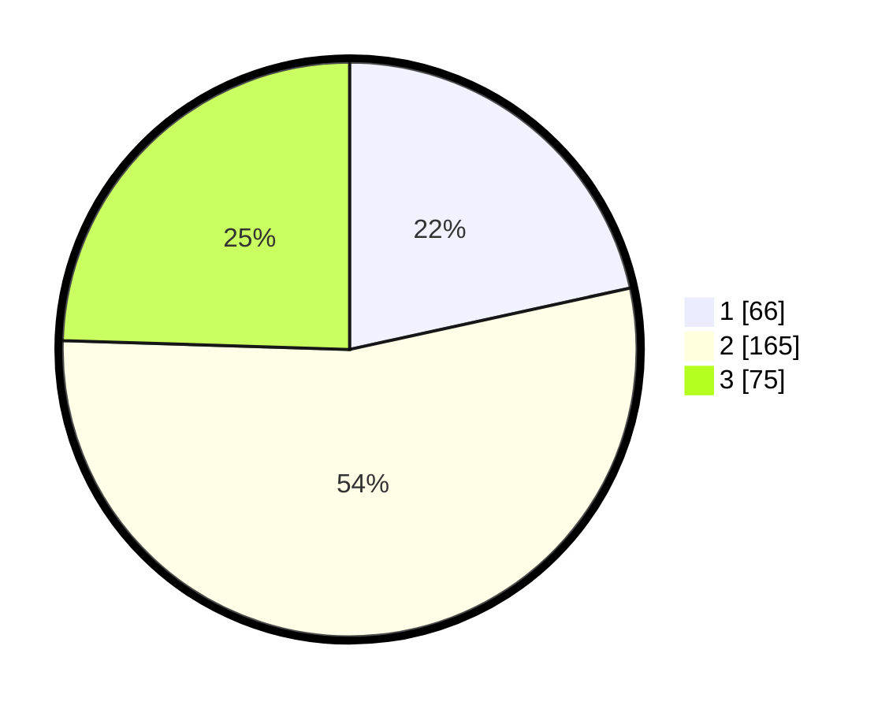

# Hasil

## Grafik

## Tabel

| No. | Nama Paslon    | Suara | Suara (raw) | Persentase |
|:--- |:-------------- | -----:| -----------:| ----------:|
| 1   | ANIES MUHAIMIN | 66    | [66][p-1]   | 21,57      |
| 2   | PRABOWO GIBRAN | 165   | [165][p-2]  | 53,92      |
| 3   | GANJAR MAHFUD  | 75    | [75][p-3]   | 24,51      |

[p-1]: https://github.com/gigit-pemilu/pemilu-2024-32-jawa-barat/blob/main/pilpres/hitung-suara/sub/32-jawa-barat/sub/04-bandung/sub/15-pangalengan/sub/2007-margamulya/sub/034-tps/sub/paslon-1.txt
[p-2]: https://github.com/gigit-pemilu/pemilu-2024-32-jawa-barat/blob/main/pilpres/hitung-suara/sub/32-jawa-barat/sub/04-bandung/sub/15-pangalengan/sub/2007-margamulya/sub/034-tps/sub/paslon-2.txt
[p-3]: https://github.com/gigit-pemilu/pemilu-2024-32-jawa-barat/blob/main/pilpres/hitung-suara/sub/32-jawa-barat/sub/04-bandung/sub/15-pangalengan/sub/2007-margamulya/sub/034-tps/sub/paslon-3.txt

## Foto C Plano

https://sirekap-obj-formc.kpu.go.id/797c/pemilu/ppwp/32/04/15/20/07/3204152007034-20240224-144215--26bcf996-1219-4222-8d5f-6b28f5efe24d.jpg

https://sirekap-obj-formc.kpu.go.id/797c/pemilu/ppwp/32/04/15/20/07/3204152007034-20240224-144225--347a232f-5658-4893-b9e8-c8176752b730.jpg

https://sirekap-obj-formc.kpu.go.id/797c/pemilu/ppwp/32/04/15/20/07/3204152007034-20240224-144619--7350b385-e755-448c-83c5-84503a33e3fa.jpg

## Metadata

| Key        | Value               |
| ---------- | ------------------- |
| Time Stamp | 2024-02-24 22:31:28 |

