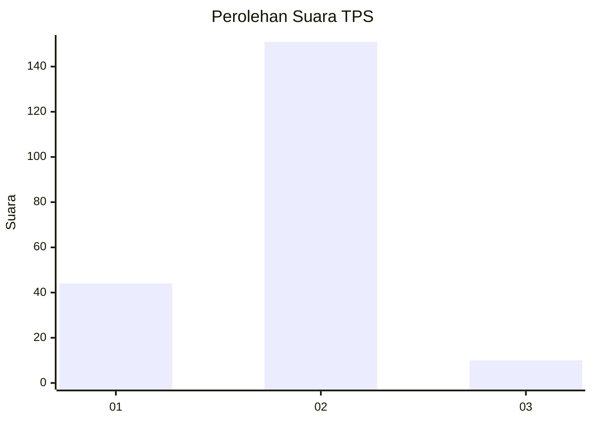
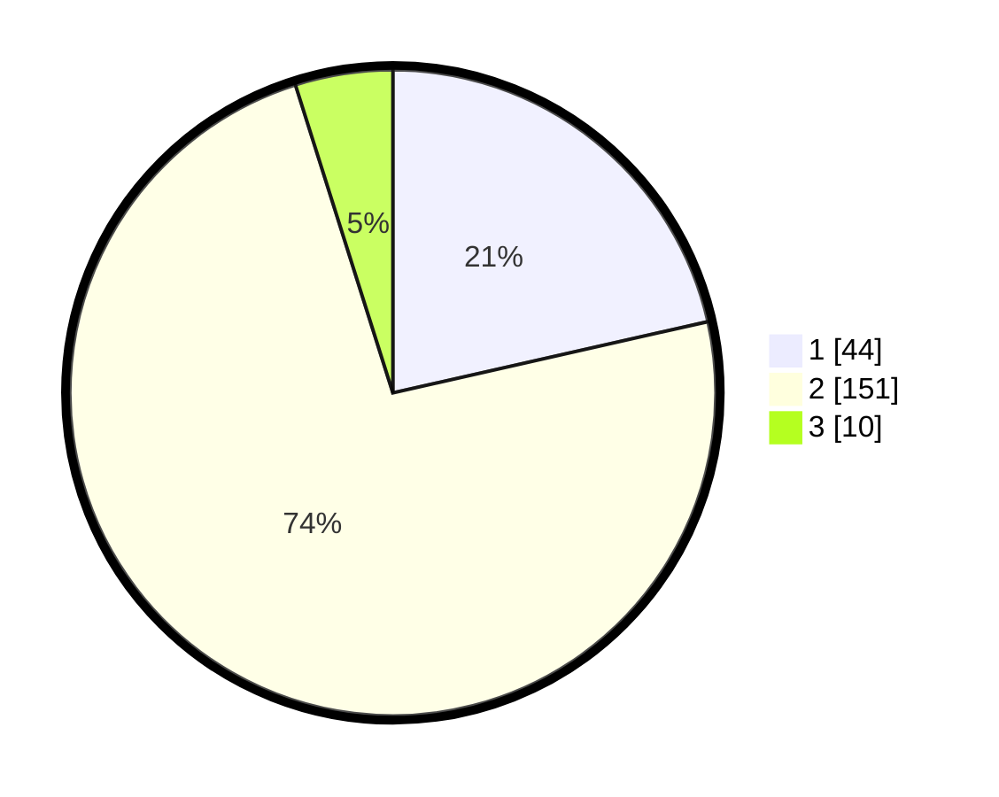

# Hasil

## Grafik

## Tabel

| No. | Nama Paslon    | Suara | Suara (raw) | Persentase |
|:--- |:-------------- | -----:| -----------:| ----------:|
| 1   | ANIES MUHAIMIN | 44    | [44][p-1]   | 21,46      |
| 2   | PRABOWO GIBRAN | 151   | [151][p-2]  | 73,66      |
| 3   | GANJAR MAHFUD  | 10    | [10][p-3]   | 4,88       |

[p-1]: https://github.com/gigit-pemilu/pemilu-2024/blob/main/pilpres/hitung-suara/sub/32-jawa-barat/sub/04-bandung/sub/16-arjasari/sub/2006-mangunjaya/sub/014-tps/sub/paslon-1.txt
[p-2]: https://github.com/gigit-pemilu/pemilu-2024/blob/main/pilpres/hitung-suara/sub/32-jawa-barat/sub/04-bandung/sub/16-arjasari/sub/2006-mangunjaya/sub/014-tps/sub/paslon-2.txt
[p-3]: https://github.com/gigit-pemilu/pemilu-2024/blob/main/pilpres/hitung-suara/sub/32-jawa-barat/sub/04-bandung/sub/16-arjasari/sub/2006-mangunjaya/sub/014-tps/sub/paslon-3.txt

## Foto C Plano

https://sirekap-obj-formc.kpu.go.id/7f97/pemilu/ppwp/32/04/16/20/06/3204162006014-20240225-232802--ecf1a3fb-0f3d-4133-bccf-fd308b333582.jpg

https://sirekap-obj-formc.kpu.go.id/7f97/pemilu/ppwp/32/04/16/20/06/3204162006014-20240225-232440--85f47433-d893-49b2-8d4d-302598fb8a0d.jpg

https://sirekap-obj-formc.kpu.go.id/7f97/pemilu/ppwp/32/04/16/20/06/3204162006014-20240225-232635--db62b011-3721-43ef-a08d-be5c9b913347.jpg

## Metadata

| Key        | Value               |
| ---------- | ------------------- |
| Time Stamp | 2024-02-26 00:00:00 |

## DATA PEMILIH TETAP

Jumlah pemilih dalam DPT: **292**.
 * L: **556**.
 * P: **646**.

## DATA PENGGUNA HAK PILIH

Jumlah pengguna hak pilih dalam DPT: **107**.
 * L: **554**.
 * P: **444**.

Jumlah pengguna hak pilih dalam DPTb: **605**.
 * L: **664**.
 * P: **664**.

Jumlah pengguna hak pilih dalam DPK: **0**.
 * L: **666**.
 * P: **660**.

Jumlah pengguna hak pilih: **212**.
 * L: **444**.
 * P: **441**.

## JUMLAH SUARA SAH DAN TIDAK SAH

JUMLAH SELURUH SUARA SAH: **210**.

JUMLAH SUARA TIDAK SAH: **2**.

JUMLAH SELURUH SUARA SAH DAN SUARA TIDAK SAH: **212**.

