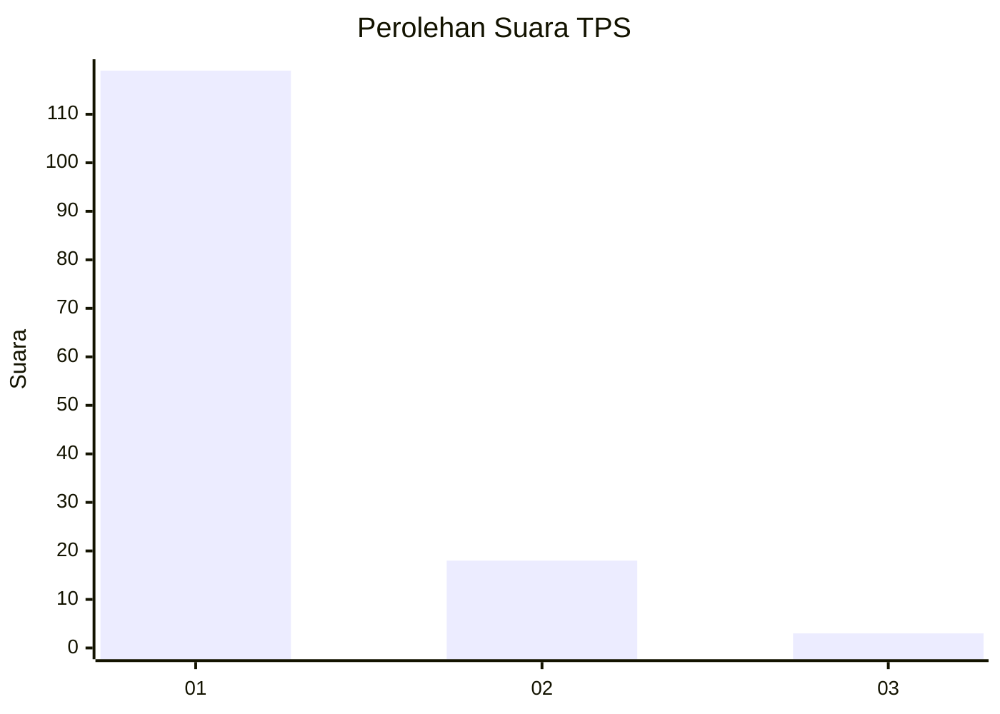
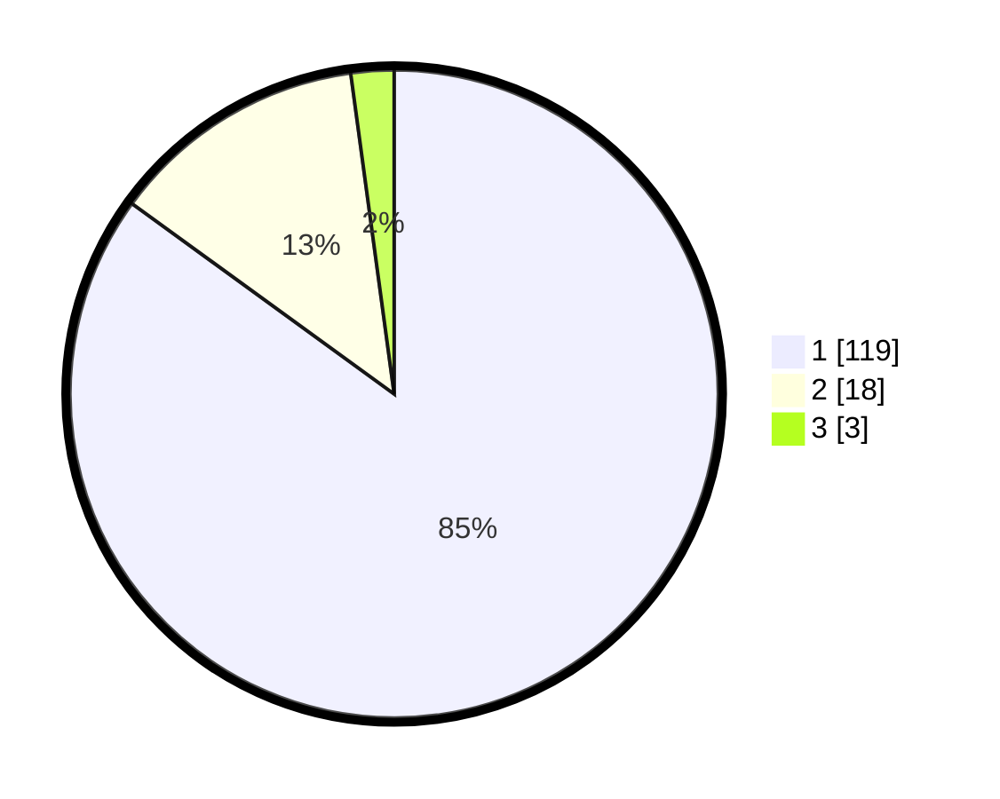

# Hasil

## Grafik

## Tabel

| No. | Nama Paslon    | Suara | Suara (raw) | Persentase |
|:--- |:-------------- | -----:| -----------:| ----------:|
| 1   | ANIES MUHAIMIN | 119   | [119][p-1]  | 85,00      |
| 2   | PRABOWO GIBRAN | 18    | [18][p-2]   | 12,86      |
| 3   | GANJAR MAHFUD  | 3     | [3][p-3]    | 2,14       |

[p-1]: https://github.com/gigit-pemilu/pemilu-2024-32-jawa-barat/blob/main/pilpres/hitung-suara/sub/32-jawa-barat/sub/04-bandung/sub/16-arjasari/sub/2009-patrolsari/sub/006-tps/sub/paslon-1.txt
[p-2]: https://github.com/gigit-pemilu/pemilu-2024-32-jawa-barat/blob/main/pilpres/hitung-suara/sub/32-jawa-barat/sub/04-bandung/sub/16-arjasari/sub/2009-patrolsari/sub/006-tps/sub/paslon-2.txt
[p-3]: https://github.com/gigit-pemilu/pemilu-2024-32-jawa-barat/blob/main/pilpres/hitung-suara/sub/32-jawa-barat/sub/04-bandung/sub/16-arjasari/sub/2009-patrolsari/sub/006-tps/sub/paslon-3.txt

## Foto C Plano

https://sirekap-obj-formc.kpu.go.id/6a24/pemilu/ppwp/32/04/16/20/09/3204162009006-20240215-003033--78998c21-3d71-44e7-8c2d-de923fc64006.jpg

https://sirekap-obj-formc.kpu.go.id/6a24/pemilu/ppwp/32/04/16/20/09/3204162009006-20240215-004216--59c5892d-4209-4e38-8792-de415733cc5a.jpg

https://sirekap-obj-formc.kpu.go.id/6a24/pemilu/ppwp/32/04/16/20/09/3204162009006-20240215-004035--3ffd79cb-f4dc-4015-ba8e-708ac6ca7df0.jpg

## Metadata

| Key        | Value               |
| ---------- | ------------------- |
| Time Stamp | 2024-02-16 08:00:28 |

