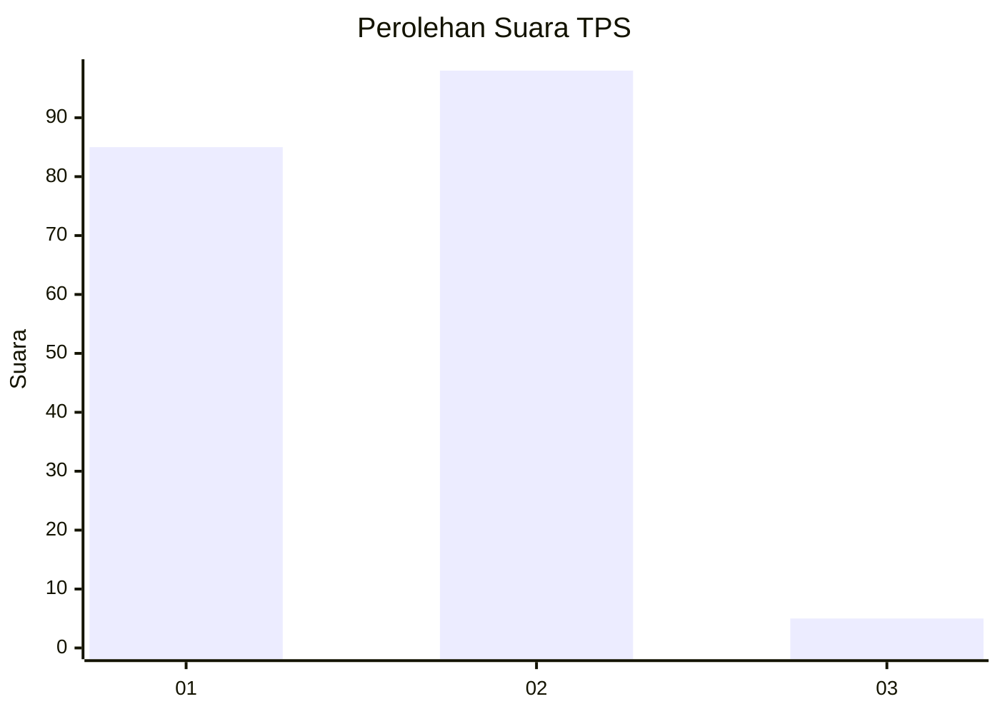
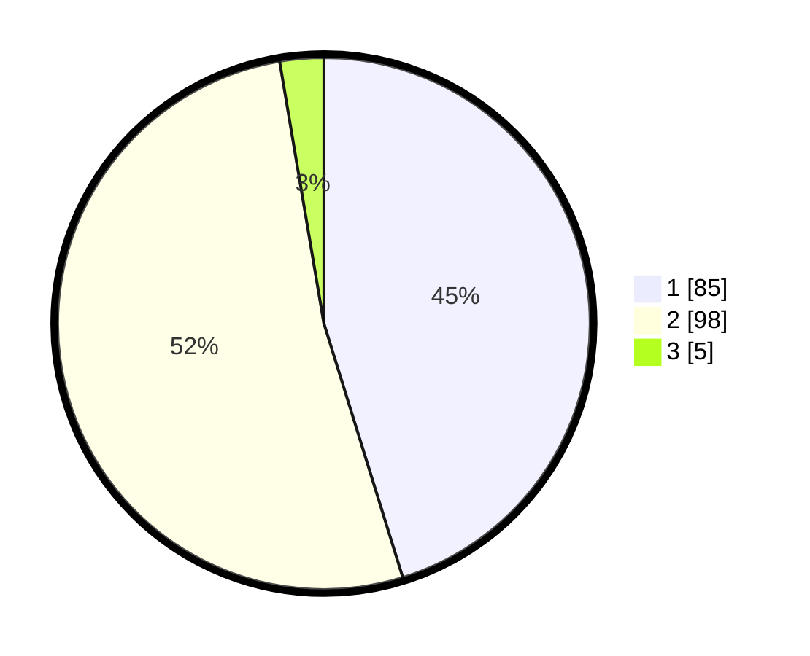

# Hasil

## Grafik

## Tabel

| No. | Nama Paslon    | Suara | Suara (raw) | Persentase |
|:--- |:-------------- | -----:| -----------:| ----------:|
| 1   | ANIES MUHAIMIN | 85    | [85][p-1]   | 45,21      |
| 2   | PRABOWO GIBRAN | 98    | [98][p-2]   | 52,13      |
| 3   | GANJAR MAHFUD  | 5     | [5][p-3]    | 2,66       |

[p-1]: https://github.com/gigit-pemilu/pemilu-2024-32-jawa-barat/blob/main/pilpres/hitung-suara/sub/32-jawa-barat/sub/04-bandung/sub/16-arjasari/sub/2010-rancakole/sub/004-tps/sub/paslon-1.txt
[p-2]: https://github.com/gigit-pemilu/pemilu-2024-32-jawa-barat/blob/main/pilpres/hitung-suara/sub/32-jawa-barat/sub/04-bandung/sub/16-arjasari/sub/2010-rancakole/sub/004-tps/sub/paslon-2.txt
[p-3]: https://github.com/gigit-pemilu/pemilu-2024-32-jawa-barat/blob/main/pilpres/hitung-suara/sub/32-jawa-barat/sub/04-bandung/sub/16-arjasari/sub/2010-rancakole/sub/004-tps/sub/paslon-3.txt

## Foto C Plano

https://sirekap-obj-formc.kpu.go.id/7c55/pemilu/ppwp/32/04/16/20/10/3204162010004-20240225-003832--e6a7b29e-e397-4537-b018-f5a3b925a3b6.jpg

https://sirekap-obj-formc.kpu.go.id/7c55/pemilu/ppwp/32/04/16/20/10/3204162010004-20240225-003906--f7c52879-51bf-452c-8058-f8e393ecb5e4.jpg

https://sirekap-obj-formc.kpu.go.id/7c55/pemilu/ppwp/32/04/16/20/10/3204162010004-20240225-003929--4b348d1b-9565-44b2-92a5-5faa9aa5593e.jpg

## Metadata

| Key        | Value               |
| ---------- | ------------------- |
| Time Stamp | 2024-02-25 01:00:00 |

## DATA PEMILIH TETAP

Jumlah pemilih dalam DPT: **242**.
 * L: **133**.
 * P: **109**.

## DATA PENGGUNA HAK PILIH

Jumlah pengguna hak pilih dalam DPT: **222**.
 * L: **26**.
 * P: **23**.

Jumlah pengguna hak pilih dalam DPTb: **20**.
 * L: **0**.
 * P: **222**.

Jumlah pengguna hak pilih dalam DPK: **2**.
 * L: **0**.
 * P: **21**.

Jumlah pengguna hak pilih: **22**.
 * L: **222**.
 * P: **52**.

## JUMLAH SUARA SAH DAN TIDAK SAH

JUMLAH SELURUH SUARA SAH: **188**.

JUMLAH SUARA TIDAK SAH: **2**.

JUMLAH SELURUH SUARA SAH DAN SUARA TIDAK SAH: **190**.

