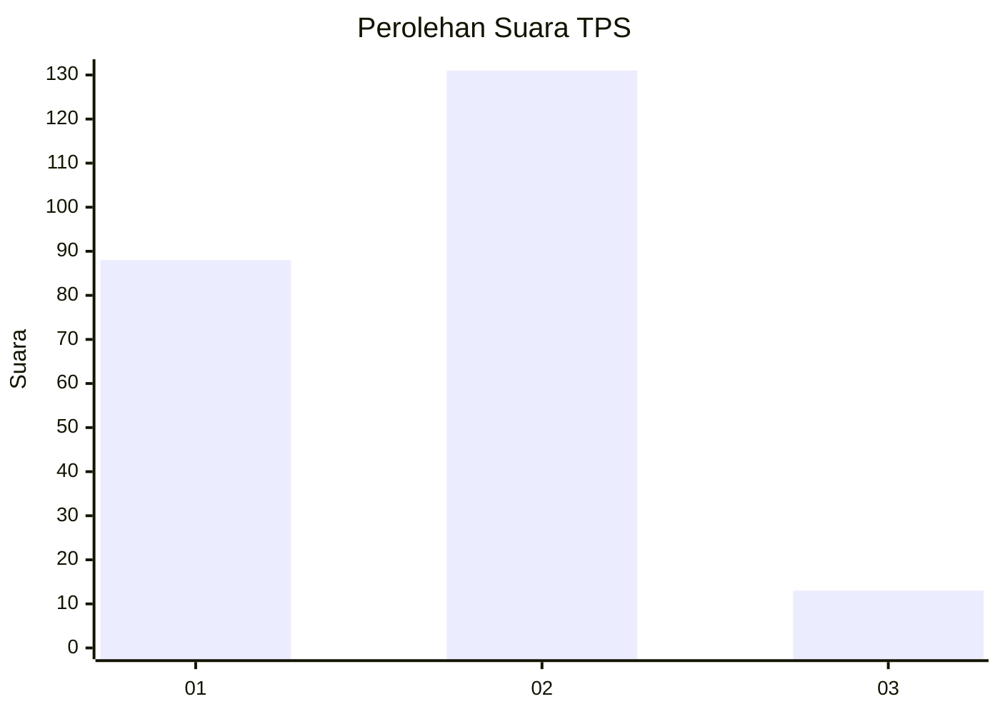
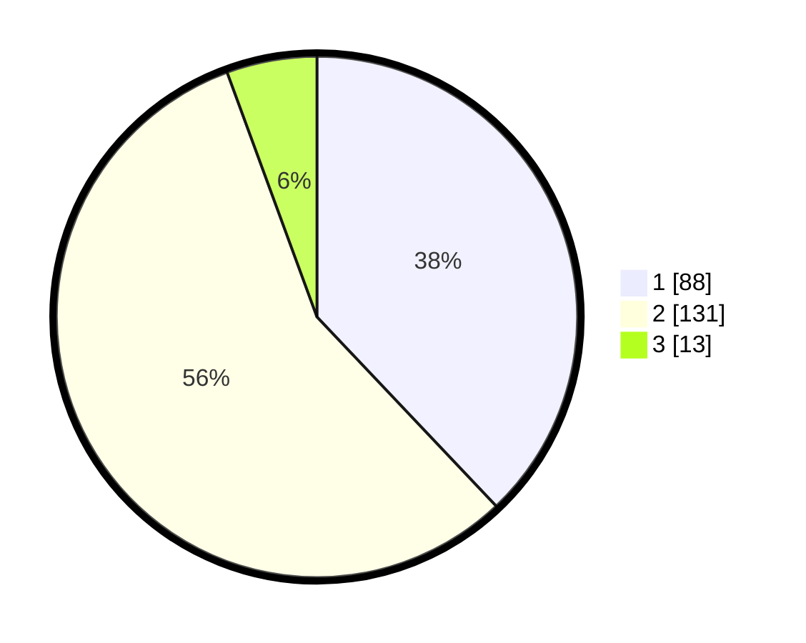

# Hasil

## Grafik

## Tabel

| No. | Nama Paslon    | Suara | Suara (raw) | Persentase |
|:--- |:-------------- | -----:| -----------:| ----------:|
| 1   | ANIES MUHAIMIN | 88    | [88][p-1]   | 37,93      |
| 2   | PRABOWO GIBRAN | 131   | [131][p-2]  | 56,47      |
| 3   | GANJAR MAHFUD  | 13    | [13][p-3]   | 5,60       |

[p-1]: https://github.com/gigit-pemilu/pemilu-2024-32-jawa-barat/blob/main/pilpres/hitung-suara/sub/32-jawa-barat/sub/04-bandung/sub/16-arjasari/sub/2010-rancakole/sub/007-tps/sub/paslon-1.txt
[p-2]: https://github.com/gigit-pemilu/pemilu-2024-32-jawa-barat/blob/main/pilpres/hitung-suara/sub/32-jawa-barat/sub/04-bandung/sub/16-arjasari/sub/2010-rancakole/sub/007-tps/sub/paslon-2.txt
[p-3]: https://github.com/gigit-pemilu/pemilu-2024-32-jawa-barat/blob/main/pilpres/hitung-suara/sub/32-jawa-barat/sub/04-bandung/sub/16-arjasari/sub/2010-rancakole/sub/007-tps/sub/paslon-3.txt

## Foto C Plano

https://sirekap-obj-formc.kpu.go.id/3343/pemilu/ppwp/32/04/16/20/10/3204162010007-20240224-230619--5cc1cc0c-0bcc-49ab-acf1-b691b758f20d.jpg

https://sirekap-obj-formc.kpu.go.id/3343/pemilu/ppwp/32/04/16/20/10/3204162010007-20240224-230708--e1a067c9-c5ce-416a-a6b3-2abbc1859fdc.jpg

https://sirekap-obj-formc.kpu.go.id/3343/pemilu/ppwp/32/04/16/20/10/3204162010007-20240224-231009--78ba682f-bff2-4478-a11f-e1e5fda28d72.jpg

## Metadata

| Key        | Value               |
| ---------- | ------------------- |
| Time Stamp | 2024-02-25 16:00:00 |

## DATA PEMILIH TETAP

Jumlah pemilih dalam DPT: **378**.
 * L: **399**.
 * P: **329**.

## DATA PENGGUNA HAK PILIH

Jumlah pengguna hak pilih dalam DPT: **237**.
 * L: **573**.
 * P: **519**.

Jumlah pengguna hak pilih dalam DPTb: **663**.
 * L: **827**.
 * P: **232**.

Jumlah pengguna hak pilih dalam DPK: **333**.
 * L: **805**.
 * P: **222**.

Jumlah pengguna hak pilih: **236**.
 * L: **126**.
 * P: **366**.

## JUMLAH SUARA SAH DAN TIDAK SAH

JUMLAH SELURUH SUARA SAH: **232**.

JUMLAH SUARA TIDAK SAH: **4**.

JUMLAH SELURUH SUARA SAH DAN SUARA TIDAK SAH: **236**.

