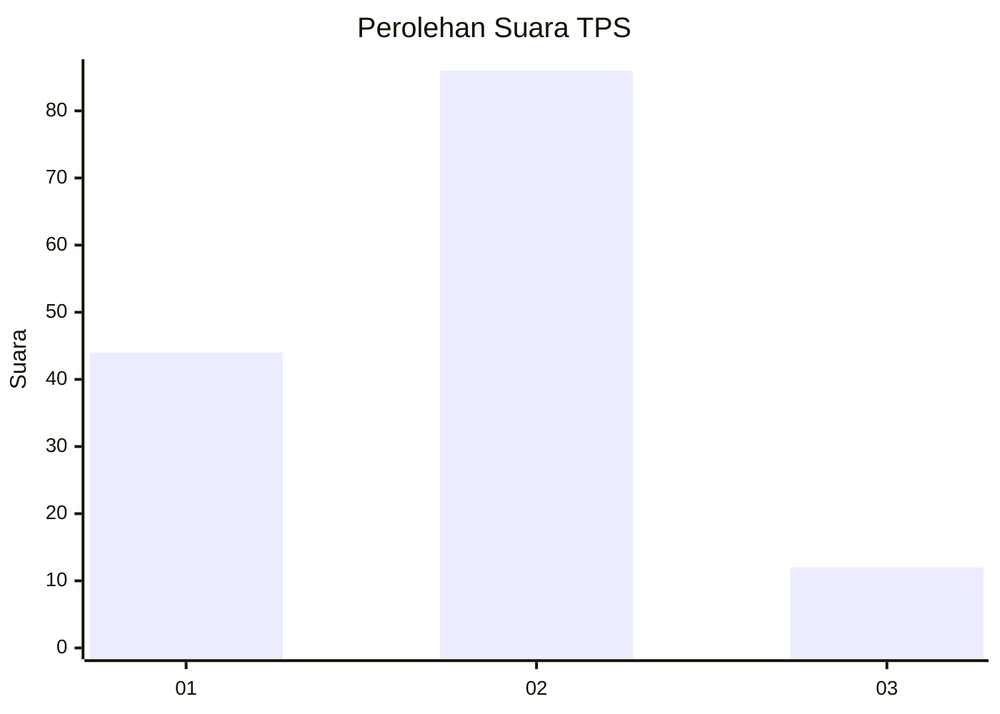
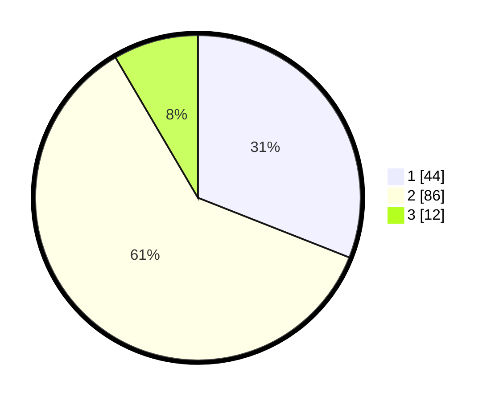

# Hasil

## Grafik

## Tabel

| No. | Nama Paslon    | Suara | Suara (raw) | Persentase |
|:--- |:-------------- | -----:| -----------:| ----------:|
| 1   | ANIES MUHAIMIN | 44    | [44][p-1]   | 30,99      |
| 2   | PRABOWO GIBRAN | 86    | [86][p-2]   | 60,56      |
| 3   | GANJAR MAHFUD  | 12    | [12][p-3]   | 8,45       |

[p-1]: https://github.com/gigit-pemilu/pemilu-2024-32-jawa-barat/blob/main/pilpres/hitung-suara/sub/32-jawa-barat/sub/04-bandung/sub/25-cicalengka/sub/2002-cicalengka-wetan/sub/043-tps/sub/paslon-1.txt
[p-2]: https://github.com/gigit-pemilu/pemilu-2024-32-jawa-barat/blob/main/pilpres/hitung-suara/sub/32-jawa-barat/sub/04-bandung/sub/25-cicalengka/sub/2002-cicalengka-wetan/sub/043-tps/sub/paslon-2.txt
[p-3]: https://github.com/gigit-pemilu/pemilu-2024-32-jawa-barat/blob/main/pilpres/hitung-suara/sub/32-jawa-barat/sub/04-bandung/sub/25-cicalengka/sub/2002-cicalengka-wetan/sub/043-tps/sub/paslon-3.txt

## Foto C Plano

https://sirekap-obj-formc.kpu.go.id/22ba/pemilu/ppwp/32/04/25/20/02/3204252002043-20240227-193637--e64ac5bb-e91a-4f0d-aee2-4026d4fc1be9.jpg

https://sirekap-obj-formc.kpu.go.id/22ba/pemilu/ppwp/32/04/25/20/02/3204252002043-20240227-194002--b05f3190-7f2d-42f3-ac95-078ad88c25d9.jpg

https://sirekap-obj-formc.kpu.go.id/22ba/pemilu/ppwp/32/04/25/20/02/3204252002043-20240227-194001--d6df8b35-3d88-4f31-ae0d-798b5bc70476.jpg

## Metadata

| Key        | Value               |
| ---------- | ------------------- |
| Time Stamp | 2024-03-01 20:00:00 |

## DATA PEMILIH TETAP

Jumlah pemilih dalam DPT: **87**.
 * L: **550**.
 * P: **86**.

## DATA PENGGUNA HAK PILIH

Jumlah pengguna hak pilih dalam DPT: **727**.
 * L: **558**.
 * P: **708**.

Jumlah pengguna hak pilih dalam DPTb: **88**.
 * L: **5**.
 * P: **88**.

Jumlah pengguna hak pilih dalam DPK: **887**.
 * L: **820**.
 * P: **88**.

Jumlah pengguna hak pilih: **143**.
 * L: **870**.
 * P: **73**.

## JUMLAH SUARA SAH DAN TIDAK SAH

JUMLAH SELURUH SUARA SAH: **142**.

JUMLAH SUARA TIDAK SAH: **1**.

JUMLAH SELURUH SUARA SAH DAN SUARA TIDAK SAH: **143**.

