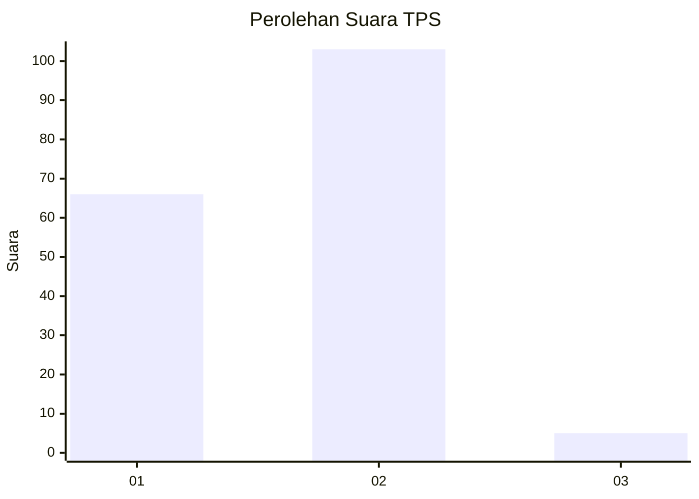
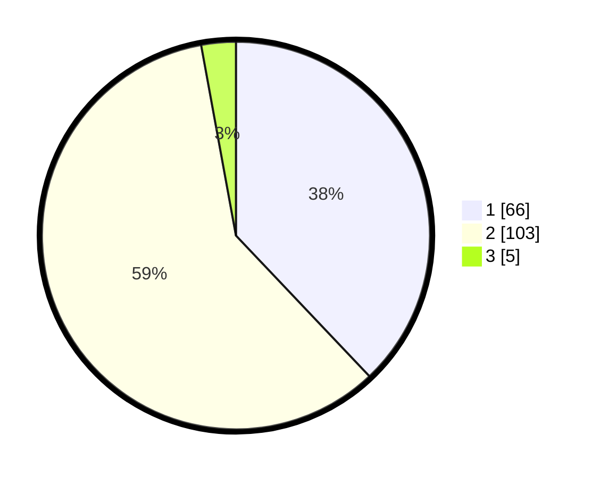

# Hasil

## Grafik

## Tabel

| No. | Nama Paslon    | Suara | Suara (raw) | Persentase |
|:--- |:-------------- | -----:| -----------:| ----------:|
| 1   | ANIES MUHAIMIN | 66    | [66][p-1]   | 37,93      |
| 2   | PRABOWO GIBRAN | 103   | [103][p-2]  | 59,20      |
| 3   | GANJAR MAHFUD  | 5     | [5][p-3]    | 2,87       |

[p-1]: https://github.com/gigit-pemilu/pemilu-2024/blob/main/pilpres/hitung-suara/sub/32-jawa-barat/sub/04-bandung/sub/25-cicalengka/sub/2003-babakan-peuteuy/sub/033-tps/sub/paslon-1.txt
[p-2]: https://github.com/gigit-pemilu/pemilu-2024/blob/main/pilpres/hitung-suara/sub/32-jawa-barat/sub/04-bandung/sub/25-cicalengka/sub/2003-babakan-peuteuy/sub/033-tps/sub/paslon-2.txt
[p-3]: https://github.com/gigit-pemilu/pemilu-2024/blob/main/pilpres/hitung-suara/sub/32-jawa-barat/sub/04-bandung/sub/25-cicalengka/sub/2003-babakan-peuteuy/sub/033-tps/sub/paslon-3.txt

## Foto C Plano

https://sirekap-obj-formc.kpu.go.id/4bb2/pemilu/ppwp/32/04/25/20/03/3204252003033-20240226-184418--830c076e-6fef-4dae-81b4-716476513688.jpg

https://sirekap-obj-formc.kpu.go.id/4bb2/pemilu/ppwp/32/04/25/20/03/3204252003033-20240226-184526--8c88de3a-223b-4e11-a2dc-c5e549759743.jpg

https://sirekap-obj-formc.kpu.go.id/4bb2/pemilu/ppwp/32/04/25/20/03/3204252003033-20240226-184714--484abab2-fc04-4004-a319-326eae29aa88.jpg

## Metadata

| Key        | Value               |
| ---------- | ------------------- |
| Time Stamp | 2024-02-26 22:00:00 |

## DATA PEMILIH TETAP

Jumlah pemilih dalam DPT: **394**.
 * L: **707**.
 * P: **834**.

## DATA PENGGUNA HAK PILIH

Jumlah pengguna hak pilih dalam DPT: **773**.
 * L: **80**.
 * P: **87**.

Jumlah pengguna hak pilih dalam DPTb: **585**.
 * L: **48**.
 * P: **4**.

Jumlah pengguna hak pilih dalam DPK: **32**.
 * L: **82**.
 * P: **0**.

Jumlah pengguna hak pilih: **275**.
 * L: **2**.
 * P: **47**.

## JUMLAH SUARA SAH DAN TIDAK SAH

JUMLAH SELURUH SUARA SAH: **174**.

JUMLAH SUARA TIDAK SAH: **1**.

JUMLAH SELURUH SUARA SAH DAN SUARA TIDAK SAH: **175**.

