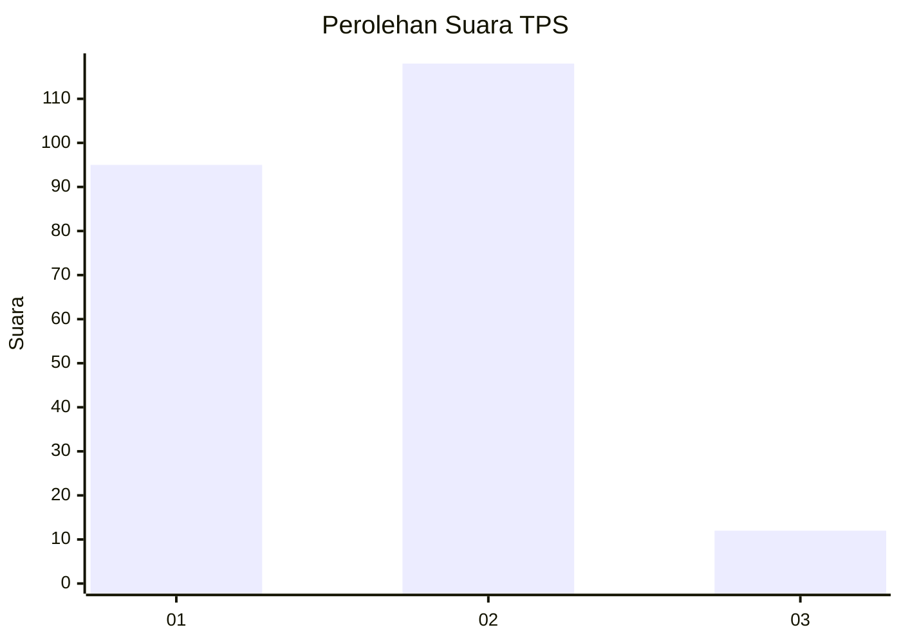
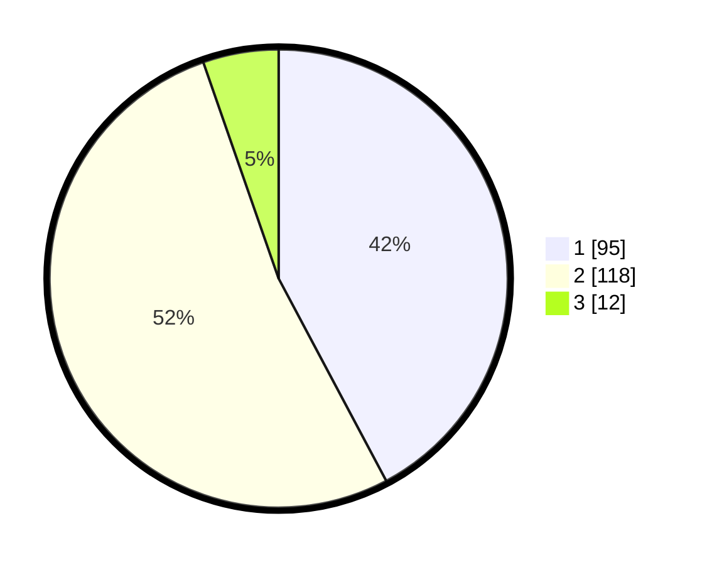

# Hasil

## Grafik

## Tabel

| No. | Nama Paslon    | Suara | Suara (raw) | Persentase |
|:--- |:-------------- | -----:| -----------:| ----------:|
| 1   | ANIES MUHAIMIN | 95    | [95][p-1]   | 42,22      |
| 2   | PRABOWO GIBRAN | 118   | [118][p-2]  | 52,44      |
| 3   | GANJAR MAHFUD  | 12    | [12][p-3]   | 5,33       |

[p-1]: https://github.com/gigit-pemilu/pemilu-2024/blob/main/pilpres/hitung-suara/sub/32-jawa-barat/sub/04-bandung/sub/25-cicalengka/sub/2005-dampit/sub/002-tps/sub/paslon-1.txt
[p-2]: https://github.com/gigit-pemilu/pemilu-2024/blob/main/pilpres/hitung-suara/sub/32-jawa-barat/sub/04-bandung/sub/25-cicalengka/sub/2005-dampit/sub/002-tps/sub/paslon-2.txt
[p-3]: https://github.com/gigit-pemilu/pemilu-2024/blob/main/pilpres/hitung-suara/sub/32-jawa-barat/sub/04-bandung/sub/25-cicalengka/sub/2005-dampit/sub/002-tps/sub/paslon-3.txt

## Foto C Plano

https://sirekap-obj-formc.kpu.go.id/f1df/pemilu/ppwp/32/04/25/20/05/3204252005002-20240225-120745--6700277f-e95e-4bf0-8ce0-ba0ba9a43689.jpg

https://sirekap-obj-formc.kpu.go.id/f1df/pemilu/ppwp/32/04/25/20/05/3204252005002-20240225-121019--175546ae-68a5-4d8e-943b-a8bb6c511684.jpg

https://sirekap-obj-formc.kpu.go.id/f1df/pemilu/ppwp/32/04/25/20/05/3204252005002-20240225-121245--45b9c1c6-8eb4-4c22-9fa6-4f1ed0bac808.jpg

## Metadata

| Key        | Value               |
| ---------- | ------------------- |
| Time Stamp | 2024-02-25 13:00:00 |

## DATA PEMILIH TETAP

Jumlah pemilih dalam DPT: **577**.
 * L: **557**.
 * P: **557**.

## DATA PENGGUNA HAK PILIH

Jumlah pengguna hak pilih dalam DPT: **725**.
 * L: **554**.
 * P: **577**.

Jumlah pengguna hak pilih dalam DPTb: **227**.
 * L: **554**.
 * P: **667**.

Jumlah pengguna hak pilih dalam DPK: **141**.
 * L: **16**.
 * P: **640**.

Jumlah pengguna hak pilih: **441**.
 * L: **142**.
 * P: **666**.

## JUMLAH SUARA SAH DAN TIDAK SAH

JUMLAH SELURUH SUARA SAH: **225**.

JUMLAH SUARA TIDAK SAH: **1**.

JUMLAH SELURUH SUARA SAH DAN SUARA TIDAK SAH: **226**.

