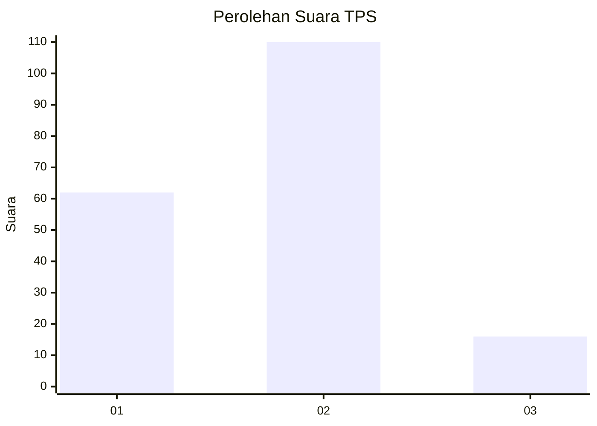
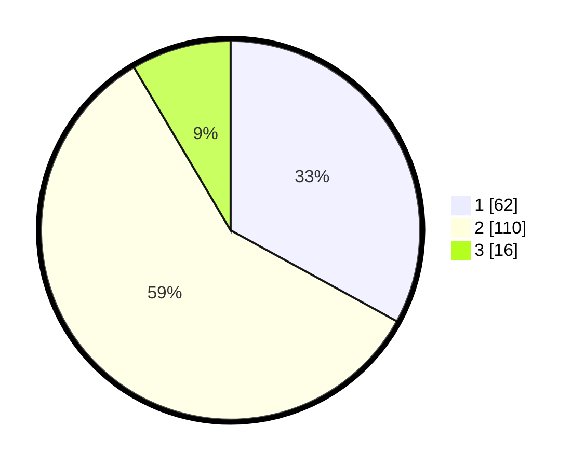

# Hasil

## Grafik

## Tabel

| No. | Nama Paslon    | Suara | Suara (raw) | Persentase |
|:--- |:-------------- | -----:| -----------:| ----------:|
| 1   | ANIES MUHAIMIN | 62    | [62][p-1]   | 32,98      |
| 2   | PRABOWO GIBRAN | 110   | [110][p-2]  | 58,51      |
| 3   | GANJAR MAHFUD  | 16    | [16][p-3]   | 8,51       |

[p-1]: https://github.com/gigit-pemilu/pemilu-2024-32-jawa-barat/blob/main/pilpres/hitung-suara/sub/32-jawa-barat/sub/04-bandung/sub/25-cicalengka/sub/2010-tenjolaya/sub/004-tps/sub/paslon-1.txt
[p-2]: https://github.com/gigit-pemilu/pemilu-2024-32-jawa-barat/blob/main/pilpres/hitung-suara/sub/32-jawa-barat/sub/04-bandung/sub/25-cicalengka/sub/2010-tenjolaya/sub/004-tps/sub/paslon-2.txt
[p-3]: https://github.com/gigit-pemilu/pemilu-2024-32-jawa-barat/blob/main/pilpres/hitung-suara/sub/32-jawa-barat/sub/04-bandung/sub/25-cicalengka/sub/2010-tenjolaya/sub/004-tps/sub/paslon-3.txt

## Foto C Plano

https://sirekap-obj-formc.kpu.go.id/eac4/pemilu/ppwp/32/04/25/20/10/3204252010004-20240227-160000--98ec0e6e-f4c2-4172-a80b-771262e9511c.jpg

https://sirekap-obj-formc.kpu.go.id/eac4/pemilu/ppwp/32/04/25/20/10/3204252010004-20240227-160135--cf9b3336-be7d-49f6-85e4-95546294b9c4.jpg

https://sirekap-obj-formc.kpu.go.id/eac4/pemilu/ppwp/32/04/25/20/10/3204252010004-20240227-160357--9ca4d49a-be9f-4680-838f-f855e8e2e47b.jpg

## Metadata

| Key        | Value               |
| ---------- | ------------------- |
| Time Stamp | 2024-02-27 22:00:00 |

## DATA PEMILIH TETAP

Jumlah pemilih dalam DPT: **223**.
 * L: **106**.
 * P: **117**.

## DATA PENGGUNA HAK PILIH

Jumlah pengguna hak pilih dalam DPT: **687**.
 * L: **883**.
 * P: **104**.

Jumlah pengguna hak pilih dalam DPTb: **88**.
 * L: **0**.
 * P: **80**.

Jumlah pengguna hak pilih dalam DPK: **802**.
 * L: **1**.
 * P: **81**.

Jumlah pengguna hak pilih: **189**.
 * L: **884**.
 * P: **105**.

## JUMLAH SUARA SAH DAN TIDAK SAH

JUMLAH SELURUH SUARA SAH: **188**.

JUMLAH SUARA TIDAK SAH: **1**.

JUMLAH SELURUH SUARA SAH DAN SUARA TIDAK SAH: **189**.

