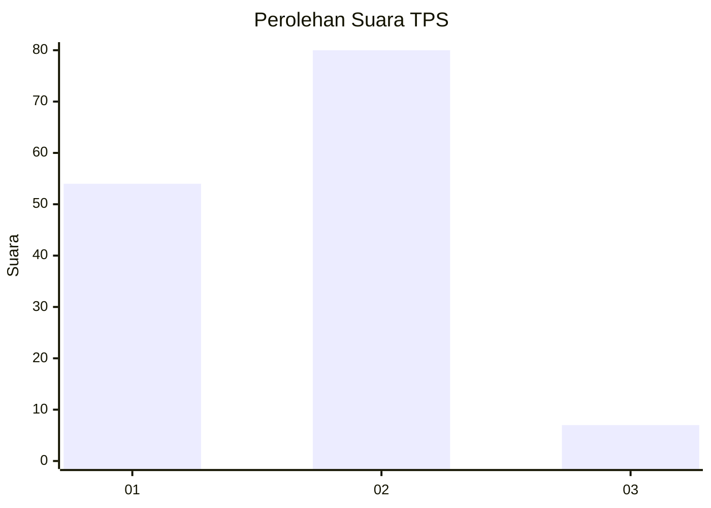
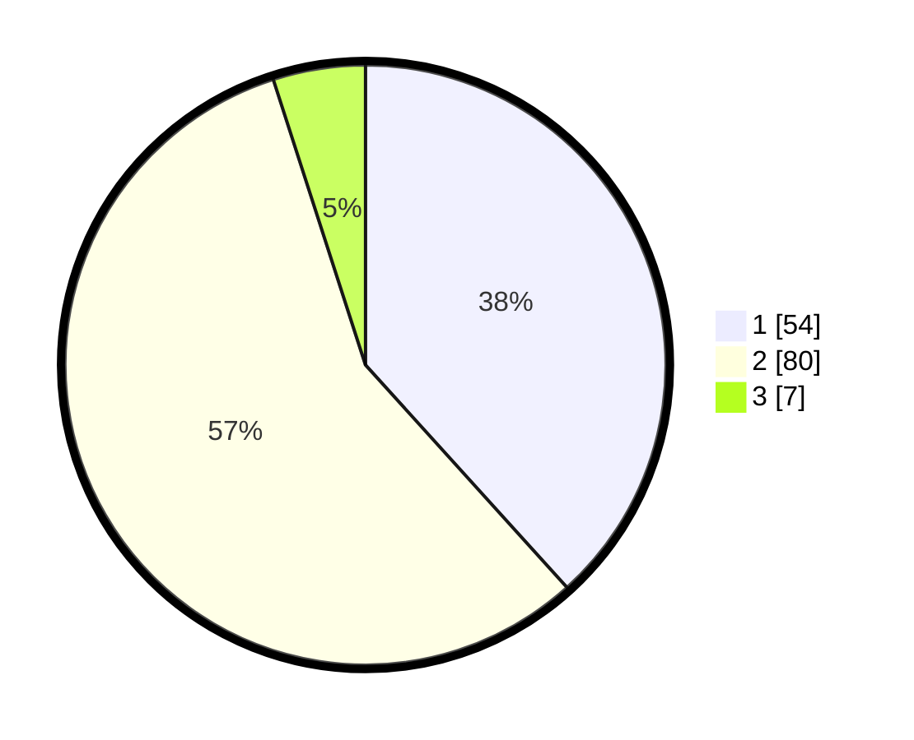

# Hasil

## Grafik

## Tabel

| No. | Nama Paslon    | Suara | Suara (raw) | Persentase |
|:--- |:-------------- | -----:| -----------:| ----------:|
| 1   | ANIES MUHAIMIN | 54    | [54][p-1]   | 38,30      |
| 2   | PRABOWO GIBRAN | 80    | [80][p-2]   | 56,74      |
| 3   | GANJAR MAHFUD  | 7     | [7][p-3]    | 4,96       |

[p-1]: https://github.com/gigit-pemilu/pemilu-2024-32-jawa-barat/blob/main/pilpres/hitung-suara/sub/32-jawa-barat/sub/04-bandung/sub/25-cicalengka/sub/2010-tenjolaya/sub/007-tps/sub/paslon-1.txt
[p-2]: https://github.com/gigit-pemilu/pemilu-2024-32-jawa-barat/blob/main/pilpres/hitung-suara/sub/32-jawa-barat/sub/04-bandung/sub/25-cicalengka/sub/2010-tenjolaya/sub/007-tps/sub/paslon-2.txt
[p-3]: https://github.com/gigit-pemilu/pemilu-2024-32-jawa-barat/blob/main/pilpres/hitung-suara/sub/32-jawa-barat/sub/04-bandung/sub/25-cicalengka/sub/2010-tenjolaya/sub/007-tps/sub/paslon-3.txt

## Foto C Plano

https://sirekap-obj-formc.kpu.go.id/8a15/pemilu/ppwp/32/04/25/20/10/3204252010007-20240227-172051--a816e92a-0dae-4a4a-9985-4a8cc7e6eba9.jpg

https://sirekap-obj-formc.kpu.go.id/8a15/pemilu/ppwp/32/04/25/20/10/3204252010007-20240227-172301--56e8ecae-3432-4568-afd3-9b97ccf80ede.jpg

https://sirekap-obj-formc.kpu.go.id/8a15/pemilu/ppwp/32/04/25/20/10/3204252010007-20240227-172649--a19714ae-27f4-4ea6-861e-fff2e852af79.jpg

## Metadata

| Key        | Value               |
| ---------- | ------------------- |
| Time Stamp | 2024-02-27 18:00:00 |

## DATA PEMILIH TETAP

Jumlah pemilih dalam DPT: **168**.
 * L: **857**.
 * P: **881**.

## DATA PENGGUNA HAK PILIH

Jumlah pengguna hak pilih dalam DPT: **192**.
 * L: **871**.
 * P: **21**.

Jumlah pengguna hak pilih dalam DPTb: **88**.
 * L: **888**.
 * P: **488**.

Jumlah pengguna hak pilih dalam DPK: **881**.
 * L: **81**.
 * P: **8**.

Jumlah pengguna hak pilih: **143**.
 * L: **472**.
 * P: **471**.

## JUMLAH SUARA SAH DAN TIDAK SAH

JUMLAH SELURUH SUARA SAH: **141**.

JUMLAH SUARA TIDAK SAH: **2**.

JUMLAH SELURUH SUARA SAH DAN SUARA TIDAK SAH: **143**.

