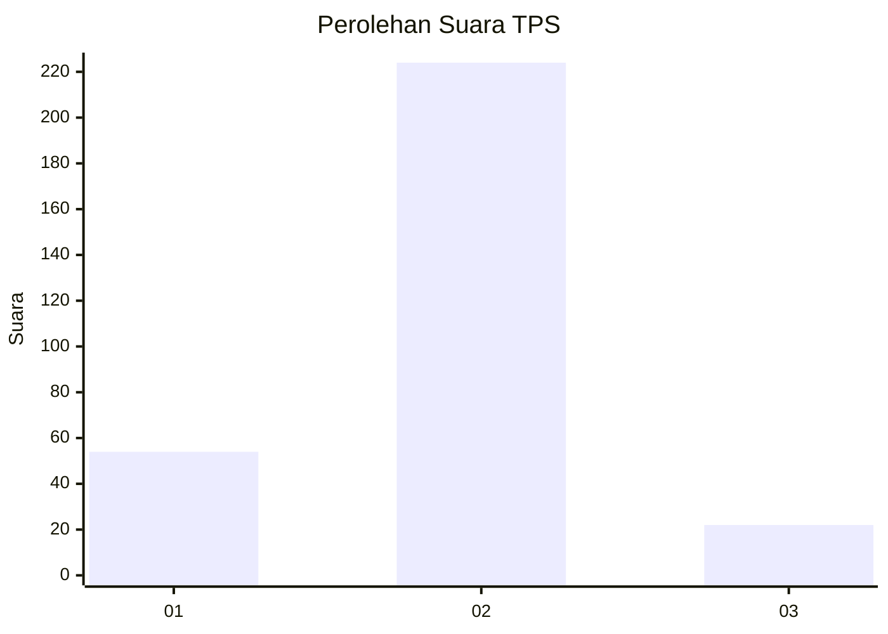
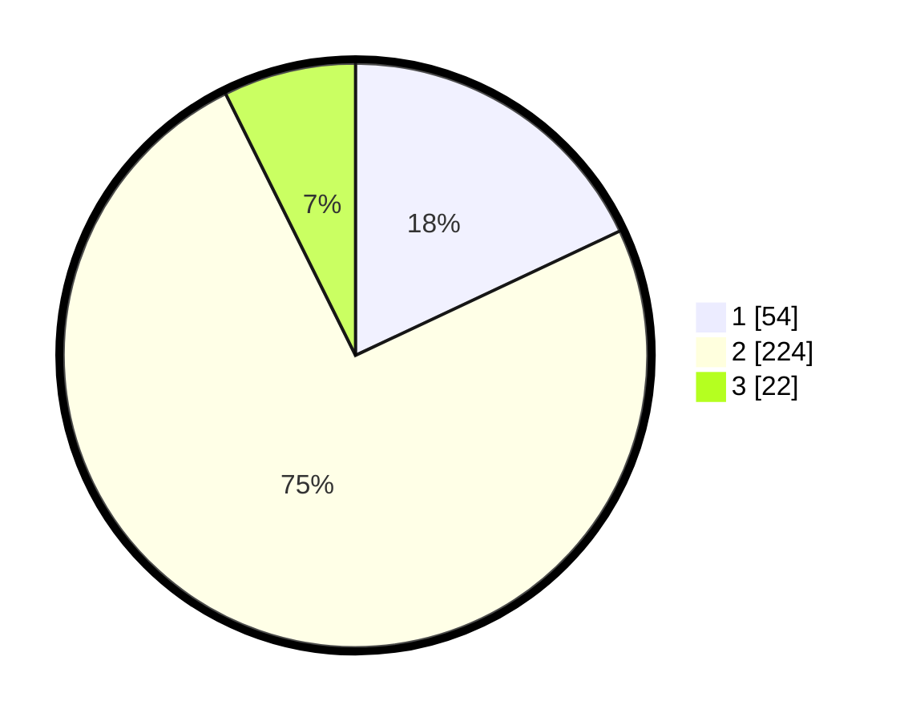

# Hasil

## Grafik

## Tabel

| No. | Nama Paslon    | Suara | Suara (raw) | Persentase |
|:--- |:-------------- | -----:| -----------:| ----------:|
| 1   | ANIES MUHAIMIN | 54    | [54][p-1]   | 18,00      |
| 2   | PRABOWO GIBRAN | 224   | [224][p-2]  | 74,67      |
| 3   | GANJAR MAHFUD  | 22    | [22][p-3]   | 7,33       |

[p-1]: https://github.com/gigit-pemilu/pemilu-2024-32-jawa-barat/blob/main/pilpres/hitung-suara/sub/32-jawa-barat/sub/04-bandung/sub/25-cicalengka/sub/2011-waluya/sub/033-tps/sub/paslon-1.txt
[p-2]: https://github.com/gigit-pemilu/pemilu-2024-32-jawa-barat/blob/main/pilpres/hitung-suara/sub/32-jawa-barat/sub/04-bandung/sub/25-cicalengka/sub/2011-waluya/sub/033-tps/sub/paslon-2.txt
[p-3]: https://github.com/gigit-pemilu/pemilu-2024-32-jawa-barat/blob/main/pilpres/hitung-suara/sub/32-jawa-barat/sub/04-bandung/sub/25-cicalengka/sub/2011-waluya/sub/033-tps/sub/paslon-3.txt

## Foto C Plano

https://sirekap-obj-formc.kpu.go.id/81b7/pemilu/ppwp/32/04/25/20/11/3204252011033-20240227-175721--d07ba477-f327-4813-bfec-d221377a98ef.jpg

https://sirekap-obj-formc.kpu.go.id/81b7/pemilu/ppwp/32/04/25/20/11/3204252011033-20240227-175544--233d7ed7-44c8-448f-8f36-fa5ac246c308.jpg

https://sirekap-obj-formc.kpu.go.id/81b7/pemilu/ppwp/32/04/25/20/11/3204252011033-20240227-175300--1ea44463-084f-4c9f-9bd8-cb5bc601e278.jpg

## Metadata

| Key        | Value               |
| ---------- | ------------------- |
| Time Stamp | 2024-02-27 18:00:00 |

