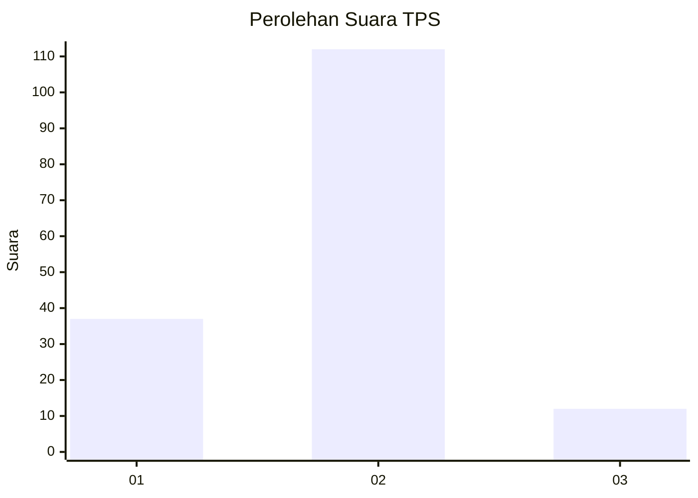
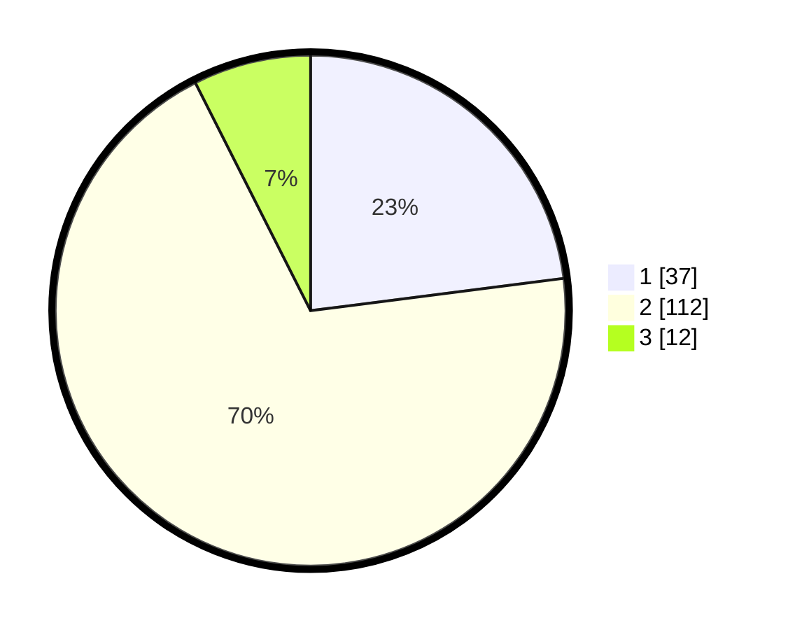

# Hasil

## Grafik

## Tabel

| No. | Nama Paslon    | Suara | Suara (raw) | Persentase |
|:--- |:-------------- | -----:| -----------:| ----------:|
| 1   | ANIES MUHAIMIN | 37    | [37][p-1]   | 22,98      |
| 2   | PRABOWO GIBRAN | 112   | [112][p-2]  | 69,57      |
| 3   | GANJAR MAHFUD  | 12    | [12][p-3]   | 7,45       |

[p-1]: https://github.com/gigit-pemilu/pemilu-2024/blob/main/pilpres/hitung-suara/sub/32-jawa-barat/sub/04-bandung/sub/25-cicalengka/sub/2012-nagrog/sub/027-tps/sub/paslon-1.txt
[p-2]: https://github.com/gigit-pemilu/pemilu-2024/blob/main/pilpres/hitung-suara/sub/32-jawa-barat/sub/04-bandung/sub/25-cicalengka/sub/2012-nagrog/sub/027-tps/sub/paslon-2.txt
[p-3]: https://github.com/gigit-pemilu/pemilu-2024/blob/main/pilpres/hitung-suara/sub/32-jawa-barat/sub/04-bandung/sub/25-cicalengka/sub/2012-nagrog/sub/027-tps/sub/paslon-3.txt

## Foto C Plano

https://sirekap-obj-formc.kpu.go.id/7108/pemilu/ppwp/32/04/25/20/12/3204252012027-20240227-195228--ee622b77-f514-4f46-a3a0-1f9b01795c9c.jpg

https://sirekap-obj-formc.kpu.go.id/7108/pemilu/ppwp/32/04/25/20/12/3204252012027-20240227-195350--79f28582-87d8-4cd9-ad23-0cce67684a32.jpg

https://sirekap-obj-formc.kpu.go.id/7108/pemilu/ppwp/32/04/25/20/12/3204252012027-20240227-195526--6d0c0774-d06f-428c-9984-50006c1a4575.jpg

## Metadata

| Key        | Value               |
| ---------- | ------------------- |
| Time Stamp | 2024-02-28 00:00:00 |

## DATA PEMILIH TETAP

Jumlah pemilih dalam DPT: **400**.
 * L: **290**.
 * P: **206**.

## DATA PENGGUNA HAK PILIH

Jumlah pengguna hak pilih dalam DPT: **834**.
 * L: **884**.
 * P: **878**.

Jumlah pengguna hak pilih dalam DPTb: **85**.
 * L: **86**.
 * P: **4**.

Jumlah pengguna hak pilih dalam DPK: **204**.
 * L: **886**.
 * P: **0**.

Jumlah pengguna hak pilih: **465**.
 * L: **83**.
 * P: **842**.

## JUMLAH SUARA SAH DAN TIDAK SAH

JUMLAH SELURUH SUARA SAH: **161**.

JUMLAH SUARA TIDAK SAH: **4**.

JUMLAH SELURUH SUARA SAH DAN SUARA TIDAK SAH: **165**.

