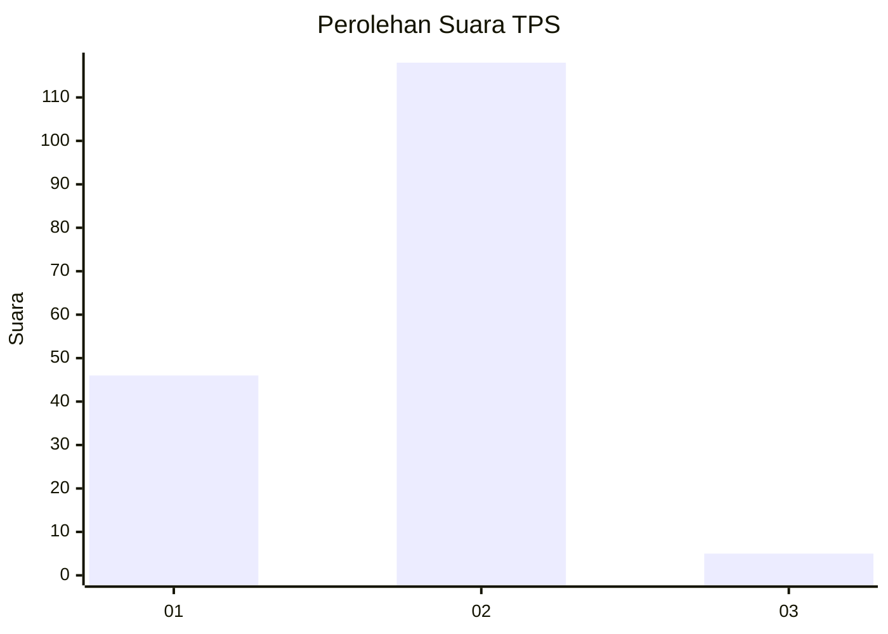
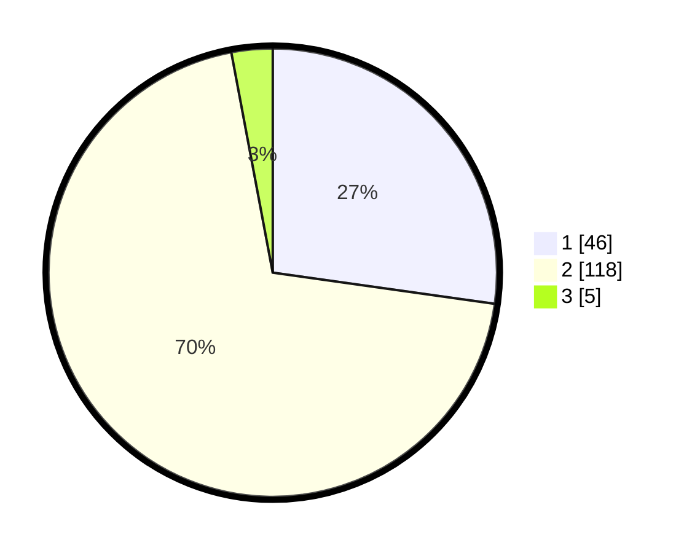

# Hasil

## Grafik

## Tabel

| No. | Nama Paslon    | Suara | Suara (raw) | Persentase |
|:--- |:-------------- | -----:| -----------:| ----------:|
| 1   | ANIES MUHAIMIN | 46    | [46][p-1]   | 27,22      |
| 2   | PRABOWO GIBRAN | 118   | [118][p-2]  | 69,82      |
| 3   | GANJAR MAHFUD  | 5     | [5][p-3]    | 2,96       |

[p-1]: https://github.com/gigit-pemilu/pemilu-2024/blob/main/pilpres/hitung-suara/sub/32-jawa-barat/sub/04-bandung/sub/25-cicalengka/sub/2012-nagrog/sub/043-tps/sub/paslon-1.txt
[p-2]: https://github.com/gigit-pemilu/pemilu-2024/blob/main/pilpres/hitung-suara/sub/32-jawa-barat/sub/04-bandung/sub/25-cicalengka/sub/2012-nagrog/sub/043-tps/sub/paslon-2.txt
[p-3]: https://github.com/gigit-pemilu/pemilu-2024/blob/main/pilpres/hitung-suara/sub/32-jawa-barat/sub/04-bandung/sub/25-cicalengka/sub/2012-nagrog/sub/043-tps/sub/paslon-3.txt

## Foto C Plano

https://sirekap-obj-formc.kpu.go.id/1f3b/pemilu/ppwp/32/04/25/20/12/3204252012043-20240227-194550--54ed761d-6eff-4270-87ba-917f8479b03f.jpg

https://sirekap-obj-formc.kpu.go.id/1f3b/pemilu/ppwp/32/04/25/20/12/3204252012043-20240227-194650--4a05e0c3-0f2d-4708-a3d7-eafe4cb83e50.jpg

https://sirekap-obj-formc.kpu.go.id/1f3b/pemilu/ppwp/32/04/25/20/12/3204252012043-20240227-194837--e78bc6c6-bf1e-44ef-b3e7-83effbc34321.jpg

## Metadata

| Key        | Value               |
| ---------- | ------------------- |
| Time Stamp | 2024-02-27 23:00:00 |

## DATA PEMILIH TETAP

Jumlah pemilih dalam DPT: **666**.
 * L: **522**.
 * P: **55**.

## DATA PENGGUNA HAK PILIH

Jumlah pengguna hak pilih dalam DPT: **572**.
 * L: **83**.
 * P: **825**.

Jumlah pengguna hak pilih dalam DPTb: **0**.
 * L: **88**.
 * P: **8**.

Jumlah pengguna hak pilih dalam DPK: **0**.
 * L: **828**.
 * P: **0**.

Jumlah pengguna hak pilih: **572**.
 * L: **93**.
 * P: **89**.

## JUMLAH SUARA SAH DAN TIDAK SAH

JUMLAH SELURUH SUARA SAH: **169**.

JUMLAH SUARA TIDAK SAH: **3**.

JUMLAH SELURUH SUARA SAH DAN SUARA TIDAK SAH: **172**.

