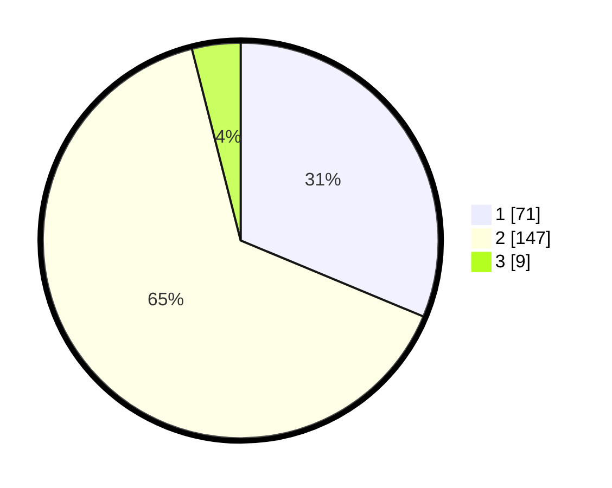

# Hasil

## Grafik

## Tabel

| No. | Nama Paslon    | Suara | Suara (raw) | Persentase |
|:--- |:-------------- | -----:| -----------:| ----------:|
| 1   | ANIES MUHAIMIN | 71    | [71][p-1]   | 31,28      |
| 2   | PRABOWO GIBRAN | 147   | [147][p-2]  | 64,76      |
| 3   | GANJAR MAHFUD  | 9     | [9][p-3]    | 3,96       |

[p-1]: https://github.com/gigit-pemilu/pemilu-2024-32-jawa-barat/blob/main/pilpres/hitung-suara/sub/32-jawa-barat/sub/04-bandung/sub/26-nagreg/sub/2007-nagreg-kendan/sub/005-tps/sub/paslon-1.txt
[p-2]: https://github.com/gigit-pemilu/pemilu-2024-32-jawa-barat/blob/main/pilpres/hitung-suara/sub/32-jawa-barat/sub/04-bandung/sub/26-nagreg/sub/2007-nagreg-kendan/sub/005-tps/sub/paslon-2.txt
[p-3]: https://github.com/gigit-pemilu/pemilu-2024-32-jawa-barat/blob/main/pilpres/hitung-suara/sub/32-jawa-barat/sub/04-bandung/sub/26-nagreg/sub/2007-nagreg-kendan/sub/005-tps/sub/paslon-3.txt

## Foto C Plano

https://sirekap-obj-formc.kpu.go.id/b7d9/pemilu/ppwp/32/04/26/20/07/3204262007005-20240224-212741--cc1e13ed-76ba-40ec-9486-1aeeb6d06fac.jpg

https://sirekap-obj-formc.kpu.go.id/b7d9/pemilu/ppwp/32/04/26/20/07/3204262007005-20240224-113643--494e2538-ba38-45f0-af0e-541f39c707b5.jpg

https://sirekap-obj-formc.kpu.go.id/b7d9/pemilu/ppwp/32/04/26/20/07/3204262007005-20240224-114140--6119c490-a338-4fe3-be2b-6f5e23b73e26.jpg

## Metadata

| Key        | Value               |
| ---------- | ------------------- |
| Time Stamp | 2024-02-24 22:31:28 |

