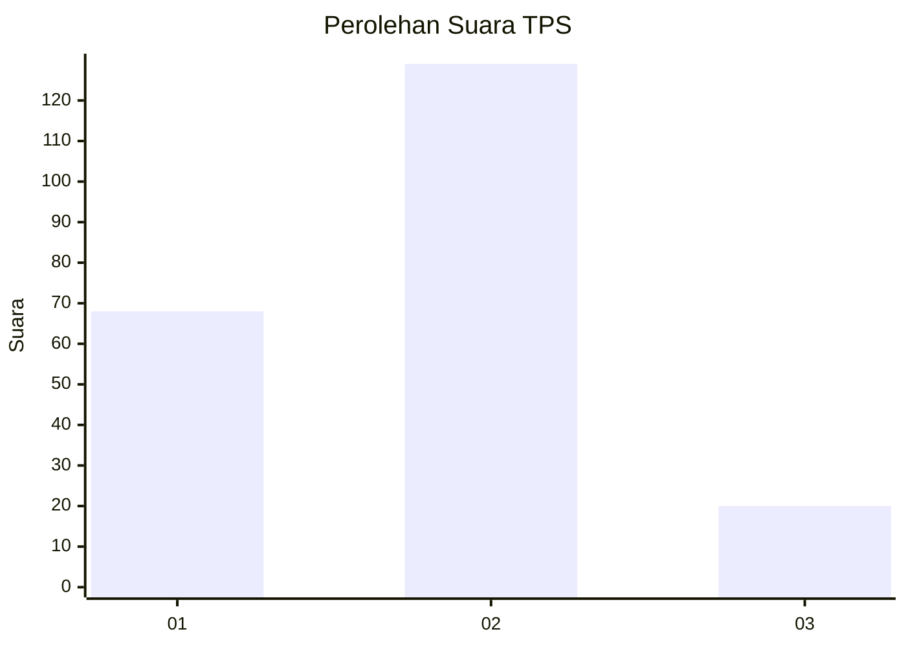
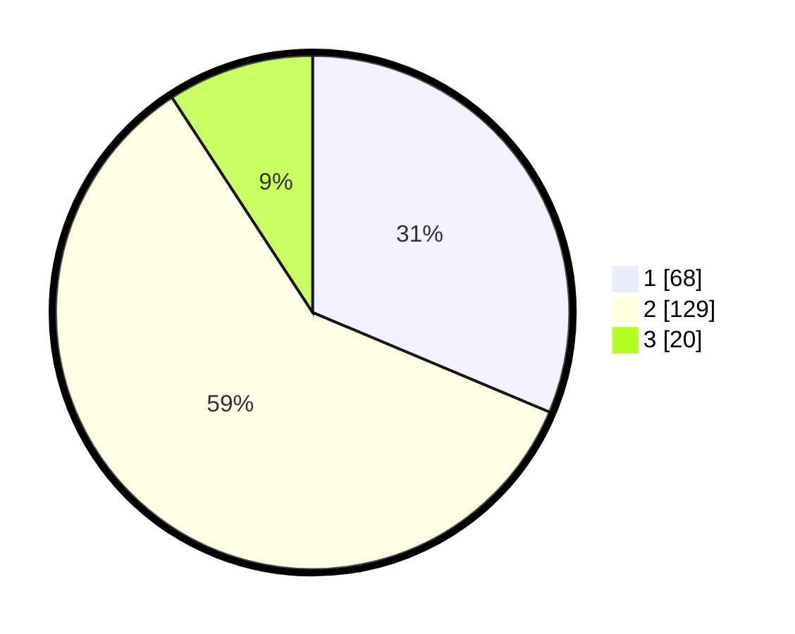

# Hasil

## Grafik

## Tabel

| No. | Nama Paslon    | Suara | Suara (raw) | Persentase |
|:--- |:-------------- | -----:| -----------:| ----------:|
| 1   | ANIES MUHAIMIN | 68    | [68][p-1]   | 31,34      |
| 2   | PRABOWO GIBRAN | 129   | [129][p-2]  | 59,45      |
| 3   | GANJAR MAHFUD  | 20    | [20][p-3]   | 9,22       |

[p-1]: https://github.com/gigit-pemilu/pemilu-2024-32-jawa-barat/blob/main/pilpres/hitung-suara/sub/32-jawa-barat/sub/04-bandung/sub/27-cikancung/sub/2001-mandalasari/sub/001-tps/sub/paslon-1.txt
[p-2]: https://github.com/gigit-pemilu/pemilu-2024-32-jawa-barat/blob/main/pilpres/hitung-suara/sub/32-jawa-barat/sub/04-bandung/sub/27-cikancung/sub/2001-mandalasari/sub/001-tps/sub/paslon-2.txt
[p-3]: https://github.com/gigit-pemilu/pemilu-2024-32-jawa-barat/blob/main/pilpres/hitung-suara/sub/32-jawa-barat/sub/04-bandung/sub/27-cikancung/sub/2001-mandalasari/sub/001-tps/sub/paslon-3.txt

## Foto C Plano

https://sirekap-obj-formc.kpu.go.id/ac49/pemilu/ppwp/32/04/27/20/01/3204272001001-20240224-172924--27e5cac7-918a-428f-9ffe-4f2cd0fd887d.jpg

https://sirekap-obj-formc.kpu.go.id/ac49/pemilu/ppwp/32/04/27/20/01/3204272001001-20240224-173036--845ba39e-73ad-470f-8990-a16f79db0367.jpg

https://sirekap-obj-formc.kpu.go.id/ac49/pemilu/ppwp/32/04/27/20/01/3204272001001-20240224-173136--d51862dd-8106-46bf-a3d4-0fbdeba51527.jpg

## Metadata

| Key        | Value               |
| ---------- | ------------------- |
| Time Stamp | 2024-02-26 11:00:00 |

